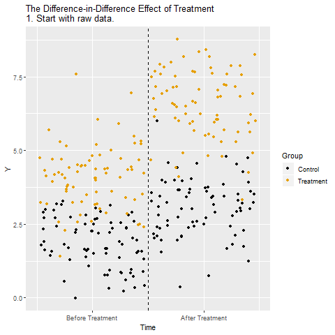
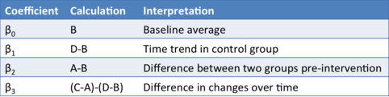
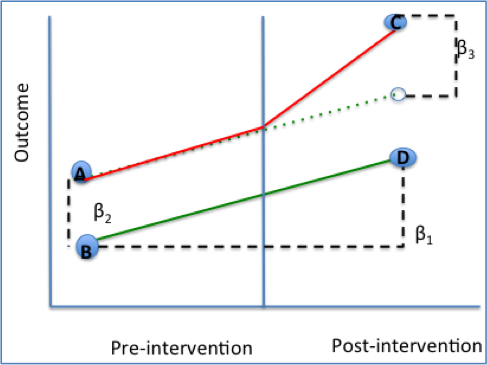
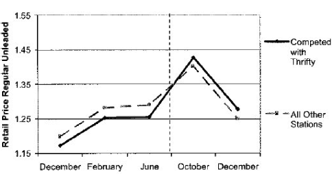
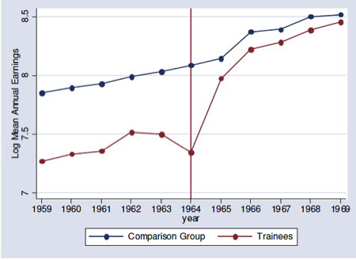
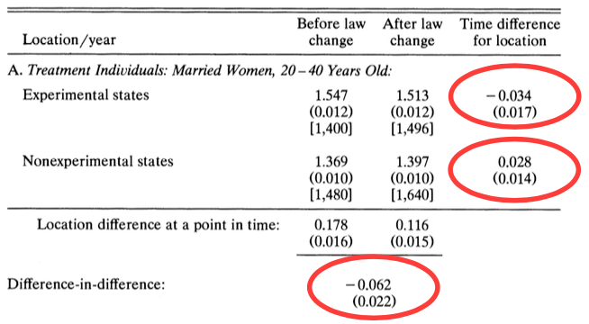
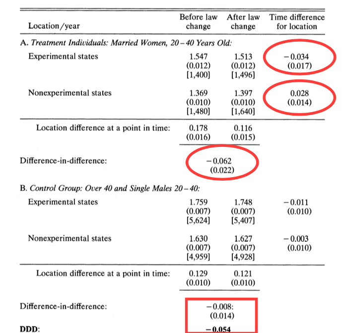

class: middle, center, inverse
# Difference in Differences

---
## An Alternative Approach

We saw previously that RCT's are the ideal empirical study.

When an RCT is unavailable, then provided we observe enough covariates to eliminate all forms of selection and omitted variable bias, we can use regression to estimate accurate causal effects.

---
## Alternative Strategies

But sometimes we find ourselves in a situation where an RCT is not feasible, and it is impossible to observe all the important ways in which the treated and control units differ.

In this case, there are three additional empirical strategies typically use:

  - Difference in Differences
  - Instrumental Variables
  - Regression Discontinuity
  
Today, we will look at dif-in-dif.

---
## Framework

Recall the potential outcome framework. When we estimate a treatment
control contrast what we get is:
$$E(Y|D=1)-E(Y|D=0)=\delta+E(Y_0|D=1)-E(Y_0|D=0)$$
Where $\delta$ is the ATE.

This equation says that the average of the treated group minus the average of the control group is the average treatment effect plus selection
bias (AKA omitted variable bias in the regression framework).

---
## Parallel Trends

We will now explore another way to get rid of the selection bias.

Suppose we have data on the outcome variable for our treatment and control group from the previous period. Call this $Y_{pre}$.

Now suppose further that:
$$E(Y_0|D=1)-E(Y_{pre}|D=1)=E(Y_0|D=0)-E(Y_{pre}|D=0)$$
This assumption is known as the __parallel trends__ assumptions and is crucial for getting compelling estimates in the dif-in-dif framework.

What does this assumption mean?

---
## Parallel Trends

It says that if the treatment group had never been treated, the average change in the outcome variable would have been identical to the average change in the outcome variable for the control group.

How plausible this assumption is depends upon the given study you are
examining.

For now, let's assume it is true, and see how this can help us kill the
selection bias.

---
## Difference in Difference

Suppose instead of just comparing the average treatment outcome to the average control outcome, we use the pre-period data to compare the average change in the treatment group to the average change in the control group.

That is, we calculate:
$$E(Y|D=1)-E(Y_{pre}|D=1)-[E(Y|D=0)-E(Y_{pre}|D=0)]$$
This is a __difference in difference__ or dif-in-dif estimate.

---
## Difference in Differences: Animated

```{r echo=FALSE, message=FALSE, warning=FALSE,fig.align='center'}
library(knitr)

```

---
## Difference in Differences: Differences in Means Example
```{r echo=FALSE, warnings = FALSE, message=FALSE, out.width="150%", fig.align='center'}

```

---
## Difference in Differences: Graphical Approach

$$\begin{align*}Y&= \beta_0 + \beta_1*[Time] + \beta_2*[Intervention] \\
&+ \beta_3*[Time*Intervention] + \beta_4*[Covariates]+\epsilon\end{align*}$$
```{r echo=FALSE, message=FALSE, warning=FALSE, out.width="70%", fig.align='center'}

```

---
## Parallel Trend Assumption

The parallel trend assumption is the most critical of the above the four assumptions to ensure internal validity of DID models and is the hardest to fulfill. 

It requires that in the absence of treatment, the difference between the 'treatment' and 'control' group is constant over time. 

Although there is no statistical test for this assumption, visual inspection is useful when you have observations over many time points. 

It has also been proposed that the smaller the time period tested, the more likely the assumption is to hold. 

Violation of parallel trend assumption will lead to biased estimation of the causal effect.

---
## Parralel Trend Assumption: Met

```{r echo=FALSE, message=FALSE, warning=FALSE, out.width="80%",fig.align='center'}

```

---
## Parralel Trend Assumption: Violated

```{r echo=FALSE, message=FALSE, warning=FALSE, out.width="80%",fig.align='center'}

```

---
## Dif-in-Dif in Practice

__Case study: who pays for mandated childbirth coverage?__

When the government mandates employers to provide benefits, who is really footing the bill? 

  - Is it the employer? 
  - Or is it the employee who pays for it indirectly in the form of a pay cut?
  
This analysis is first conducted by Jonathan Gruber in 1994, an MIT Professor who serves as the director of the Health Care Program at the National Bureau of Economic Research (NBER). To date, The Incidence of Mandated Benefits remains one of the most influential paper in healthcare economics. 

---
## Timeline

Understanding the timeline is important for identifying the causal effect:

Before 1978: there was limited health care coverage for childbirth.

1975-1979: a subset of states passed laws, mandating the health care coverage of childbirth.

Starting in 1978: federal legislation mandates the health care coverage of childbirth for all states.

---
## Difference-in-Differences Table

```{r echo=FALSE, message=FALSE, warning=FALSE, out.width="75%",fig.align='center'}

```

---
## The Legendary Triple Dif

```{r echo=FALSE, message=FALSE, warning=FALSE, out.width="75%",fig.align='center'}

```

---
## Dif-in-Dif in R - Manual Calculation

```{r message=FALSE, warning=FALSE}
require(foreign)
eitc<-read.dta("https://github.com/CausalReinforcer/Stata/raw/master/eitc.dta")
# Create two additional dummy variables to indicate before/after
# and treatment/control groups.

# the EITC went into effect in the year 1994
eitc$post93 = as.numeric(eitc$year >= 1994)

# The EITC only affects women with at least one child, so the
# treatment group will be all women with children.
eitc$anykids = as.numeric(eitc$children >= 1)

# Compute the four data points needed in the DID calculation:
a = sapply(subset(eitc, post93 == 0 & anykids == 0, select=work), mean)
b = sapply(subset(eitc, post93 == 0 & anykids == 1, select=work), mean)
c = sapply(subset(eitc, post93 == 1 & anykids == 0, select=work), mean)
d = sapply(subset(eitc, post93 == 1 & anykids == 1, select=work), mean)

# Compute the effect of the EITC on the employment of women with children:
(d-c)-(b-a)
```

---
## Dif-in-Dif in R - Regression

$$work=\beta_0+\delta_0posst93+\beta_1anykids+\delta_1(anykids*post93)+\epsilon$$
```{r warning=FALSE, message=FALSE}
reg1 = lm(work ~ post93 + anykids + post93*anykids, data = eitc)
summary(reg1)
```

---
## Create Plot

```{r eval=FALSE, warning=FALSE, message=FALSE}
# Take average value of 'work' by year, conditional on anykids
minfo = aggregate(eitc$work, list(eitc$year,eitc$anykids == 1), mean)
# rename column headings (variables)
names(minfo) = c("YR","Treatment","LFPR")

# Attach a new column with labels
minfo$Group[1:6] = "Single women, no children"
minfo$Group[7:12] = "Single women, children"
#minfo

require(ggplot2)	#package for creating nice plots

qplot(YR, LFPR, data=minfo, geom=c("point","line"), colour=Group,
xlab="Year", ylab="Labor Force Participation Rate")+geom_vline(xintercept = 1994)
```

---
## Create Plot

```{r echo=FALSE,fig.align='center', warning=FALSE, message=FALSE}
# Take average value of 'work' by year, conditional on anykids
minfo = aggregate(eitc$work, list(eitc$year,eitc$anykids == 1), mean)
# rename column headings (variables)
names(minfo) = c("YR","Treatment","LFPR")

# Attach a new column with labels
minfo$Group[1:6] = "Single women, no children"
minfo$Group[7:12] = "Single women, children"
#minfo

require(ggplot2)	#package for creating nice plots

qplot(YR, LFPR, data=minfo, geom=c("point","line"), colour=Group,
xlab="Year", ylab="Labor Force Participation Rate")+geom_vline(xintercept = 1994)
```

---
class: center, middle, inverse
# Strengths and Limitations

---
## Strengths

* Intuitive interpretation
* Can obtain causal effect using observational data if assumptions are met
* Can use either individual and group level data
* Comparison groups can start at different levels of the outcome. (DID focuses on change rather than absolute levels)
* Accounts for change/change due to factors other than intervention

---
## Limitations

* Requires baseline data & a non-intervention group
* Cannot use if intervention allocation determined by baseline outcome
* Cannot use if comparison groups have different outcome trend (Abadie 2005 has proposed solution)
* Cannot use if composition of groups pre/post change are not stable

---
## BEST PRACTICES
 
* Be sure outcome trends did not influence allocation of the treatment/intervention
* Acquire more data points before and after to test parallel trend assumption
* Use linear probability model to help with interpretability
* Be sure to examine composition of population in treatment/intervention and control groups before and after intervention
* Use robust standard errors to account for autocorrelation between pre/post in same individual
* Perform sub-analysis to see if intervention had similar/different effect on components of the outcome
