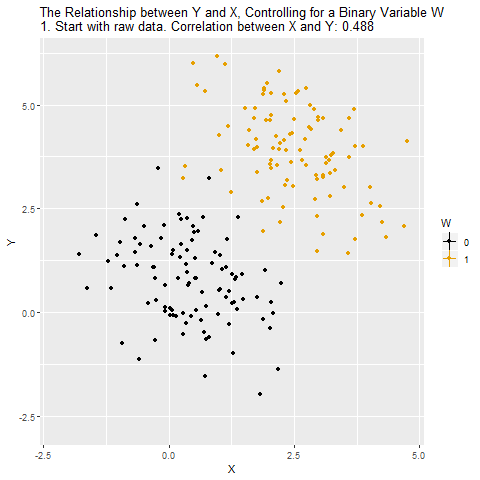

class: middle, center, inverse
# Dummy Variables, Log Transformations, Quadratics, and Interactions

---
## Sometimes the relationship is not Linear


---
## Dummy Variables

Dummy (binary) Variables allows us to capture information from non-numeric or continuous random variables.

We can control for observable categories such as race, religion, gender, and state of residence.

---
## Dummy Variables (aka Binary Variables)
We can think of sex as a dummy variable that has two values. 
$$female = \left\{\begin{matrix}
1 \text{ if female}\\ 
0 \text{ otherwise}
\end{matrix}\right.$$

If G is the number of groups in the category, then we must include G-1 dummy variables. For the case of sex, we have two groups, male and female. Therefore, we need only one dummy variable.

If we have dummy variables for states (there are 50 states), then we would have 49 dummy variables.

---
## Interpreting Dummy Variables

Suppose we have the following equation $$Test_Scores_i = \beta_0 + \beta_1 Female_i+u_i$$

In this case, $\beta_0$ would tell us the average score for male test takers. Why? Because the variable Female = 0 for male test takers reducing the formula to $$Test_Scores_i = \beta_0 + u_i$$

For Female test takers, the mean score would be $\beta_0+\beta_1$. Why? The variable for Female = 1 for female test takers so the equation becomes. $$Test_Scores_i = \beta_0 + \beta_1+u_i$$
The coefficient $\beta_1$ tells us by how much female test takers score more or less relative to male test takers.

If $\beta_1$ is not statistically significant, then we cannot conclude there is a difference in mean test scores between the two sexes.

---
### More than Two Dummy Variables

Suppose we extended our test scores example to include race/ethnicity as well. Let's suppose we receive a variable called race that 
$$Race = \left\{\begin{matrix}
1 \text{ if White}\\ 
2 \text{ if Black}\\
3 \text{ if Hispanic}
\end{matrix}\right.$$

Since there are three categories, we need to create two dummy variables

.pull-left[
$$Black = \left\{\begin{matrix}
1 \text{ if Black}\\ 
0 \text{ if otherwise}
\end{matrix}\right.$$
]

.pull-right[
$$Hispanic = \left\{\begin{matrix}
1 \text{ if Hispanic}\\ 
0 \text{ if otherwise}
\end{matrix}\right.$$
]

Now the regression equation would be $$Test_score_i = \beta_0+\beta_1 Female_i + \beta_2 Black_i + \beta_3 Hispanic + u_i$$

The intercept $\beta_0$ represents the null group. In this case, the null group is a white male because that is when Black, Female, and Hispanic all equal zero.

Think of what the coefficients would be for a Hispanic Female.
---
## Dummy Variables

```{r echo=FALSE, fig.align='center', warning=FALSE, message=FALSE}
library(knitr)
library(stargazer)

```

---
## Data

Current Population Survey (CPS) is produced by the BLS and provides data on labor force characteristics of the population, including the level of employment, unemployment, and earnings.  

* 65,000 randomly selected U.S. households are surveyed each month. 
* The MARCH survey is more detailed than in other months and asks questions about earnings during the previous year.  

---
## Variables

Variables  | Definition                           | 
---------  | ------------------------------------ |
gender     | 1 if female; 0 if male               | 
Age        | Age in Years                         | 
earnings   | Avg. Hourly Earnings                 |
education  | Years of Education                   |
Northeast  | 1 if from the Northeast, 0 otherwise |
Midwest    | 1 if from the Midwest, 0 otherwise   |
South      | 1 if from the South, 0 otherwise     |
West	     | 1 if from the West, 0 otherwise      |

---
## Load the data 


```{r , warning=FALSE, message=FALSE}
library("AER")
library("lattice")
data("CPSSW8")
summary(CPSSW8)
```

---
## Histogram of Wages by Gender
```{r echo=FALSE, warning=FALSE, message=FALSE}
histogram(~CPSSW8$earnings | CPSSW8$gender)
```

---
## Statistical discrimination

.pull-left[One thing we can do with categorical variables is to identify statistical discrimination.

A simple linear regression of Avg. Hourly Earnings on Gender will give us a quick comaprison of earnings between females and males.]

.pull-right[
```{r results='asis', warning=FALSE, message=FALSE}
m1 = lm(earnings ~ factor(gender), data=CPSSW8)
stargazer(m1,type="html", single.row = TRUE, covariate.labels = c("Female"))
```
]

---
## Warning about Statistical Discrimination
Although, we estimate that women earn less than men. It would be incorrect to say that this definitely proves women earn less than men do to discriminiation.

- The dummy variable does not take on all the attritubes of the group. It simply labels them
- There could still be difference in amount of education, type of education, amount of experience, age, race, etc. 
- All of these could be contributing to the differences between the genders, but since we are not controlling for them it appears as if there is gender discrimination.
- This problem is even worse for race.
- [See a large twitter fight about the subject here amoung economists](https://twitter.com/jodiecongirl/status/1268758788062040065)
- Summary if you think there is systemic racisim then the amount of education receive will not be independent of the error term. 

---
### Let's add some controls
In this second regression we include some addtional explanatory variables.

$$earnings_i = \beta_0+\beta_1 Female_i +\beta_2 age + \beta_3 education$$

```{r results='asis', warning=FALSE, message=FALSE}
m2 = lm(earnings ~ factor(gender)+age+education, data=CPSSW8)
stargazer(m1,m2,type="html",omit.stat = c("f","ser"),single.row = TRUE, covariate.labels = c("Female","Age","Educ."))
```

---
## Quadratic function

Economic theory tells us that there are diminishing returns to productivity. 

As we age we become more productivity, but at a decreasing rate. 

One way to account for this change is by including a quadratic term in our specification.

$$earnings_i = \beta_0+\beta_1 Female_i +\beta_2 age + \beta_3 age^2 +\beta_4 education$$

```{r results='hide', eval=FALSE, warning=FALSE, message=FALSE}
CPSSW8$age2=CPSSW8$age*CPSSW8$age
m3 = lm(earnings ~ factor(gender)+age+age2+education, data=CPSSW8)
stargazer(m1,m2,m3,type="html",omit.stat = c("f","ser"),single.row = TRUE)
```

---
#### Quadratic function
```{r results='asis', echo=FALSE, warning=FALSE, message=FALSE}
CPSSW8$age2=CPSSW8$age*CPSSW8$age
m3 = lm(earnings ~ factor(gender)+age+age2+education, data=CPSSW8)
library(texreg)
#stargazer(m1,m2,m3,type="html",omit.stat = c("f","ser"))
htmlreg(list(m1,m2,m3), single.row = TRUE, custom.coef.names = c("Intercept","Female","Age","Education","Age Sq"))
```

---
## Interaction term 

Potentially, the returns from education are different by gender. We add this feature to the model by including an interaction term. 

We multiply gender and education. 

$$earnings_i = \beta_0+\beta_1 Female_i +\beta_2 age+ \beta_3 age^2 \\
+\beta_4 education+ \beta_5 education *Female$$

We see from the regression results that there are not much difference with respect to education

---
#### Interaction Term
```{r results='asis',echo=FALSE, warning=FALSE, message=FALSE}
m4 = lm(earnings ~ age+age2+education+education*factor(gender), data=CPSSW8)
#stargazer(m1,m2,m3,m4,type="html",omit.stat = c("f","ser"))
htmlreg(list(m1,m2,m3,m4),single.row = TRUE, custom.coef.names = c("Intercept","Female","Age","Education","Age Sq","Education*Female"))
```

---
#### Location, Location, Location

There are often unobservable characteristics about markets that we would like to capture, but we just don't have this variable (i.e. unemployment rate by gender or sector, culture, laws, etc). 

One way to handle this problem is to use categorical variables for the location of the person or firm. 

These categorical variables will capture any time invariant differences between locations.  

---
#### Location, Location, Location
```{r results='asis', echo=FALSE , warning=FALSE, message=FALSE}
m5 = lm(earnings ~ age+age2+education+education*factor(gender)+factor(region), data=CPSSW8)
htmlreg(list(m3,m4,m5),single.row = TRUE, custom.coef.names = c("Intercept","Female","Age","Age Sq","Education","Education*Female","MidWest","South","West"))
```

---
## Log Transformation

The normality assumption about the error term implies the dependent variable can potentially take on both negative and positive values. 

However, there are some variables we use often that are always positive

* price
* quantity
* income
* wages 

One method used to insure that we have a positive depedent variable is to transform the dependent variable by taking the natural log. 

---
#### Log Transformation
```{r results='asis', echo=FALSE, warning=FALSE, message=FALSE}
m6 = lm(log(earnings) ~ age+age2+education+education*factor(gender)+factor(region), data=CPSSW8)
stargazer(m4,m5,m6,type="html", covariate.labels = c("Age","Age Squared","Education","Female","Education*Female","MidWest","South","West"),omit.stat = c("f","ser"),single.row = TRUE, style = "aer")
```

---
#### Log Transformation

A classic place where we see log transformation is when estimating supply and demand curves.

- Price and quantity are both positive values
- Economist love talking about elasticity
- Elasticity is the percent change in quantity over the precent change in price.

$$Quantity_i = \beta_0 + \beta_1*Price+u_i$$
This equation tells us how much quantity changes per unit for a given change in price per dollar.
$$\log{Quantity_i} = \beta_0 + \beta_1*\log{Price_i}+u_i$$
This equation tells us the percent change in quantity for a percent change in price.
- $\beta_1$ is the elasticity term in this equation.

---
#### More on Log Transformations

Different cases lead to different interpretations

Both X and Y are continuous
- log Y and X = a one unit change in X leads to a $\beta$ percent change in Y.
  - Special Case if X is a dummy variable, then $\beta$ is the percent change in Y for that category.
- Y and log X = a one percent change in X (i.e. log (X1)-log(X2)=.01) leads to a $.01*\beta$ change in Y
- log Y and log X = a one percent change in X leads to a $.01*\beta$ percent change in Y.

