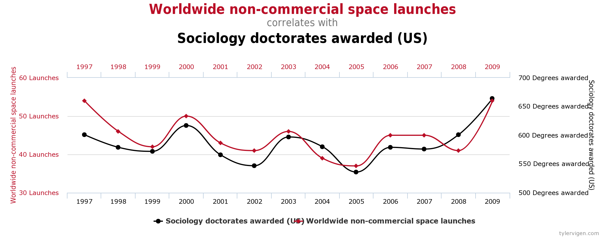
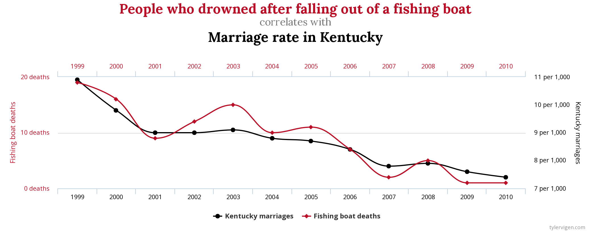
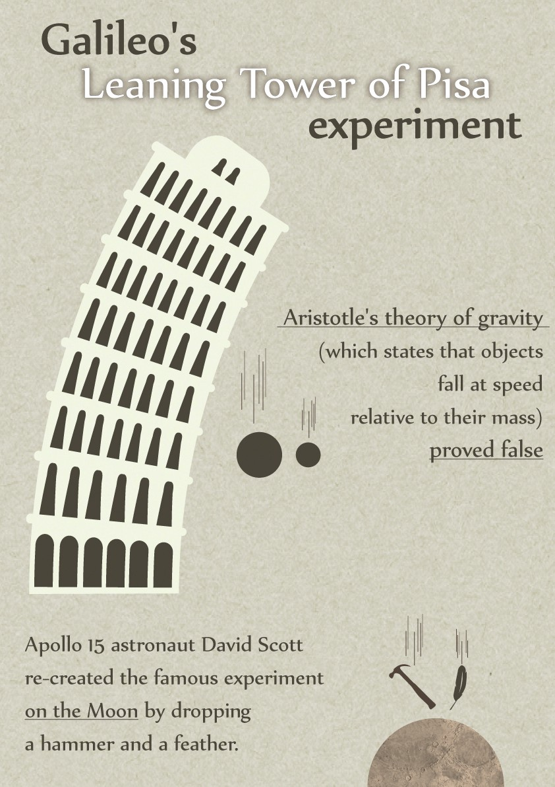
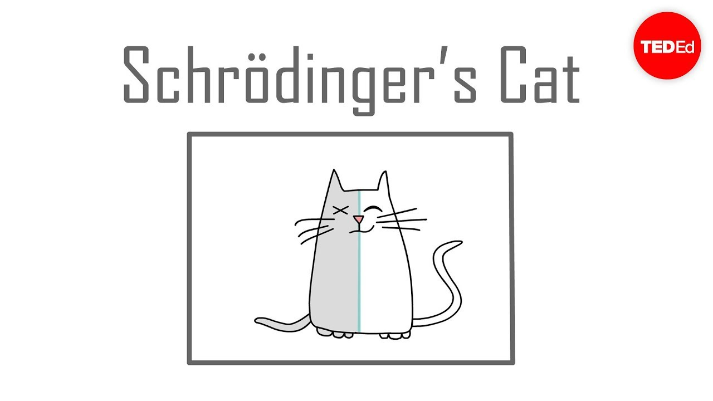
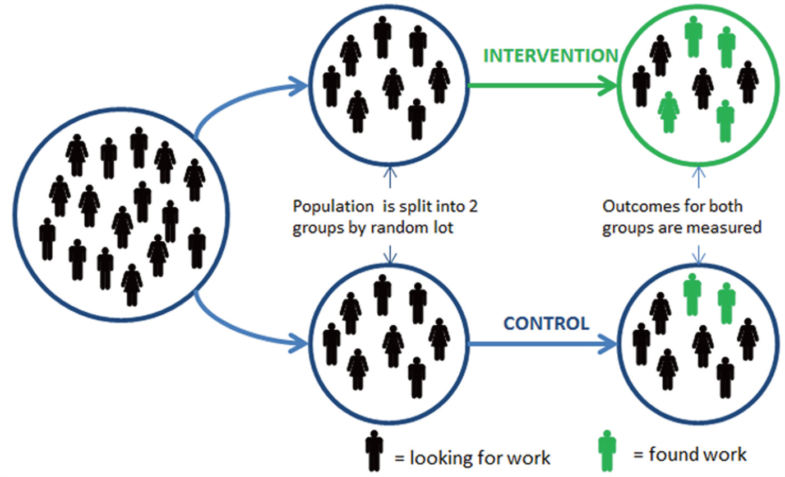

# Causal Inference

## Predictive vs Prescriptive

In Data Analytics there are often three types of answers

- Descriptive - Aim is to aggregate and describe your current data (a snapshot)
  - Tables, Charts, Maps, Tableau
- Predictive - Aim is to predict the dependent variable. How will it change in the near future?
  - Machine Learning
  - Time Series Forecast
- Prescriptive - Aim is to explain the dependent variable. What is the effect of your advertising campaign? Why are workers leaving your firm?
  - What this course is about!
    
---
## Linear Regression Models for Causal Inference

This semester we will cover:

  - Randomized Experiments
  - Simple Linear Regression
  - Multiple Regression
  - Difference-in-Differences
  - Instrumental Variables
  - Regression Discontinuity
  
---

## Two Types of Causal Questions

Two types of causal questions (Gelman and Imbens 2013):

* Reverse causal inference: search for causes of effects (Why?).
    - Why does the United States perform so poorly in Math standardized exams?
  
* Forward causal questions: estimation of effects of causes (What if ...?).
    - Does teacher's IQ affect students performance? Class size?
    
---

## Causal effects
We are motivated by why questions but, when conducting our analysis, we tend to proceed by addressing what if questions.

Examples:

* How does taking this course affect your earnings in 3-years?
    * Note that this is different from a predictive question: "What will be the earnings of students taking this course?"
* If Uber increases prices, how would it affect demand?
* Does the death penalty decrease crime rates?
* Would it be profitable for a firm to allow employees to work from home? (Yahoo 2013)
* Are employees more satisfied if they are informed about the salaries of their colleagues? (Card, Mas, Moretti and Saez 2012)

---
## Correlation Does not Imply Causation

* Two well known properties
    1. Correlation does not imply causation
    2. y can cause x even if x takes place before y
--
* Less known property
    - y can cause x
    - x can cause y
    - z can cause both x and y
    
---

## Examples

Potentially confusing examples:

  * Red cars are more likely to get involved in accidents
  * People that sleep less tend to live longer
  * Students living in households where there are more books tend to have higher GPA's.
  * Countries that eat more chocolate receive more Nobel prizes (Messerli 2012)
  
---

## Examples

```{r echo=FALSE, fig.align='center'}
suppressWarnings(library(knitr))
library(kableExtra)


```

---

## Examples

```{r echo=FALSE, out.width="100%", fig.align='center'}
include_graphics('correlation.png')
```

---

# Randomized Experiments

## How to Estimate Causal Effects

In the physical sciences:
- Often, one can answer this type of question by running an experiment on a specific unit.
- Example: Galileo Galilei Leaning Tower of Pisa experiment
    + Necessary conditions (ceteris paribus, other things being equal):
    + Temporal stability: the response does not change if we change the moment when the treatment is applied.
    + Causal transience: the response of one treatment is not affected by prior exposure of the unit to the other treatment.
    + Unit homogeneity: homogeneity with respect to treatments and responses.
    
---
## Leaning Tower of Pisa experiment

```{r echo=FALSE, out.width="55%", fig.align='center'}
library(knitr)

```

---
## How to Estimate Causal Effects
In the social sciences:
- None of these assumptions is plausible.
- We use the statistical solution: we estimate the average causal effect of the treatment over the population of units.
- Intuition: "All Other things being equal" conditions are likely to be satisfied on average across treated and non-treated if the treatment is randomly assigned.

---
## Health Insurance Experiment

Suppose we are interested in the effect of health insurance on a person's health

Let's think of a treatment (getting insurance) of individual $i$ as a binary random variable $D_i = {0, 1}$
And potential outcomes (counterfactuals): $Y_{0i}$, $Y_{1i}$

$Y_{1i}$ = A measure of person $i$'s health given they _have_ insurance $(D_i=1)$.

$Y_{0i}$ = A measure of person $i$'s health given they _do not have_ insurance $(D_i=0)$.

The individual treatment effect is $Y_{1i} , Y_{0i}$

Unfortunately, for $i$, we only observe $Y_{1i}$ if $D_i$ = 1 and $Y_{0i}$ if $D_i$ = 0

For any individual $i$, we only observe $Y_i=D_iY_{1i}+(1-D_i)Y_{0i}$

---

## No Schrodinger's Cat
```{r, echo = FALSE, eval=TRUE, out.width="100%"}


```

[Learn more about Schrodinger's Cat at the link](https://youtu.be/IOYyCHGWJq4)

---
## AVERAGE TREATMENT EFFECT

The problem is we cannot observe you as both having and not having insurance.

Solution is to look for the __AVERAGE TREATMENT EFFECT__ (ATE)!
$$E[Y_{1i}] - E[Y_{0i}]$$
And a naive comparison of averages does not tell us what we want to
know:
$$E[Y_{1i}|D_{i} = 1] - E[Y_{0i}|D_{i} = 0]$$
$$=\begin{array}{c}\underbrace{E[Y_{1i}|D_{i} = 1] - E[Y_{0i}|D_{i} = 1] }\\ ATE\end{array}+\begin{array}{c}\underbrace{E[Y_{0i}|D_{i} = 1] - E[Y_{0i}|D_{i} = 0] }\\ Sample \, Selection \, Bias\end{array}$$

---
## Average Treatment effect on the Treated

Average treatment effect (ATE) and average treatment effect on the treated (ATT) need not to be the same and the distinction is sometimes important

They will be the same only if treatment is homogeneous across groups:
$$E[Y_{1i} - Y_{0i}|D_i = 1] = E[Y_{1i} - Y_{0i}|D_i = 0] = E[Y_{1i} - Y_{0i}]$$

That is, the treatment is assigned randomly.

---
## Random Assigment

We want to understand what would have happened to the treated in the absence of treatment and thus overcome the selection problem...

Solution : __Random assignment__

```{r echo=FALSE, out.width="50%", fig.align='center'}

```

---
## Random Assignment

Random assignment makes $D_i$ independent of potential outcomes,
hence: 
- the selection effect is zeroed out and 
- the treatment effect on the treated is equal to the ATE.

---
## Types of randomized experiments
A randomized experiment is designed and implemented consciously by social scientists. It entails conscious use of a treatment and control group with random assignment.
  - __Lab experiments__
      - The effect of feedback on relative performance (Azmat and Iriberri, 2012). __Yes you work harder__
  - __Field experiments__ (Lab-in-the-field)
      - The effect of feedback on relative performance: (Bagues et al, work in progress) __Yes Students work harder__
  - __Natural experiments__ 
    - has a source of randomization that is as if randomly assigned, but not part of real experiment.
    - Vietnam-era service effect on education and earnings (Flory, Leibbrandt and List 2010) __Women Shy away from competitive work settings__
      
---
## Who uses Experiments in Business?

Tech Companies like Google, Facebook, and Amazon are positioned to use experiments.

They embraced the idea of "Data-Base Management" where the results of experiments were taken over the advice of HiPPO's (Highest Paid Person's Opinion)

[THE A/B TEST: INSIDE THE TECHNOLOGY THAT'S CHANGING THE RULES OF BUSINESS, Wire Magazine 4 2012](https://www.wired.com/2012/04/ff-abtesting/)

[In Praise of Data-Driven Management (AKA "Why You Should be Skeptical of HiPPO's")](https://hexawise.com/posts/in-praise-of-data-driven-management-aka-why-you-should-be-skeptical-of-hippos)

---
## Potential drawbacks of RCTs
Experiments provide a very transparent and simple empirical strategy. They solve the _selection bias_ problem. However, there are a number of potential problems:
  1. Problems of implementation
      * Compliance and attrition
      * Cost, political issues (policy makers need to acknowledge ignorance),...
  2. Ethical issues
      * Note that the ethical argument is not obvious when (i) the treatment cannot be applied to everybody (maybe due to some budget constraints) and (ii) the optimal assignment rule is unknown.
  3. Hawthorne effect
      * The Illumination Experiment (Landsberger 1950, Levitt and List 2011)
      * Audit study in France (Behaghel et al. 2015)

---
## Rand Health Insurance Study

Conducted between 1974 and 1982

Randomly assigned thousands of non-elderly individuals and families to different insurance plan designs

Plans ranged from free care to $1,000 deductible (basically) with variations in between 

Comparable deductible today is at least $4,000

Studied effects on health spending and health outcomes

---
## Rand Health Insurance

```{r echo=FALSE, message=FALSE, warning=FALSE}
library("tidyverse")
library("broom")
library("haven")
library("rlang")
library("clubSandwich")
cluster_se <- function(mod, cluster, type = "CR2") {
  vcov <- vcovCR(mod, cluster = cluster, type = type)
  coef_test(mod, vcov = vcov) %>%
    rownames_to_column(var = "term") %>%
    as_tibble() %>%
    select(term, estimate = beta, std.error = SE)
}
load("rand_sample.rda")
plantypes <- count(rand_sample, plantype)
plantypes$pct<- plantypes$n/sum(plantypes$n)
knitr::kable(plantypes, caption="Plan Types")
```

---
## Patient Characteristics

```{r echo=FALSE, message=FALSE, warning=FALSE}
#varlist <- c("female", "blackhisp", "age", "educper",
#             "income1cpi", "hosp", "ghindx", "cholest", "diastol",
#             "systol", "mhi", "ghindxx",
#             "cholestx", "diastolx", "systolx", "mhix")
varlist <- c("female", "blackhisp", "age", "educper",
             "income1cpi", "hosp", "ghindx", "mhi")
catastrophic_stats <- rand_sample %>%
  filter(plantype == "Catastrophic") %>%
  select(one_of(varlist)) %>%
  gather(variable, value) %>%
  group_by(variable) %>%
  summarise(Mean = mean(value, na.rm = TRUE),
            `Std. Dev.` = sd(value, na.rm = TRUE))
catastrophic_stats$variable<-c("Age", "Pct. Black or Hispanic", "Education", "Pct. Female","General Health Index", "Hospital", "Income", "Mental Health Index")
knitr::kable(catastrophic_stats, digits = 2, caption="Patinet Characteristics")

```

---
## Patient Characteristics by Plan 

```{r echo=FALSE, message=FALSE, warning=FALSE}
calc_diffs <- function(x) {
  # programmatically create the formula for lm
  f <- quo(!!sym(x) ~ plantype)
  mod <- lm(f, data = rand_sample)  # nolint
  out <- cluster_se(mod, cluster = rand_sample[["fam_identifier"]])
  out[["response"]] <- x
  out
}
plantype_diffs <- map_dfr(varlist, calc_diffs) %>%
  select(response, term, estimate, std.error) %>%
  mutate(term = str_replace(term, "^plantype", ""))
fmt_num <- function(x) {
  prettyNum(x, digits = 3, format = "f", big.mark = ",", drop0trailing = FALSE)
}

table1 <- plantype_diffs %>%
  mutate(estimate = str_c(fmt_num(estimate), " (", fmt_num(std.error), ")")) %>%
  select(-std.error) %>%
  spread(term, estimate)
table1$response <- c("Age", "Black/Hisp.", "Educ.", "Female","Gen. Health", "Hospital", "Income", "Mental Health")
knitr::kable(table1, digits = 3, caption="Plan Demographics - Catastrophic")

```

---
## Patient Health by Plan

```{r echo=FALSE, message=FALSE, warning=FALSE}
load("rand_person_spend.rda")
rand_person_spend <- mutate(rand_person_spend,
                            expyear = indv_start_year + year - 1)
cpi <- tribble(
  ~ year, ~ cpi,
  1973, 3.07,
  1974, 2.76,
  1975, 2.53,
  1976, 2.39,
  1977, 2.24,
  1978, 2.09,
  1979, 1.88,
  1980, 1.65,
  1981, 1.5,
  1982, 1.41,
  1983, 1.37,
  1984, 1.31,
  1985, 1.27
)
rand_person_spend <- left_join(rand_person_spend,
                               cpi, by = c("expyear" = "year")) %>%
  mutate(out_inf = outsum * cpi,
         inpdol_inf = inpdol * cpi)
rand_person_spend <- mutate(rand_person_spend,
                       tot_inf = inpdol_inf + out_inf)

rand_person_spend <- mutate(rand_person_spend,
                            any_ins = plantype != "Catastrophic")
#count(rand_person_spend, plantype)
#count(rand_person_spend, any_ins)
varlist <- c("ftf", "out_inf", "totadm", "inpdol_inf", "tot_inf")
#rand_person_spend %>%
#  filter(plantype == "Catastrophic") %>%
#  select(one_of(varlist)) %>%
#  gather(response, value) %>%
#  group_by(response) %>%
#  summarise(Mean = mean(value, na.rm = TRUE),
#            `Std. Dev.` = sd(value, na.rm = TRUE))
calc_diffs <- function(x) {
  # programmatically create the formula
  f <- quo(!!sym(x) ~ plantype)

  mod <- lm(f, data = rand_person_spend)  # nolint
  out <- cluster_se(mod, cluster = rand_person_spend[["fam_identifier"]])
  out[["response"]] <- x
  out
}
person_diffs <- map_dfr(varlist, calc_diffs) %>%
  select(response, term, estimate, std.error) %>%
  mutate(term = str_replace(term, "^plantype", ""))
fmt_num <- function(x) {
  prettyNum(x, digits = 3, format = "f", big.mark = ",", drop0trailing = FALSE)
}

table2<-person_diffs %>%
  mutate(estimate = str_c(fmt_num(estimate), " (", fmt_num(std.error), ")")) %>%
  select(-std.error) %>%
  spread(term, estimate) 
table2$response <- c("face-to-face visits","Inpatient","Outpatient","Total Cost","Admissions")
  knitr::kable(table2,digits = 3, caption="Patient Health Spending by Plan")
```

---
## References

Experiments and Potential Outcomes MM, Chapter 1

J. Angrist, D. Lang, and P. Oreopoulos, "Incentives and Services for College Achievement: Evidence from a Randomized Trial", American Economic Journal: Applied Economics, Jan. 2009.

A. Aron-Dine, L. Einav, and A. Finkelstein, "The RAND Health Insurance Experiment Three Decades Later", J. of Economic Perspectives 27 (Winter 2013), 197-222.

R.H. Brook, et al., "Does Free Care Improve Adults' Health?", New England J. of Medicine 309 (Dec. 8, 1983), 1426-1434.

S. Taubman, et al., "Medicaid Increases Emergency-Department Use: Evidence from Oregon's Health Insurance Experiment", Science, Jan 2, 2014.