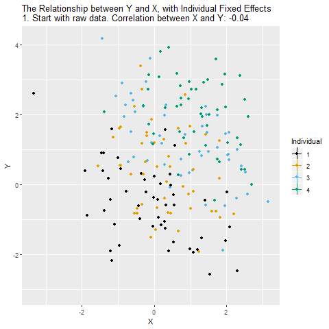

class: middle, center, inverse
# Panel Data

---
## Panel Data

Panel (or longitudinal) data are observations for $n$ entities observed at $T$ different periods. 

A balanced panel data has observations for all the $n$ entities at every period.

An unbalanced panel data will have some observations missing at some periods.


In this chapter we will focus on state traffic fatalities $(n = 48$ and $T = 7)$

An observed variable is denoted as $Y_{it}$

---
## Example: Traffic Deaths and Alcohol Taxes (1)

There are approximately 40,000 highway traffic fatalities each year in the US.

Approximately a quarter of fatal crashes involve a driver who was drinking.

It is estimated that 25% of drivers on the road between 1am and 3am have been drinking.

A driver who is legally drunk is at least 13 times as likely to cause a fatal crash as a driver who has not been drinking.

---
## Example: Traffic Deaths and Alcohol Taxes (2)

We want to study government policies that can be used to discourage drunk driving.

```{r message=FALSE, warning=FALSE}
library("knitr")
library("AER")
data("Fatalities")
fatality.data=Fatalities
fatality.data$year <- factor(fatality.data$year)
fatality.data$mrall <- with(Fatalities, fatal/pop * 10000) 
fatal.82.88.data <- subset(fatality.data, year %in% c("1982", "1988"))
```

---
## Example: Traffic Deaths and Alcohol Taxes (3)

Consider regressing $FatalityRate$ (annual traffic deaths per 10,000 people in a state) on $BeerTax$ $$\begin{alignat*}{3} \widehat{FatalityRate} = &~2.01 &{}+{} &0.15 BeerTax \qquad \text{(1982 data)} \\ &(0.15) & &(0.13) \\ \widehat{FatalityRate} = &~1.86 &{}+{} &0.44 BeerTax \qquad \text{(1988 data)} \\ &(0.11) & &(0.13) \end{alignat*}$$

---
class: center, middle, inverse
## Panel Data with Two Time Periods: "Before and After" Comparisons

---
## Dealing with Possible OVB

The previous regression very likely suffer from OVB (which omitted variables?).

We can expand our specification to include these omitted variables, but some, like cultural attitudes towards drinking and driving in different states, would be difficult to control for.

If such omitted variables are constant across time, then we can control for them using panel data methods.

Suppose we have observations for $T = 2$ periods for each of the $n = 48$ states.

This approach is based on comparing the _"differences"_ in the regression variables.

---
## Modeling the Time-Constant Omitted Variable

Consider having an omitted variable $Z_i$ that is state specific but constant across time

$$FatalityRate_{it} = \beta_0 + \beta_1 BeerTax_{it} + \beta_2 Z_i + u_{it}$$

Consider the model for the years 1982 and 1988

$$\begin{align*} FatalityRate_{i,1982} &= \beta_0 + \beta_1 BeerTax_{i,1982} + \beta_2 Z_i + u_{i,1982} \\ FatalityRate_{i,1988} &= \beta_0 + \beta_1 BeerTax_{i,1988} + \beta_2 Z_i + u_{i,1988} \end{align*}$$

---
## Regress on Changes (1)

Subtract the previous models for the two observed years

$$\begin{align*} FatalityRate_{i,1988}& - FatalityRate_{i,1982} = \\ &\beta_1 (BeerTax_{i,1988} - BeerTax_{i,1982}) \\ {} &+ (u_{i,1988} - u_{i,1982}) \end{align*}$$

Intuitively, by basing our regression on the change in fatalities we can ignore the time constant omitted variables.

---
## Regress on Changes (2)

If we regress the change in fatalities in states on the change in taxes we get $$\begin{align*} &\widehat{FatalityRate_{1988} - FatalityRate_{1982}} = \\ &\qquad {} - 0.072 - 1.04 (BeerTax_{1988} - BeerTax_{1982}) \end{align*}$$

(with standard errors $0.064$ and $0.26$, respectively)

We reject the hypothesis that $\beta_1$ is zero at the 5% level. 

According to this estimate an increase of $1 tax would reduce traffic fatalities by 1.04 deaths/10,000 people (a reduction by 2 of current average fatality in the data).

---
class: middle, center, inverse
## Fixed Effect Regression

---
## The Fixed Effects Regression Model

We can modify our previous model

$$Y_{it} = \beta_0 + \beta_1 X_{it} + \beta_2 Z_i + u_{it}$$

as

$$Y_{it} = \beta_1 X_{it} + \alpha_i + u_{it}$$

where $\alpha_i = \beta_0 + \beta_2Z_i$ are the $n$ entity specific intercepts.

These are also known as entity fixed effects, since they represent the constant effect of being in entity $i$.

---
## Dummy Variable Fixed Effects Regression Model

Let the dummy variable $D1_i$ be binary variable that equal 1 when $i = 1$, 0 otherwise. 

We can likewise define $n$ dummy variables $Dj_i$ which are equal to 1 when $j = i$. We can write our model as

$$Y_{it} = \beta_0 + \beta_1 X_{it} + \underbrace{\gamma_2 D2_i + \gamma_3 D3_i + \cdots + \gamma_n Dn_i}_{n-1 \text{ dummy variables}} + u_{it}$$

---
## Fixed Effects Animated

```{r echo=FALSE,fig.align='center' , message=FALSE, warning=FALSE}

```

---
## Multiple Regression Model

We can easily extend both forms of the fixed effects model to include multiple regressors

$$\begin{align*} Y_{it} &= \beta_1 X_{1,it} + \cdots + \beta_k X_{k,it} + \alpha_i + u_{it} \\ 
Y_{it} &= \beta_0 + \beta_1 X_{1,it} + \cdots + \beta_k X_{k,it}\\ {} &+ \gamma_2 D2_i + \gamma_3 D3_i + \cdots + \gamma_n Dn_i + u_{it} \end{align*}$$

---
## Estimation and Inference (1)

We now have $k + n$ coefficients to estimate

We are not interested in estimating the entity-specific effects so we need a way to subtract them from the regression. We use an "entity-demeaned" OLS algorithm.

  * We subtract the entity specific average from each variables
  * We regress the demeaned dependent variable on the demeaned regressors

---
## Estimation and Inference (2)

Taking averages of the fixed effects model $$\bar{Y}_i = \beta_1\bar{X}_i + \alpha_i + \bar{u}_i$$ 
and subtract it from the original model 
$$Y_{it} - \bar{Y}_i = \beta_1(X_{it} - \bar{X}_i) + (u_{it} - \bar{u}_i)$$ 
or 
$$\tilde{Y}_{it} = \beta_1 \tilde{X}_{it} + \tilde{u}_{it}$$
We will discuss needed assumptions in order to carry out OLS regression and inference below.

---
## Application to Traffic Deaths

```{r message=FALSE, warning=FALSE}
library(plm)
regress.results.fe.only <- plm(mrall ~ beertax, 
                               data=fatality.data, 
                               index=c('state', 'year'), 
                               effect='individual', 
                               model='within')
robust.se <- vcovHC(regress.results.fe.only, method="arellano", type="HC2")
coeftest(regress.results.fe.only, vcov = robust.se)

```

---
## Regressions with Time Fixed Effects

__Time Fixed Effects__

In the previous regression there is still a possibility of OVB due to effects are constant across states by different across time.

We can modify our model to

$$Y_{it} = \beta_0 + \beta_1 X_{it} + \beta_2 Z_i + \beta_3 S_t + u_{it}$$

where $S_t$ is unobserved.

---
## Time Effects Only (1)

Suppose that entity specific effects $(Z_i)$ are not present in our model but time effects are.

The same as with entity fixed effects we can model time effects as having a different intercept per time period $$Y_{it} = \beta_1 X_{it} + \lambda_t + u_{it}$$ where $\lambda_1,\dots, \lambda_T$ are the time fixed effects.

---
## Time Effects Only (2)

We can also use the dummy variable approach. Let $Bs_t$ be equal to 1 if $s = t$ and 0 otherwise.

$$Y_{it} = \beta_0 + \beta_1 X_{it} + \underbrace{\delta_2 B2_t + \cdots + \delta_T BT_t}_{T-1\text{ dummy variables}} + u_{it}$$

---
## Application to Traffic Deaths

```{r message=FALSE, warning=FALSE}
library(plm)
regress.results.fe.time1 <- plm(mrall ~ beertax, 
                               data=fatality.data, 
                               index=c('state', 'year'), 
                               effect='time', 
                               model='within')
robust.se <- vcovHC(regress.results.fe.time1, method="arellano", type="HC2")
coeftest(regress.results.fe.time1, vcov = robust.se)

```

---
## Both Entity and Time Fixed Effects

Now to control for both $Z_i$ and $S_t$ we have the combined entity and time fixed effects regression model

$$Y_{it} = \beta_1 X_{it} + \alpha_i + \lambda_t + u_{it}$$

or

$$\begin{align*} Y_{it} &= \beta_0 + \beta_1 X_{it} + \gamma_2 D2_i + \cdots + \gamma_n Dn_i \\ {}&+ \delta_2 B2_t + \cdots + \delta_T BT_t + u_{it} \end{align*}$$

---
## Application to Traffic Deaths

```{r message=FALSE, warning=FALSE}
regress.results.fe.time <- plm(mrall ~ beertax,
                               data = fatality.data, 
                               index = c('state', 'year'), 
                               effect = 'twoways', 
                               model = 'within')
robust.se <- vcovHC(regress.results.fe.time, method="arellano", type="HC2")
coeftest(regress.results.fe.time, vcov = robust.se)
```

---
class: center, middle, inverse
## The Fixed Effects Regression Assumptions and Standard Errors for Fixed Effects Regression

---
## The Fixed Effects Regression Assumptions

$$Y_{it} = \beta_1 X_{it} + \alpha_i + u_{it},~~i = 1, \dots,n,~~t = 1,\dots,T.$$

- FE.A.1: $u_{it}$ has conditional mean zero: $E[u_{it}|X_{i1}, \dots, X_{iT}, \alpha_i] = 0$.
- FE.A.2: $(X_{i1}, \dots, X_{iT}, u_{i1},\dots,u_{iT})$, $i = 1,\dots,n$ are i.i.d. draws from their joint distribution.
- FE.A.3: Large outliers are unlikely.
- FE.A.4: No perfect multicollinearity.

---
## Serial Correlation of Standard Errors (1)

An important assumption for fixed effects regressions is FE.A.2

The assumption requires variables to be independent across entities but not necessarily within entities.

For example any $X_{it}$ and $X_{is}$ for $t \ne s$ can be correlated: this is called autocorrelation or serial correlation.

---
## Serial Correlation of Standard Errors (2)

Autocorrelation is common in time series and panel data: 

what happens in one period is probably correlated with what happens in other periods for the same entity.

The same can be said for the error terms $u_{it}$.

For that reason we need to use heteroskedasticity- and autocorrelation-consistent (HAC) standard errors.

---
## Let us test for Serial Correlation in R

```{r,echo=TRUE}
pbgtest(regress.results.fe.time)
```

---
## Robust Standard Errors

We will use two types of robust standard erros to deal with the problem of heteroskedasticity.

- General Robust Standard errors
- Clustered Robust Standard Errors

---
## Robust Standard Errors

In regression and time-series modelling, basic forms of models make use of the assumption that the errors or disturbances $u_i$ have the same variance across all observation points. 

When this is not the case, the errors are said to be heteroscedastic, or to have heteroscedasticity, and this behaviour will be reflected in the residuals $u_i$  estimated from a fitted model. 

Heteroscedasticity-consistent standard errors are used to allow the fitting of a model that does contain heteroscedastic residuals. 

The first such approach was proposed by Huber (1967), and further improved procedures have been produced since for cross-sectional data, time-series data and GARCH estimation.

---
## How to test for heteroscedasticity in R

We use the Breusch-Pagan test to detect heteroskedasticity. The null hypothesis is homoskedasticity in the errors.

```{r,echo=TRUE}
library(lmtest)
bptest(mrall ~ beertax+factor(state)+factor(year), data = fatality.data, studentize=F)
```

---
## Clustered Robust Standard Errors
Let's say that you want to relax the Gauss-Markov homoskedasticity assumption, and account for the fact that there may be several different covariance structures within your data sample that vary by a certain characteristic - a "cluster" - but are homoskedastic within each cluster.

For example, say you have a panel data set with a bunch of different test scores from different schools around the country. 

You may want to cluster your sample by state, by school district, or even by town. 

Economic theory and intuition will guide you in this decision.
