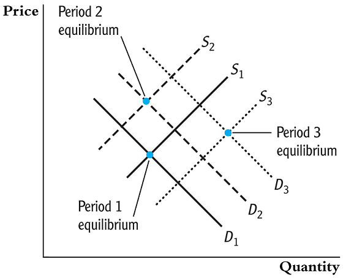
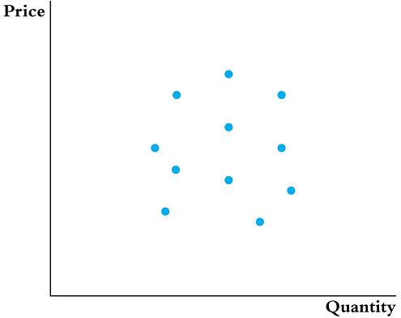
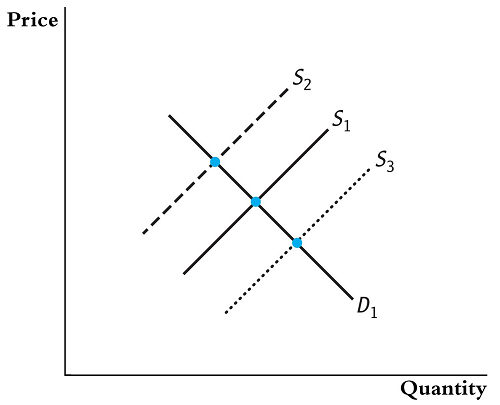
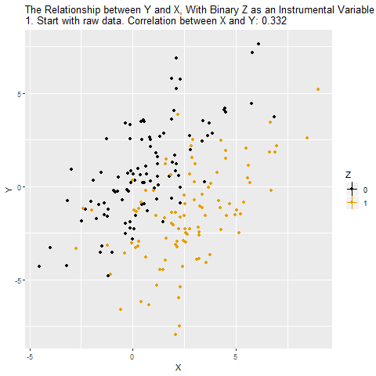

class: middle, center, inverse
# Intrumental Variables

---
## Introduction (1)

- As discussed many times before, correlation between the error terms and regressors is a serious threat to internal validity.
- We know this can happen because of omitted variables, measurement errors, and simultaneous causality.
- __Instrumental variables (IV) regression__ is an approach to eliminate any inconsistency in our estimation because of correlation with the error terms.

---
## Introduction (2)

- We can imagine that a regressor $X$ has two parts: the part that is correlated with $u$ and another that is not
- We use instrumental variables (or instruments, for short) to isolate the uncorrelated part and use it in our estimation.
- Let's use a Venn-Diagram illustrating the variation in 
    + the Outcome Variable $(Y)$
    + the Treatment Variable $(X)$ and
    + the Instrumental Variable $(Z)$

---
## Visual Concept

```{r echo=FALSE, message=FALSE, warning=FALSE, out.width="50%", fig.align='center'}
library(knitr)
include_graphics("instrumental-variables.png")
```

- The $\color{green}{Green\, circle\, is\, the\, unexplained\, variation.}$
- The $\color{red}{Red\, circle\, is\, the\, correlated\, part\, of\, X\, with\, the\, error.}$
- The $\color{blue}{Blue\, circle\, is\, the\, uncorrelated\, part\, of\, X\, with\, the\, error.}$
- The $\color{orange}{Orange\, circle\, shows\, where\, X\, and\, Z\, are\, correlated.}$
- The $\color{purple}{Purple\, circle\, shows\, where\, X,\, Y,\, and\, Z\, are\, correlated.}$

---
## Education Example

$$ln(wage)= \beta_0+\beta_1*EDUC+\beta_2*EXP +\beta_3*EXP^2+...+u$$

What is $u$? 

- Ability
- Motivation
- Everything Else that affects wage

Further, we can think of the Education as function.
$$EDUC=f(GENDER,S-E, location, Ability, Motivation)$$

---
## What influences Log wages?

$$\begin{align*} ln(wage) &=\beta_0+\beta_1*EDUC(X,Ability,Motivation)+\beta_2*EXP \\
&+\beta_3*EXP^2+...+u(Ability,Motivation)\end{align*}$$

Increased __Ability__ is associated with increases in Education and $u$. 

What looks like an effect due to an increase in Education may be an increase in __Ability__. 

The estimate of $\beta_1$ picks up the effect of Education and the hidden effect of __Ability__.

---
## An Exogenous Influence

$$ln(wage)=\beta_0+\beta_1*EDUC(Z,X,Ability,Motivation) \\
+\beta_2*EXP+\beta_3*EXP^2+...+u(Ability,Motivation)$$

A variable Z is associated with an increase in Education, but does not affect the error $u$.

An effect due to an increase of Z on Education will only be an increase in Education. For changes in Z, we can estimate changes in log wages that are caused by education.

- Z is an Instrumental Variable

---
## Instrumental Variables Regression

Three important threats to internal validity are:

- __omitted variable bias__ from a variable that is correlated with X but is unobserved, so cannot be included in the regression;
- __simultaneous causality bias__ (X causes Y,  Y causes X);
- __errors-in-variables bias or measurement error__ (X is measured with error)

Instrumental variables regression can eliminate bias when 
$E(u|X) \ne 0$ by using an _instrumental variable, Z_

---
class: middle, center, inverse
## The IV Estimator with a Single Regressor and a Single Instrument

---
## The IV Model

Let our population regression model be

$$Y_i = \beta_0 + \beta_1 X_i + u_i,~~i=1,\dots,n$$

and let the variable $Z_i$ be an instrumental variable that isolates the part of $X_i$ that is uncorrelated with $u_i$.

---
## Endogeneity and Exogeneity

- We define variables that are correlated with the error term as __endogenous__
- We define variables that are uncorrelated with the error term as __exogenous__
- Exogenous variables are those that are determined outside our model
- Endogenous variables are determined from within our model. For example, in the cause of simultaneous causality, both our dependent variable $Y$ and the regressor $X$ are endogenous.

---
## Conditions for a Valid Instrument

- Instrument relevance condition: $Corr(Z_i, X_i) \ne 0$
- Instrument exogeneity condition: $Corr(Z_i, u_i) = 0$

The first condition simply says that the instrument, $Z$, is correlated with the endogenous variable of interest, $X$. So $Z$ explains _some_ of $X$.

The second condition says that $Z$ is independent of the error term, $u$. This means that Z can explain X, but does so only with the uncorrelated portion of X.

---
## The Two Stage Least Squares Estimator (1)

If valid instrument, $Z$, is available, we are able to estimate the coefficient $\beta_1$ using two stage least squares (TSLS).

- decompose $X$ into its two components to isolate the component that is uncorrelated with the error terms. $$X_i = \underbrace{\pi_0 + \pi_1 Z_i}_{\text{uncorrelated component}} + v_i$$Since we don't observe $\pi_0$ and $\pi_1$ we need to estimate them using OLS $$\hat{X}_i = \hat{\pi}_0 + \hat{\pi}_1 Z_i$$

---
## The Two Stage Least Squares Estimator (2)

Then, we use this uncorrelated component to estimate $\beta_1$: we regress $Y_i$ on $\hat{X}_i$ using OLS to estimate $\beta_0^{TSLS}$ and $\beta_1^{TSLS}$.

---
## Example: Philip Wright's Problem

Suppose we wanted to estimate the price elasticity in the log-log model

$$\ln(Q_i^{butter}) = \beta_0 + \beta_1 \ln(P_i^{butter}) + u_i$$

if we had a sample of $n$ observations of quantity demanded and the equilibrium price, we can run an OLS estimation to estimate the elasticity coefficient $\beta_1$.

---
## Supply and Demand (1)



---
## Supply and Demand (2)



---
## Supply and Demand (3)



---
## IV Animated

```{r echo=FALSE, message=FALSE, warning=FALSE,fig.align='center'}

```

---
## Example: Estimating the Effect on Test Scores of Class Size

- Consider the estimation undertaken before using data from 420 California school districts
- A variety of regressors were added to the regression specification to address possible OVB.
- However, there are still some possible factors that are omitted: teacher quality and opportunities outside school.
- A possible hypothetical instrument: an earthquake causes closure of some schools until repairs are completed. Students are then expected to attend classes in neighboring schools unaffected by the earthquake causing an increase in their class sizes.

---
## The Sampling Distribution of the TSLS Estimator (1)

- The exact distribution of the TSLS estimator is complicated in small samples.
- But in large samples it approaches a normal distribution.
- Using a single regressor the calculation of the TSLS is simple $$\hat{\beta}_1^{TSLS} = \frac{s_{ZY}}{s_{ZX}}$$

---
## The Sampling Distribution of the TSLS Estimator (2)

This can be shown because

$$\begin{align*} Cov(Z_i, Y_i) &= Cov[Z_i, (\beta_0 + \beta_1 X_i + u_i)]\\ &= \beta_1 Cov(Z_i, X_i) + Cov(Z_i, u_i) \end{align*}$$

And since $Cov(Z_i, u_i) = 0$ and $Cov(Z_i, X_i) \ne 0$

$$\beta_1 = \frac{Cov(Z_i, Y_i)}{Cov(Z_i, X_i)}$$

---
## The Sampling Distribution of the TSLS Estimator (3)

Since $$\begin{align*} s_{ZY} &\overset{p}{\longrightarrow} Cov(Z_i, Y_i) \\ s_{ZX} &\overset{p}{\longrightarrow} Cov(Z_i, X_i) \end{align*}$$

therefore

$$\hat{\beta}_1^{TSLS} = \frac{s_{ZY}}{s_{ZX}} \overset{p}{\longrightarrow} \frac{Cov(Z_i, Y_i)}{Cov(Z_i, X_i)} = \beta_1$$
---
class: inverse, middle, center
# Application to the Demand for Cigarettes

---
## Application to the Demand for Cigarettes (1)

- Consider the question of imposing a tax on cigarettes in order to reduce illness and deaths from smoking-in addition to other negative externalities on society.
- If the elasticity of demand is responsive to changes in cigarette prices, then it would be easy to impose a policy to reduce smoking by any desired proportion.
- We need to estimate this elasticity, but we cannot rely on data of demand and prices
- We need to use an instrumental variable.

---
## Application to the Demand for Cigarettes (2)

We have cross-sectional data from 48 US states in 1995 with the variables

- $SalesTax_i$: Which we use as an instrument.
- $Q_i^{cigarettes}$: Cigarette consumption: number of packs sold/capita in state $i$
- $P_i^{cigarettes}$: Average real price/pack including all taxes

---
## Application to the Demand for Cigarettes (3)

Before we can carry out TSLS estimation we must investigate the relevance of our instrument.

- First, instrument relevance: since higher sales taxes would lead to higher cigarette prices this condition is plausibly satisfied.
- Second, instrument exogeneity: since sales taxes are set driven by questions of public finance and politics, and not questions of cigarette consumption, this condition is also plausibly satisfied.

---
## Application to the Demand for Cigarettes (4)

Statistical software conceals the various steps needed for IV regression, but it can be useful to demonstrate the steps here

The first state regression yields $$\begin{alignat*}{2} \widehat{\ln(P_i^{cigarettes})} = &4.63 + &&~0.031 SalesTax_i \\ &(0.03) &&~(0.005) \end{alignat*}$$

with $R^2 = 0.47$.

---
## Data

```{r,echo=TRUE}
suppressMessages(library("AER"))
suppressMessages(library("plm"))
data("CigarettesSW")
```

---
## Data (2)

```{r,echo=TRUE}
cig.data=CigarettesSW
cig.data$packpc=cig.data$pack
cig.data$ravgprs <- cig.data$price/cig.data$cpi # real average price
cig.data$rtax <- cig.data$tax/cig.data$cpi # real average cig tax
cig.data$rtaxs <- cig.data$taxs/cig.data$cpi # real average total tax
cig.data$rtaxso <- cig.data$rtaxs - cig.data$rtax # instrument 
```

---
## The first stage regression:

```{r,echo=TRUE}
first.stage.res <- lm(log(ravgprs) ~ rtaxso, data=cig.data, subset=(year == 1995))
coeftest(first.stage.res, vcov.=vcovHAC(first.stage.res))
```

---
## Application to the Demand for Cigarettes (5)

In the second stage, $\ln(Q_i^{cigarettes})$ is regressed on $\widehat{\ln(P_i^{cigarettes})}$ $$\begin{alignat*}{3} \widehat{\ln(Q_i^{cigarettes})} = &9.72 - &&~1.08 \widehat{\ln(P_i^{cigarettes})} \\ &(1.53) &&~(0.32) \end{alignat*}$$

---
## IV regression in R

```{r,echo=TRUE}
library(AER)
iv.res <- ivreg(log(packpc) ~ log(ravgprs) | rtaxso, data=cig.data, subset=(year == 1995))
coeftest(iv.res, vcov.=vcovHAC(iv.res))
```

---
## Application to the Demand for Cigarettes (6)

This is a strong relationship between prices and demand. 

But perhaps our assumption of exogeneity might not be very valid. 

Consider income: states with higher income might not need to rely on taxes for revenue and there is presumably an effect of income on consumption of cigarettes.

---
class: center, middle, inverse
## The General IV Regression Model

---
## Variables of the General IV Regression Model (1)

$$Y_i = \beta_0 + \beta_1 X_{1i} + \cdots + \beta_k X_{ki} + \beta_{k+1} W_{1i} + \cdots + \beta_{k+r}W_{ri} + u_i$$

For $i = 1,\dots,n$,

- __dependent variable__: $Y_i$
- __endogenous regressors__: $X_{1i},\dots, X_{ki}$
- __included exogenous regressors__: $W_{1i},\dots$
- __instrumental variables__: $Z_{1i},\dots, Z_{mi}$

---
## Variables of the General IV Regression Model (2)

Let $m$ be the number of instruments and $k$ be the number of endogenous regressors. The coefficients of this model are said to be

- __exactly identified__: if $m = k$
- __overidentified__: if $m > k$
- __underidentified__: if $m < k$

For an IV regression to be possible, we must have exact identification or overidentification.

---
## Included Exogenous Variables and Control Variables in IV Regression (1)

The variables in $W$ can either be

- __exogenous variables__: in which case $E[u_i|W_i] = 0$
- __control variables__: which have no causal interpretation are used to ensure there is no correlation between the included and instrumental variables and the error terms.

---
## Included Exogenous Variables and Control Variables in IV Regression (2)

For example, in the model

$$\ln(Q_i^{cigarettes}) = \beta_0 + \beta_1\ln(P_i^{cigarettes}) + u_i$$

we raised the possibility of having income has an omitted factor that would be correlated with sales tax. If we added income directly or a control for it we can remove this bias.

---
## TSLS in the General IV Model (1)

Let our model be
$$Y_i = \beta_0 + \beta_1 X_{i} + \beta_{2} W_{1i} + \cdots + \beta_{1+r}W_{ri} + u_i$$
The first stage (which is often called the __reduced form__ equation for $X$) would be
$$\begin{align*} X_i = &\pi_0 + \pi_1 Z_{1i} + \cdots + \pi_m Z_{mi}\\ {}+ &\pi_{m+1} W_{i1} + \cdots + \pi_{m+r}W_{ri} + v_i \end{align*}$$
and from it we can estimate $\hat{X}_1, \dots, \hat{X}_n$. 

---
## TSLS in the General IV Model (2)

The second stage would then be
$$Y_i = \beta_0 + \beta_1 \hat{X}_{i} + \beta_{2} W_{1i} + \cdots + \beta_{1+r}W_{ri} + u_i.$$
If we have multiple endogenous regressors, $X_{1i},\dots,X_{ki}$, we would repeat the first stage for each of the $k$ regressors, and plug them in in the second stage.

---
## Conditions for Valid Instruments in the General IV Model

- __Instrument relevance__: In general if $\hat{X}_{1i}$ denotes the predicted value for $X_{1i}$ using the instruments $Z$, then $(\hat{X}_{1i},\dots,\hat{X}_{ki},W_{1i}, W_{ri},1)$ must not be perfectly multicollinear.
- __Instrument exogeneity__: $Corr(Z_{1i},u_i) = 0, \dots, Corr(Z_{mi}, u_i) = 0$

---
## The IV Regression Assumptions

- __IV.A.1__: $E[u_i|W_{1i}, \dots, W_{ri}] = 0$.
- __IV.A.2__: $(X_{1i},\dots,X_{ki},W_{1i},\dots,W_{ri}, Z_{1i}, \dots, Z_{mi}, Y_i)$ are i.i.d. draws from their joint distribution.
- __IV.A.3__: Large outliers are unlikely
- __IV.A.4__: Instruments satisfy the two conditions for being valid.

---
## Application to the Demand for Cigarettes (1)

As stated before, when we regressed quantity demanded on prices, using sales taxes as an instrument, we might have correlation with the error since state income might be correlated with sales taxes. So, now let's add an exogenous variable for income

$$\begin{alignat*}{5} \widehat{\ln(Q_i^{cigarettes})} = &9.43 - &&1.14 \widehat{\ln(P_i^{cigarettes})} + &&0.21\ln(Inc_i) \\ &(1.26) &&(0.37) && (0.31) \end{alignat*}$$

---
## Application to the Demand for Cigarettes in R (1)

```{r}
cig.data$perinc <- cig.data$income/(cig.data$pop * cig.data$cpi)

iv.res.2 <- ivreg(log(packpc) ~ log(ravgprs) + log(perinc) 
                  | rtaxso + log(perinc), data=cig.data, 
                  subset=(year == 1995))
coeftest(iv.res.2, vcov.=vcovHAC(iv.res.2))
```

---
## Application to the Demand for Cigarettes (2)

Now instead of using only one instrument we can use two: $SalesTax_i$ and $CigTax_i$, so $m = 2$, making this model overidentified.

$$\begin{alignat*}{5} \widehat{\ln(Q_i^{cigarettes})} = &9.89 - &&1.28 \widehat{\ln(P_i^{cigarettes})} + &&0.28\ln(Inc_i) \\ &(0.96) &&(0.25) &&(0.25) \end{alignat*}$$

---
## Application to the Demand for Cigarettes in R (2)

```{r}
iv.res.3 <- ivreg(log(packpc) ~ log(ravgprs) + log(perinc) 
                  | rtaxso + rtax + log(perinc), data=cig.data, 
                  subset=(year == 1995))
coeftest(iv.res.3, vcov.=vcovHAC(iv.res.3)) # For Robust Standard Errors
```

---
class: middle, center, inverse
# Instrument Validity

---
## Checking Instrument Validity

- How do you know you have good instruments?

#### Assumption #1: Instrument Relevance

- The relevance of an instrument (the more the variation in $X$ is explained by the instrument) plays the same role as sample size: it produces more accurate estimators.
- Instruments that do not explain a lot of the variation in $X$ are called __weak instruments__. For example, distance of the state from cigarette manufacturing.

---
## Why Weak Instruments are a Problem? (1)

- If instruments are weak, it is like having a very small sample size: the approximation of the estimator's distribution to the normal distribution is very poor.
- Recall that with a single regressor and instrument
    $$\hat{\beta}_1^{TSLS} = \frac{s_{ZY}}{s_{ZX}} \overset{p}{\longrightarrow} \frac{Cov(Z_i, Y_i)}{Cov(Z_i, X_i)} = \beta_1$$

---
## Why Weak Instruments are a Problem? (2)

- Suppose that the instrument is completely irrelevant so that $Cov(Z_i, X_i) = 0$, then
    $$s_{ZX} \overset{p}{\longrightarrow} Cov(Z_i, X_i) = 0$$
    Causing the denominator of $Cov(Z_i,Y_i)/Cov(Z_i,X_i)$ to be zero, which makes the distribution of $\beta_1^{TSLS}$ not normal.
- A similar problem would be encountered with instruments that are not completely irrelevant but are weak.

---
## Checking for Weak Instruments

- To check for weak instruments, compute the $F$-statistic testing the hypothesis that the coefficients on all the instruments are zero in the first stage.
- A rule of thumb is not to worry about weak instruments if the __first-stage $F$-statistic__ is greater than 10.

---
## What to Do with Weak Instruments

- If the model is overidentified and we have both weak and strong instruments, it is best to drop the weak instruments

- However, if the model is exactly identified, it is not possible to drop any instruments. 

- In this case, we should try find stronger instruments (not a very easy task) or use the weak instruments with other methods than TSLS that are less sensitive to weak instruments.

---
## Why Weak Instruments are a Problem? (2)

- Suppose that the instrument is completely irrelevant so that $Cov(Z_i, X_i) = 0$, then
    $$s_{ZX} \overset{p}{\longrightarrow} Cov(Z_i, X_i) = 0$$

- Causing the denominator of $Cov(Z_i,Y_i)/Cov(Z_i,X_i)$ to be zero, which makes the distribution of $\beta_1^{TSLS}$ not normal.

- A similar problem would be encountered with instruments that are not completely irrelevant but are weak.

---
## Checking for Weak Instruments

- To check for weak instruments, compute the $F$-statistic testing the hypothesis that the coefficients on all the instruments are zero in the first stage.

- A rule of thumb is not to worry about weak instruments if the first-stage $F$-statistic is greater than 10.

#### Assumption #2: Instrument Exogeneity

If the instruments are not exogenous then TSLS estimators will suffer from inconsistency.

---
## Can Exogeneity be Statistically Tested?

- If the model is exactly identified we cannot test for exogeneity
- If the model is overidentified it is possible to test the hypothesis that the "extra'' instruments are exogenous under the assumption that there are enough valid instruments to identify the coefficients of interest __(test of overidentified restrictions)__.

---
## The Overidentifying Restrictions Test (The J-Statistic) (1)

- Suppose you have a model with one endogenous regressor and two instruments
- We can test for exogeneity by running two IV regressions once with each of the instruments
- If they are both valid, we should expect our estimates to be close, otherwise we should be suspicious of the validity one or both of the instruments.

---
## The Overidentifying Restrictions Test (The J-Statistic) (2)

We can test for exogeneity using the $J$-statistic. We do this by estimating the following regression

$$\begin{align*} \hat{u}_i^{TSLS} = &\delta_0 + \delta_1 Z_{1i} + \cdots + \delta_m Z_{mi}\\ {}+ &\delta_{m+1} W_{1i} + \cdots + \delta_{m+r} W_{ri} + e_i \end{align*}$$

and using an $F$-test for $\delta_1 = \cdots = \delta_m = 0$

---
class: middle, inverse, center
# Overidentification Test witin the Application to the Demand for Cigarettes

---
## Instrument Validity (1)

In our previous TSLS we used two instruments: $SalesTax_i$ and $CigTax_i$, and one exogenous regressor: state income.

There are still concerns about the exogeneity of $CigTax_i$: there could be state specific characteristics that influence both cigarette taxes and cigarette consumption.

---
## Instrument Validity (2)

- Luckily, we have panel data so we can eliminate state fixed effects.
- To simplify matters we will focus on the differences between 1985 and 1995.

 - We regress $[\ln(Q_{i,1995}^{cigarettes}) - \ln(Q_{i,1985}^{cigarettes})]$ on $[\ln(P_{i,1995}^{cigarettes}) - \ln(P_{i,1985}^{cigarettes})]$ and $[\ln(Inc_{i,1995}) - \ln(Inc_{i,1985})]$
    
    - We use as instruments $[SalexTax_{i,1995} - SalesTax_{i,1985}]$ and $[CigTax_{i,1995} - CigTax_{i,1985}]$

---
## We are actually going to run a state fixed effects regression using all the data.

```{r}
panel.iv.res.1 <- plm(log(packpc) ~ log(ravgprs) + log(perinc) 
                      | rtaxso + log(perinc), data=cig.data, 
                      method="within", effect="individual", 
                      index=c("state", "year"))
coeftest(panel.iv.res.1, vcov.=vcovHC(panel.iv.res.1))
```

---
## First Stage $F$-test

```{r}
panel.1st.stage.res.1 <- lm(log(ravgprs) ~ rtaxso, data=cig.data)
lht(panel.1st.stage.res.1, "rtaxso = 0", vcov=vcovHAC)
```

---
## Different IV

```{r}
panel.iv.res.2 <- plm(log(packpc) ~ log(ravgprs) + log(perinc)
                      | rtax + log(perinc), data=cig.data, 
                      method="within", effect="individual", 
                      index=c("state", "year"))
coeftest(panel.iv.res.2, vcov.=vcovHC(panel.iv.res.2))
```

---
## First Stage $F$-test

```{r}
panel.1st.stage.res.2 <- lm(log(ravgprs) ~ rtax, data=cig.data)
lht(panel.1st.stage.res.2, "rtax = 0", vcov=vcovHAC)
```

---
## This time we include both instruments

```{r}
panel.iv.res.3 <- plm(log(packpc) ~ log(ravgprs) 
                      + log(perinc) | rtaxso + rtax + log(perinc),
                      data=cig.data, method="within", effect="individual",
                      index=c("state", "year"))
coeftest(panel.iv.res.3, vcov.=vcovHC(panel.iv.res.3))
```

---
## First Stage $F$-test

```{r}
panel.1st.stage.res.3 <- lm(log(ravgprs) ~ rtaxso + rtax, data=cig.data)
lht(panel.1st.stage.res.3, c("rtaxso = 0", "rtax = 0"), vcov=vcovHAC)
```

---
## Hansen _J_-test:

```{r}
j.test.reg <- lm(panel.iv.res.3$residuals ~ rtaxso + rtax + log(perinc), data=cig.data)
lht(j.test.reg, c("rtaxso = 0", "rtax = 0"), vcov.=vcovHAC)
```

---
## References

J. Angrist, "Lifetime Earnings and the Vietnam Era Draft Lottery: Evidence from Social Security Administrative Records," American Economic Review, June 1990. 5

J. Angrist and A. Krueger, "Does Compulsory School Attendance Affect Schooling and Earnings?", Quarterly Journal of Economics 106, November 1991.

J. Angrist, et al., "Who benefits from KIPP?", J. of Policy Analysis and Management, Fall 2012.

J. Angrist, V. Lavy, and A. Schlosser, "Multiple Experiments for the Quantity and Quality of Children", Journal of Labor Economics 28, October 2010.

