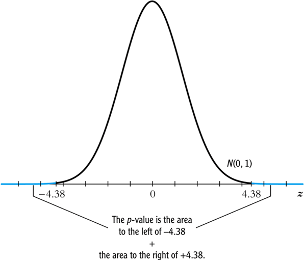
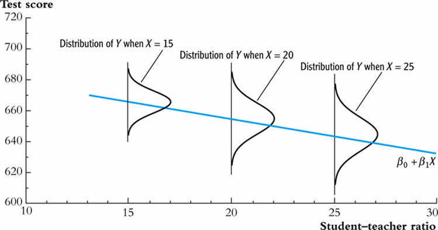
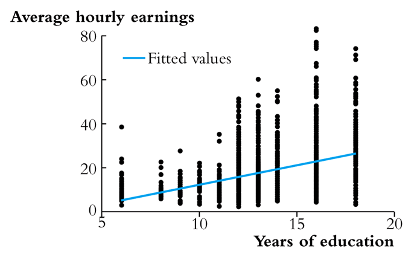
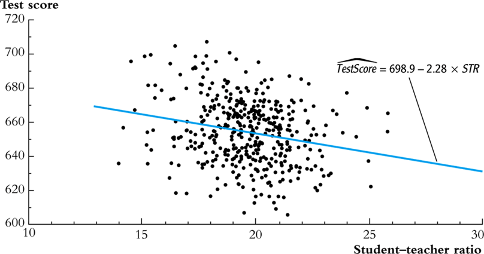

## Outline

1.  The standard error of $\hat{\beta_i}$ 
2.  Hypothesis tests concerning $\beta_1$
3.  Confidence intervals for $\beta_1$
4.  Regression when $X$ is binary
5.  Heteroskedasticity and homoskedasticity
6.  Efficiency of OLS and the Student t distribution

---
## A big picture review of where we are going

1.  We want to learn about the slope of the population regression line. We have data from a sample, so there is sampling uncertainty. There are five steps towards this goal:
2.  State the population object of interest 
3.  Provide an estimator of this population object
4.  Derive the sampling distribution of the estimator (this requires certain assumptions). In large samples this sampling distribution will be normal by the CLT.
5.  The square root of the estimated variance of the sampling distribution is the standard error (SE) of the estimator
6.  Use the SE to construct t-statistics (for hypothesis tests) and confidence intervals.

---
## Object of Interest

$$Y_i = \beta_0+\beta_1 X_i +u_i, i=1,\dots,n$$  
$\beta=\frac{\Delta Y}{\Delta X}$, for an autonomous change in __X (causal effect)__
 
__ESTIMATOR__: the OLS estimator $\hat{\beta_1}$.

__The Sampling Distribution of $\hat{\beta_1}$:__
To derive the large-sample distribution of $\hat{\beta_1}$, we make the following assumptions:
The Least Squares Assumptions:

1.  $E(u|X = x) = 0.$
2.  $(X_i,Y_i), i=1,\dots,n$ are i.i.d.
3.  Large outliers are rare $(E(X4) < \infty, E(Y4) < \infty$.

---
## The Sampling Distribution

Under the Least Squares Assumptions, for n large, $\hat{\beta_1}$ is approximately distributed,

$$\hat{\beta_1} ~ N(\beta_1,\frac{\sigma^{2}_{v}}{n(\sigma^{2}_{x})^{2}})$$

---
## General approach: construct t-statistic, and compute p-value 

- __In General__ : $t=\frac{\text{esimator}-\text{hypothesis value}}{\text{standard error of the estimator}}$

where the SE of the estimator is the square root of an estimator of the variance of the estimator.

- For testing the mean of Y: $$t=\frac{\bar{Y}-\mu_Y}{s_y/\sqrt{n}}$$
- For testing the mean of $\beta$: $$t=\frac{\hat{\beta}-\beta}{SE(\hat{\beta})}$$

---
## Example:  Test Scores and STR, California data 

Estimated regression line: $\hat{Test Score}=698.9-2.28STR$

Regression software reports the standard errors: $SE(\hat{\beta_0})=10.4$ and $SE(\hat{\beta_1})=0.52$
$$t=\frac{\hat{\beta}-\beta}{SE(\hat{\beta})}=\frac{-2.28-0}{0.52}=-4.38$$

- The 1% 2-sided critical t-statistic is 2.58, so we reject the null at the 1% significance level.
- Alternatively, we can compute the p-value.

---
## P-value



---
## Confidence Intervals for $\beta$ 

Recall that a 95% confidence is, equivalently:

- The set of points that cannot be rejected at the 5% significance level;
- A set-valued function of the data (an interval that is a function of the data) that contains the true parameter value 95% of the time in repeated samples.

Because the t-statistic for $\beta_1$ is N(0,1) in large samples, construction of a 95% confidence for $\beta_1$ is just like the case of the sample mean:  

95% confidence interval for $\beta_1$ = { $\hat{\beta_1}\pm 1.96 *SE(\hat{\beta_1}$)}

---
## Confidence interval example:  Test Scores and STR

Recall, we estimated an equation relating student/teacher ratio to test scores

- Estimated regression line: $\hat{Test Score}=698.9-2.28STR$
- Regression software reports the standard errors: $SE(\hat{\beta_0})=10.4$ and $SE(\hat{\beta_1})=0.52$

95% confidence interval for $\hat{\beta_1}$:

$(\hat{\beta_1} \pm 1.96*SE(\hat{\beta_1})) = {-2.28 \pm 1.96*0.52} = (-3.30, -1.26)$

__The following two statements are equivalent (why?)__

- The 95% confidence interval does not include zero;
- The hypothesis $\beta$ is rejected at the 5% level

---
## Hypothesis testing and confidence intervals in R (1)
In this section, we perform hypothesis test with R. 

First, we need to estimate the regression equation again and save the results as regress.results.

```{r,echo=FALSE, warning=FALSE, message=FALSE}
suppressPackageStartupMessages(library(AER,quietly=TRUE,warn.conflicts=FALSE))
library(ggplot2,quietly=TRUE,warn.conflicts=FALSE)
data("CASchools")
CASchools$str=CASchools$students/CASchools$teachers
CASchools$testscr=(CASchools$read+CASchools$math)/2
regress.results=lm(formula = testscr ~ str, data=CASchools)
summary(regress.results)
```

---
## Hypothesis testing and confidence intervals in R (2)
In this section, we perform hypothesis with R. 

Second, we can use the following commands to find a CI.

```{r}
confint(regress.results, level=0.95) # CIs for model parameters 
```

---
## Heteroskedasticity vs Homoskedasticity Standard Errors

1.  What is it?
2.  Consequences of homoskedasticity
3.  Implication for computing standard errors

__What do these two terms mean?__

- If var(u|X=x) is constant 
- that is, if the variance of the conditional distribution of u given X does not depend on X 
- then u is said to be __homoskedastic__. 
- Otherwise, u is __heteroskedastic__.

---
## Homoskedasticity in a picture: 


- E(u|X=x) = 0 (u satisfies Least Squares Assumption #1)
- The variance of u does not depend on x 

---
## Heteroskedastic or homoskedastic?


A real-data example from labor economics:  average hourly earnings vs. years of education (data source: Current Population Survey)

---
## Heteroskedastic or homoskedastic?


The Class Size Data

---
## Practical Implications

- The homoskedasticity-only formula for the standard error of  and the "heteroskedasticity-robust" formula differ - so in general, you get different standard errors using the different formulas.
- Homoskedasticity-only standard errors are the default setting in regression software 
- sometimes the only setting (e.g. Excel).  To get the general "heteroskedasticity-robust" standard errors you must override the default.
- _If you don't override the default and there is in fact heteroskedasticity, your standard errors (and t-statistics and confidence intervals) will be wrong 
- typically, homoskedasticity-only SEs are too small.

---
## How to get robust standard errors in R

Most statistical package have very simple and convienent ways to deal with heteroskedastic standard errors. However, R makes you do a little bit more work.

First, we need to install a package called sandwitch. 

Second, we will calculate the SE's for all of the potential alternative specifications.

---
## How to get robust standard errors in R
```{r}
library(sandwich) # package needed to construct robust SE's

# check that "sandwich" returns HC0
coeftest(regress.results, vcov = sandwich)                # robust; sandwich
coeftest(regress.results, vcov = vcovHC(regress.results, "HC0"))    # robust; HC0 
```

---
## How to get robust standard errors in R

```{r}
# check that the default robust var-cov matrix is HC3
coeftest(regress.results, vcov = vcovHC(regress.results))           # robust; HC3 
coeftest(regress.results, vcov = vcovHC(regress.results, "HC3"))    # robust; HC3 (default)
```

---
## How to get robust standard errors in R

```{r}
# reproduce the Stata default
coeftest(regress.results, vcov = vcovHC(regress.results, "HC1"))    # robust; HC1 (Stata default)
```

---
## The Bottom Line

- If the errors are either homoskedastic or heteroskedastic and you use heteroskedastic-robust standard errors, you are OK
- If the errors are heteroskedastic and you use the homoskedasticity-only formula for standard errors, your standard errors will be wrong (the homoskedasticity-only estimator of the variance of $\hat{\beta}$ is inconsistent if there is heteroskedasticity).
- The two formulas coincide (when n is large) in the special case of homoskedasticity
- So, you should always use heteroskedasticity-robust standard errors.

---
## The Extended Least Squares Assumptions

These consist of the three LS assumptions, plus two more:

1.  E(u|X = x) = 0.
2.  $(X_i,Y_i)$, i =1,.,n, are i.i.d.
3.  Large outliers are rare $(E(Y^4) < \infty, E(X^4) < \infty).$
4.  u is homoskedastic
5.  u is distributed $N(0,\sigma^2)$

Assumptions 4 and 5 are more restrictive - so they apply to fewer cases in practice.  

However, if you make these assumptions, then certain mathematical calculations simplify and you can prove strong results 
- results that hold if these additional assumptions are true.
