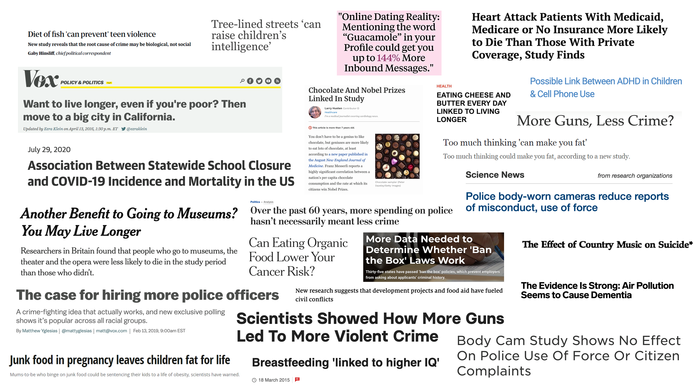
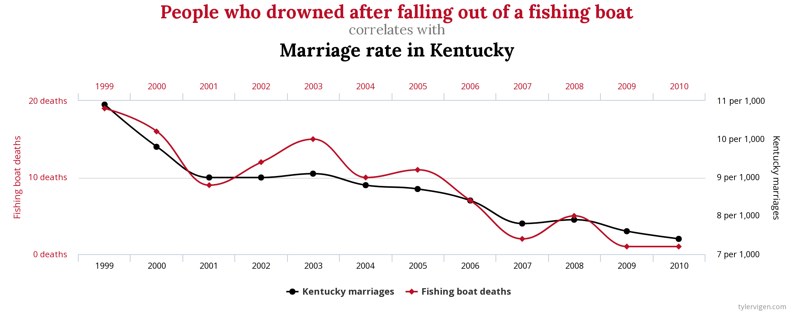

background-image: url(https://www.ineteconomics.org/uploads/featured/TeachingEconometrics.jpg)

backgroun-size: cover

```{r setup, include=FALSE}
options(htmltools.dir.version = FALSE)
```


# Econometrics

#### __Econo__ : Economics

#### __Metrics__: Measurement

#### Statistics + Economic Theory + Programming

.footnote[ Image credit: [SERGEY NVENS / fotolia.com](https://www.ineteconomics.org/uploads/featured/TeachingEconometrics.jpg) ]

---
# What does this mean for you?

.pull-left[* The ability to perform and interpret statistics correctly will improve your job market outcomes.
    + Some estimates, place the value of one course in statistics as equivalent to a $10,000 annual raise.]

.pull-right[ 
]


---
# Econometrics versus Statistics

### The key difference between an Econometrics course and a Statistics course is the application.
- Imagine we want to predict crime in a particular city.
$$Crime=F(X)$$

where X are different city characteristics (Police, income,  unemployment, etc.)

- A statistician wants to find the best way of using X to predict Y. 
- An economist is more interested in the effect of X on Y.

---


---
## The hunt for causality

__So why is it hard to know how the number of police affects crime?__

 - One of the reasons you hire more police is because the crime rate is high. More Crime $\Rightarrow$ More Police

 - The reason you hired these police is because you think more police will lead to less crime. More Police $\Rightarrow$ Less Crime
 
 - But if More Police implies Less Crime and Less Crime implies Less Police, then what does that mean?
 
 Econometrics tries to sort this out. Statistics just cares about predicting the number of crimes (or crime rate).
 
---
class: inverse, middle, center

# Correlation $\huge \neq$ Causation

---

# Two problems in Econometrics

There are two challenges in econometrics.
1. Randomness - Causes us to see relationships that do not exists or miss relationship that at real.
2. Endogeneity - sometime X causes Y, sometimes Y causes X, sometimes both X and Y are caused by Z, but we do not observe Z.
---
# The Regression Line
We can think of the relationship between two variable Y and X as being linear. $$Y_{i}=\beta_{0}+\beta_{1}X_{i}+e_{i}$$

$Y_{i}$ is our __Dependent Variable__. It is the thing we are trying to explain.

$X_{i}$ is our __Indepedent Variable__. We believe the X influences Y. 

__Error Term__ $e_{i}$ captures the randomness in the relationship between X and Y. These are all of the other items that effect the value of Y besides X.

---
class: middle, center
# Fooled by Randomness


---
class: middle, center

# Fooled by Randomness



#### Some correlations simply do not make sense!

---
# Endogeneity

There are two types of Independent variables
1. Exogenous variables: statistically indepedent of the error term.
2. Endogenous variables: Correlated with the error and/or caused by the depedent variable (i.e. Crimes and Police)

---
# Case 1: Flu Shots

__Do Flu shots save lives?__

A simple linear regression to answer this question would be $$Death_{i}=\beta_{0}+\beta_{1}FluShot_{i}+e_{i}$$

Over 36,000 people die of the flu every year. More than 100 million people get a flu shot every year as a form of precaution, but does it actually save lives? A simple regression would suggest, YES!

In fact, it appears to reduce the chance of dying by 50 percent. But is the flu shot saving people or is it something else?

- We know that smarter people are healthier and live longer. They probably get their flu shot too. So maybe it is not the flu shot, but simply that people who get the flu shot are healthier.

---

# Case 2: Suicide and Country Music

Stack and Gundlach (1992) studies the relationship between country music and suicide. $$Suicide_{i}=\beta_{0}+\beta_{1}CountryMusic_{i}+e_{i}$$

Here $Suicide$ is the suicide rate in a metropolitan area. $CountryMusic$ is the number of minutes country music is played on the radio in the metropolitan area. The authors find that 51 percent of the variation in suicide among whites is explained by county music.
- But is country music correlated with other things that are also correlated with suicides? That is does listening to country music make you suicidal or is that people who listen to country music also drink more, are more likely to be depressed, and/or own a firearm.

---

# Topics to be covered

- Review of Business Statistics and Hypothesis Testing
- Simple Linear Regression
- Multivariate Linear Regression
  - Transformation of Variables
  - Dummy Variables
- Advance Topics
  - Simultaneous Equations
  - Discrete Choice Models
  - Panel Data
  - Difference in Differences
  - Regression Discontinuity
  - Time Series

---
## Syllabus
#### Who am I?
Name: Jose M. Fernandez, PhD

Office: COB 137 __New Office to Me__

Telephone: 502-852-4861

Fax: 502-852-7672

Email: jose.fernandez@louisville.edu

Office hours 1:30pm-2:30pm on Tuesday and Thursdays. __Tentative__

---
## Syllabus
#### Who am I?
.pull-left[
- Graduated from the University of Virginia
- Have been at UofL since 2007
- Associate Professor
- Incoming Chair of the Economics Department
- President-Elect of the American Society of Hispanic Economists
- Faculty Senator
- A member of the Committee on the Status of Minority Groups in the Economic Professor for the American Economic Association
]

.pull-right[
My Research falls into three categories
- Health Economics (Mental Health, suicide, illicit drug use, autism)
- Labor Economics (minimum wages, living wages, crime)
- Industrial Organization (pricing strategies)

Hobbies
- Brazilian Jiu Jitsu; ukulele; Salsa Dancing
]

---
## Syllabus
#### Who am I?
.pull-left[
It is well known that beauty affects teaching evaluations. 
-Hammermesh and Parker (2005) Beauty in the classroom: instructors’ pulchritude and putative pedagogical productivity
- Montell (2003) Do Good Looks Equal Good Evaluations?
- Ponzo and Scoppa (2012) THE GOOD, THE BAD, AND THE UGLY:
TEACHING EVALUATIONS, BEAUTY AND ABILITIES
]

.pull-right[
If you are curious, then I look like this under the mask.

]


---
# Syllabus
#### Required and Recommended Items
Required
- Michael Bailey, Real Econometrics: The Right Tools to Answer Important Questions 2nd edition
- Tony Carilli, R Companion to Real Econometrics FREE!!!
- R – (http://www.r-project.org/) free statical software 
- R Studio (https://www.rstudio.com/) is a free interface for R. __This is where we will mostly work__

Recommended
- [Ani Katchova's Econometrics Academy-FREE](https://sites.google.com/site/econometricsacademy/) 
- [Angrist & Pischke "Mastering 'Metrics: The Path from Cause to Effect"](https://www.amazon.com/Mastering-Metrics-Path-Cause-Effect/dp/0691152845) 

---
# Syllabus
#### Expectations for the class
This is a __Hybrid Class__. What does that mean?
- The course can be complete completely online if needed
- I will use a flipped classroom.
- Lecture videos are posted. You are to watch these before class!
- I will review any material that students found challenging in the lecture videos at the beginning of class.
- We will work on In-Class Assignments during the remainder of the class.
- If you're taking the class _exclusively_ online then you will do both at home.
- All in-class lectures will recorded as well, but will be less organized content.
- Office hours will be online

---
# Syllabus
#### Grading Scheme
| Assignment Type           | Option 1 | Option 2 |
|---------------------------|----------|----------|
| In-Class Assignments (12) | 50%      | 50%      |
| Quizzes                   | 15%      | 30%      |
| Term Paper                | 20%      | 20%      |
| Final (optional)          | 15%      | --       |

---
# Syllabus
#### ICA
- 90% - everything is correct, but no effort is made to make the assignment look nice (i.e. clean tables, figures, no cut and paste)
- 85% - all parts of the assignment are complete, but there are some errors.
- 80% - there are significant errors, but the assignment was completed on time.
- 100% - If you complete the assignment and take the time to make it look presentable.
- If you try to pass off an ICA without any good faith effort to complete the assignment, then you will receive a zero. As the old saying goes, "Garbage in, Garbage out."
- Your lowest two ICA's will be dropped

---
# Syllabus
#### Quizzes
Announced Quizzes every 2-3 weeks. They will closely follow the material presented in the textbook and notes
- Quiz 1: Simple Linear Regression
- Quiz 2: Multiple Regression, Fixed Effects
- Quiz 3: Difference in Differences, Instrumental Variable, Regression Discontinuity
- Quiz 4: Probit, Logit, and Linear Probability
- Quiz 5: Time Series

---
# Syllabus
#### Term Paper
You will run your own empirical research or replicate (read this as update) a published paper.
 - This portion is one of the most rewarding parts of the class. Many of my past students have stated how their paper made them look great in job and graduate school interviews.
 

---
# What's Next?

1. Read the syllabus
2. Install R and Rstudio (or get an Rstudio Cloud account)
3. Read Chapters 1 and 2
4. Do Modules 1 - 4.

