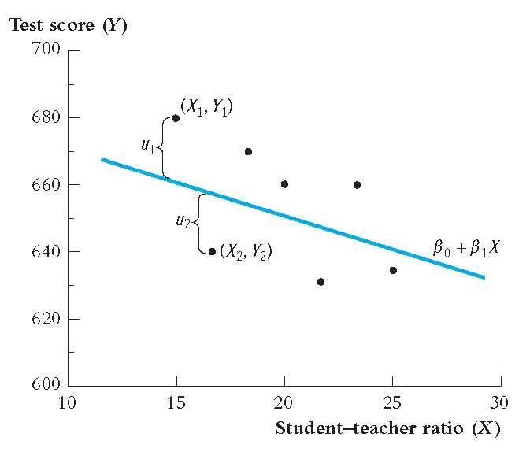
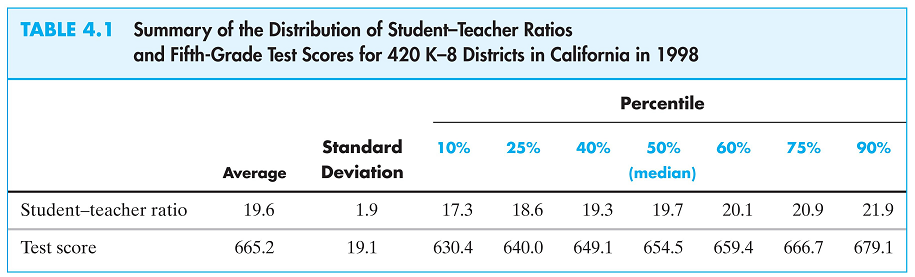
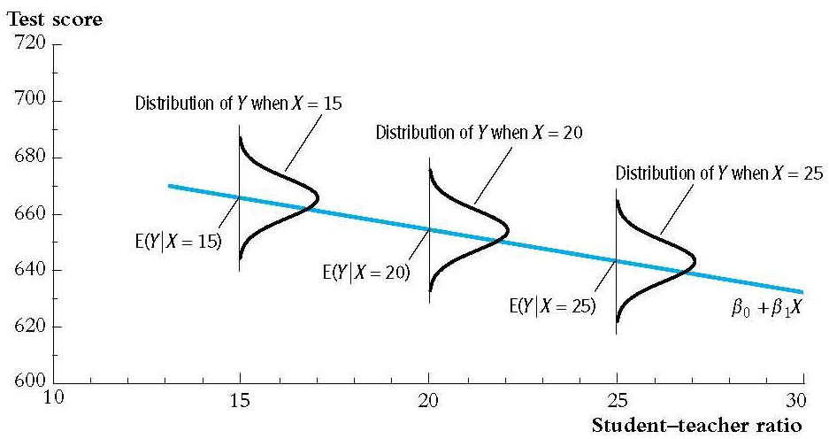
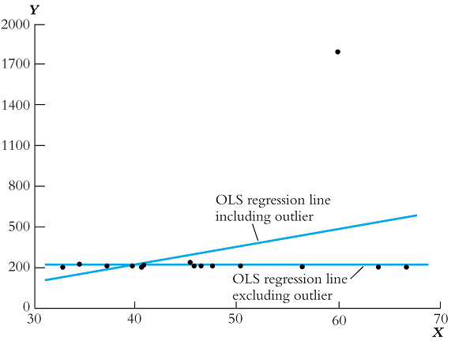
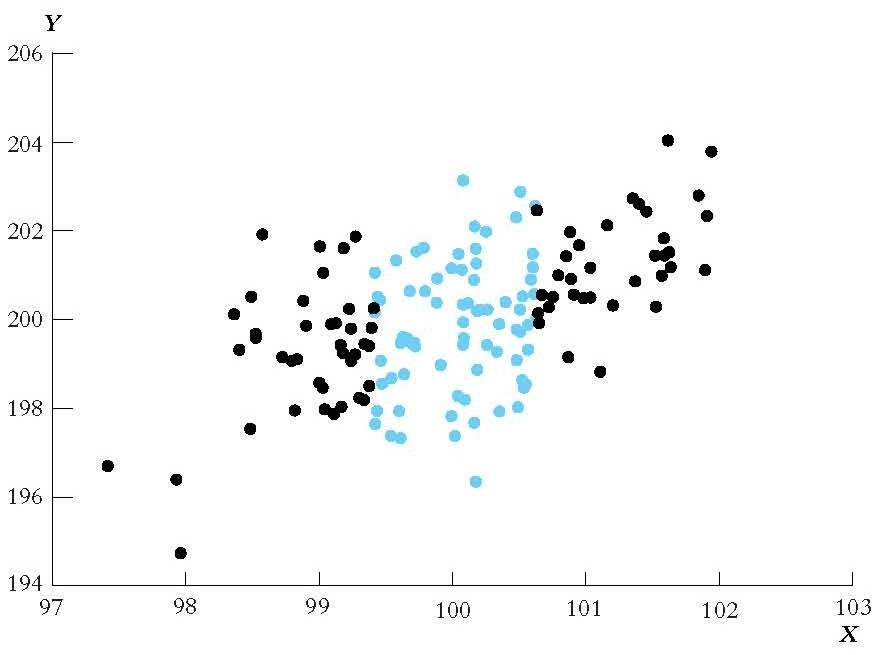
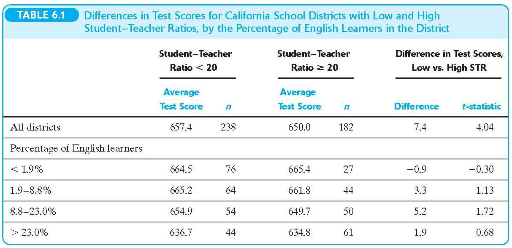
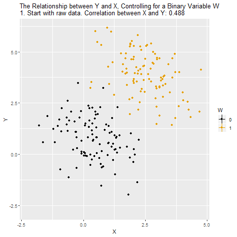
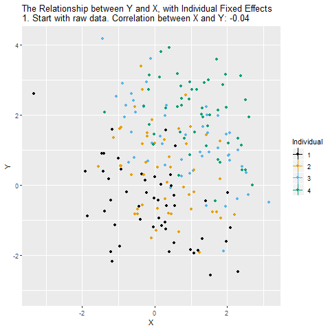

## Simple Linear Regression: Introduction

- We are interested in the causal relationship between two random variables \(X\) and \(Y\)
- We assume that \(X\) (the regressor or the independent variable) causes changes in \(Y\) (the dependent variable)
- We assume that the relationship between them is linear
- We are interested in estimating the slope of this linear relationship

---
## Example: The Effect of Class Size on Student Performance (1)

- Suppose the superintendent of an elementary school district wants to know the effect of class size on student performance
- She decides that test scores are a good measure of performance

---
## The Effect of Class Size on Student Performance (2)

What she wants to know is what is the value of $$\beta_{ClassSize} = \frac{\text{change in }TestScore}{\text{change in }ClassSize} = \frac{\Delta TestScore}{\Delta ClassSize}$$
If we knew $\beta_{ClassSize}$ we could answer the question of how student test scores would change in response to a specific change in the class sizes 
$$\Delta TestScore = \beta_{ClassSize} \times \Delta ClassSize$$
If $\beta_{ClassSize} = -0.6$ then a reduction in class size by two students would yield a change of test scores of $(-0.6)\times(-2) = 1.2$.

---
## Linear Equation of Relationship (1)

$\beta_{ClassSize}$ would be the slope of the straight line describing the linear relationship between $TestScore$ and $ClassSize$

$$TestScore = \beta_0 + \beta_{ClassSize} \times ClassSize$$

If we knew the parameters $\beta_0$ and $\beta_{ClassSize}$, not only would we be able to predict the change in student performance, we would be able to predict the average test score for any class size
---
## Linear Equation of Relationship (2)

We can't predict exact test scores since there are many other factors that influence them that are not included

- teacher quality
- better textbooks 
- different student populations 
- etc.

Our linear equation in this case is

$$TestScore = \underbrace{\beta_0 + \beta_{ClassSize} \times ClassSize}_{\text{Average }TestScore} + \text{ other factors}$$
---
## General Form

More generally, if we have $n$ observations for $X_i$ and $Y_i$ pairs 

$$Y_i = \beta_0 + \beta_1 X_i + u_i$$


- $\beta_0$ (intercept) and $\beta_1$ (slope) are the model parameters 
- $\beta_0 + \beta_1 X_i$ is the population regression line (function)
- $u_i$ is the error term. 
- It contains all the other factors beyond $X$ that influence $Y$. We refer to this relationship as: $Y_i$ regressed on $X_i$
- In our case, $Y_i$ is the average test score and $X_i$ is the average class size, for district $i$.
---
## Regression Model Plot
```{r  out.width = "100%",fig.align = "center", echo=FALSE}
library(knitr)
 
```
---
## Parameter Estimation

Our model

$$Y_i = \beta_0 + \beta_1 X_i + u_i$$

We don't know the parameters $\beta_0$ and $\beta_1$

But we can use the data we have available to infer the value of these parameters

- Point estimation
- Confidence interval estimation
- Hypothesis testing
---
## Class Size Data

To estimate the model parameters of the class size/student performance model we have data from 420 California school districts in 1999


---
## Correlation and Scatterplot (1)

- The sample correlation is found to be -0.23, indicating a weak negative relationship. 
- However, we need a better measure of causality 
- We want to be able to draw a straight line through these dots characterizing the linear regression line, and from that we get the slope.
---
## Correlation and Scatterplot (2)

```{r out.width="50%",fig.align='center'}
suppressPackageStartupMessages(library(AER,quietly=TRUE,warn.conflicts=FALSE))
library(ggplot2,quietly=TRUE,warn.conflicts=FALSE)
data("CASchools")
CASchools$str=CASchools$students/CASchools$teachers
CASchools$testscr=(CASchools$read+CASchools$math)/2
qplot(x=str, y=testscr, data=CASchools, geom="point",
      xlab="Student/Teacher Ratio", ylab="Test Scores")
```
---
## Correlation and Scatterplot (3)
```{r echo=FALSE, out.width="100%"}
include_graphics("linear-regression.png")
```

---
## The Ordinary Least Squares Estimator (1)

- The _ordinary least squares (OLS)_ estimator selects estimates for the model parameters that minimize the distance between the sample regression line (function) and the observed data.
- Recall that we use $\bar{Y}$ as an estimator of $E[Y]$ since it minimizes $\sum_i (Y_i - m)^2$
- With OLS we are interested in minimizing 
$$\min_{b_0,b_1} \sum_i [Y_i - (b_0 + b_1 X_i)]^2$$ 
We want to find $b_0$ and $b_1$ such that the mistakes between the observed $Y_i$ and the predicted value $b_0 + b_1 X_i$ are minimized.
---
## The Ordinary Least Squares Estimator (2)

The OLS estimator of $\beta_1$ is 
$$\hat{\beta}_1 = \frac{\sum_i (X_i - \bar{X})(Y_i - \bar{Y})}{\sum_i (X_i - \bar{X})^2} = \frac{s_{XY}}{s_X^2}$$

The OLS estimator of $\beta_0$ is 
$$\hat{\beta}_0 = \bar{Y} - \hat{\beta}_1 \bar{X}$$

The predicted value of $Y_i$ is 
$$\hat{Y}_i = \hat{\beta}_0 + \hat{\beta}_1 X_i$$

The error in predicting $Y_i$ is called the residual $$\hat{u}_i = Y_i - \hat{Y}_i$$
---
## OLS Regression of Test Scores on Student-Teacher Ratio (1)

Using data from the 420 school districts an OLS regression is run to estimate the relationship between test score and teacher-student ratio (STR).

$$\widehat{TestScore} = 698.9 - 2.28 \times STR$$

where $\widehat{TestScore}$ is the predicted value. (This is referred to as test scores regressed on STR)
---
## OLS Regression of Test Scores on Student-Teacher Ratio (2)
```{r out.width="50%",fig.align='center'}
qplot(x=str, y=testscr, data=CASchools, geom="point", xlab="Student/Teacher
      Ratio", ylab="Test Scores") + geom_abline(intercept=698.9, slope=-2.28,
                                                color='blue')
```
---
## Goodness of Fit

Now that we've run an OLS regression we want to know

- How much does the regressor account for variation in the dependent variable?
- Are the observations tightly clustered around the regression line?

We have two useful measures

- The regression $R^2$
- The standard error of the regression $(SER)$
---
## The R Squared (1)

  __The $R^2$ is the fraction of the sample variance of $Y_i$ (dependent variable) explained by $X_i$ (regressor)__

- From the definition of the regression predicted value $\hat{Y}_i$ we can write $$Y_i = \hat{Y}_i + \hat{u}_i$$ and $R^2$ is the ratio of the sample variance of $\hat{Y}_i$ and the sample variance of $Y_i$
- $R^2$ ranges from 0 to 1. $R^2 = 0$ indicates that $X_i$ has no explanatory power at all, while $R^2 = 1$ indicates that it explains $Y_i$ fully.
---
## The R Squared (2)

Let us define the total sum of squares $(TSS)$, the explained sum of squares $(ESS)$, and the sum of squared residuals $(SSR)$

$$\begin{align*} Y_i &= \hat{Y}_i + \hat{u}_i \\ Y_i - \bar{Y} &= \hat{Y}_i - \bar{Y} + \hat{u}_i \\ (Y_i - \bar{Y})^2 &= (\hat{Y}_i - \bar{Y} + \hat{u}_i)^2 \\ (Y_i - \bar{Y})^2 &= (\hat{Y}_i - \bar{Y})^2 + (\hat{u}_i)^2 + 2(\hat{Y}_i - \bar{Y})\hat{u}_i \\ \underbrace{\sum_i(Y_i - \bar{Y})^2}_{TSS} &= \underbrace{\sum_i(\hat{Y}_i - \bar{Y})^2}_{ESS} + \underbrace{\sum_i(\hat{u}_i)^2}_{SSR} + \underbrace{2\sum_i(\hat{Y}_i - \bar{Y})\hat{u}_i}_{=0} \\ TSS &= ESS + SSR \end{align*}$$
---
## The R Squared (3)

$$TSS = ESS + SSR$$

$R^2$ can be defined as $$R^2 = \frac{ESS}{TSS} = 1 - \frac{SSR}{TSS}$$
---
## The Standard Error of the Regression

The standard error of the regression $(SER)$ is an estimator of the standard deviation of the population regression error $u_i$.

Since we don't observe $u_1,\dots, u_n$ we need to estimate this standard deviation
We use $\hat{u}_1,\dots, \hat{u}_n$ to calculate our estimate

$$SER = s_{\hat{u}}$$ where $$s_{\hat{u}}^2 = \frac{1}{n-2}\sum_i \hat{u}_i^2 = \frac{SSR}{n-2}$$
---
## Measure of Fit of Test Score on STR Regression

- The $R^2$ is calculated to be 0.051. This means that the $STR$ explains 5.1% of the variance in $TestScore$.
- The $SER$ is calculated to be 18.6. This is an estimate of the standard deviation of $u_i$ which shows a large spread.
- Low $R^2$ (or low $SER$) does not mean that the regression is bad: it means that there are other factors that have a strong influence on the dependent variable that have not been included in the regression.
---
## Regression in R

**Load the data**

If you haven't done so already, then let's load the data into R.
We want the CA Schools data from the AER library.

Enter the following code into R

- library(AER)
- data(CASchools)

Let's Run a Regression
```{r message=FALSE, warning=FALSE, results='hide'}
library(knitr)
library(stargazer)
regress.results=lm(formula = testscr ~ str, data=CASchools)
```
---
## Regression in R 
<small>
```{r message=FALSE, warning=FALSE,results='asis'}
stargazer(regress.results, type = "html", dep.var.labels.include = FALSE, column.labels = "Test Score", covariate.labels = "Student-Teacher Ratio", fontsize = "small", style = "qje", single.row = TRUE)
```
</small>
---
## The Least Squares Assumptions

**Assumption A.1**

$$E[u_i|X_i] = 0$$

- Other factors unaccounted for in the regression are unrelated to the regressor $X_i$
- While the dependent variable varies around the population regression line, on average the predicted value is correct

---
## Assumption A.1 Plot


---
## Randomized Controlled Experiment

- In a randomized controlled experiment, subjects are placed in treatment group $(X_i = 1)$ or the control group ($X_i = 0$) randomly, not influenced by their characteristics. 
  
  + Hence, $E[u_i|X_i] = 0$.

- Using observational data, $X_i$ is not assigned randomly, therefore we must then think carefully about making assumption A.1.

**Correlation and Conditional Mean**

- Recall that if $E[u_i|X_i] = 0$ then $Corr(u_i, X_i) = 0$
- However, $u_i$ and $X_i$ being uncorrelated is not sufficient for assumption A.1 to hold.

---
## Assumption A.2

For all $i$, $(X_i, Y_i)$ are i.i.d.

- Since all observation pairs $(X_i, Y_i)$ are picked from the same population, then they are identically distributed.
- Since all observations are randomly picked, then they should be independent.
- The majority of data we will encounter will be i.i.d., except for data collected from the same entity over time (panel data, time series data)
---
## Assumption A.3: Large Outliers are Unlikely

$$0 < E[Y_i^4] < \infty$$

- None of observed data should have extreme and "unexpected" values
- Technically, this means that the fourth moment should be positive and finite
- You should look at your data (plot it) to see if any of the observations are suspicious, and then double check there was no error in the data
---
## Assumption A.3 Plot


---
## Sometimes the relationship is not Linear


---
class: inverse, middle, center
# Sampling Distribution of the OLS Estimators
---
## Coefficients are Random Variables

- Since our regression coefficient estimates, $\beta_0$ and $\beta_1$, depend on a random sample $(X_i, Y_i)$ they are random variables
- While their distributions might be complicated for small samples, for large samples, using the __Central Limit Theorem__, they can be approximated by a normal distribution.
- It is important for us to have a way to describe their distribution, in order for us to carry out our inferences about the population.
---
## Review of Sampling Distribution of the Sample Mean of Y

When we have a large sample, we can approximate the distribution of the random variable $\bar{Y}$ by a normal distribution with mean $\mu_Y$.
---
## The Sampling Distribution of the Model Coefficient Estimators (1)

- Both estimates are unbiased: $E[\hat{\beta}_0] = \beta_0$ and $E[\hat{\beta}_1] = \beta_1$.
- Using the same reasoning as we did with $\bar{Y}$, we can use the CLT to argue that $\hat{\beta}_0$ and $\hat{\beta}_1$ are both approximately normal
- The large sample variance of $\hat{\beta}_1$ is $$\sigma_{\hat{\beta}_1}^2 = \frac{1}{n}\frac{Var[(X_i - \mu_X)u_i]}{[Var(X_i)]^2}$$
- Since $\sigma_{\hat{\beta}_1}^2$ decreases to zero the large the sample, $\hat{\beta}_1$ is said to be consistent
---
## The Sampling Distribution of the Model Coefficient Estimators (2)

Another implication of the variance of $\hat{\beta}_1$ $$\sigma_{\hat{\beta}_1}^2 = \frac{1}{n}\frac{Var[(X_i - \mu_X)u_i]}{[Var(X_i)]^2}$$

is the larger $Var(X_i)$ the smaller is $\sigma_{\hat{\beta}_1}^2$ and hence tighter is our prediction of $\beta_1$.
---
## The Effect of Greater Variance in X
```{r out.width="80%",fig.align='center', echo=FALSE}

```
---
## The Sampling Distribution of the Model Coefficient Estimators (3)

Yet another implication of the variance of $\hat{\beta}_1$

$$\sigma_{\hat{\beta}_1}^2 = \frac{1}{n}\frac{Var[(X_i - \mu_X)u_i]}{[Var(X_i)]^2}$$

is that the smaller the variance $u_i$ the smaller is $\sigma_{\hat{\beta}_1}^2$ and hence tighter is our prediction of $\beta_1$.
---
class: middle, center, inverse
# Multiple Regression
---
## Multiple Regression

* In the previous chapter, we consider a simple model with only two parameters
  + constant
  + slope
  
* In this model, we used only one explanatory variable to predict the dependent variable.

---
## What is Multiple Regression (1)
Let's say we are interested in the effects of education on wages.
In reality, there are many factors affecting wages

- Education: Years of schooling, type of school, IQ
- Experience: Previous Position, Previous Company, Previous Responsibilities
- Occupation: Lawyer, Doctor, Engineer, Mathematician
- Discrimination: Sex, Age, Race, Health, or Nationality
- Location: New York City or Downtown Louisville

How do we control for each of these factors?
What pays more 2 years in graduate school or 2 years of work experience?
---
## What is Multiple Regression (2)

Multiple Regression allows us to answer these questions.

1.  Identify the relative importance of each variable
2.  Which variables matter in the prediction of wages and which do not
3.  Identify the marginal effect of each variable on wages
---
## Multiple Regression: Equation (1)
  $$wages_{i}=\beta_0+\beta_1Education_{i}+\beta_2Experience_{i}+e_{i}$$


* $\beta_2$ tells us the effect 1 additional year of schooling has on your wages, holding your level of Experience constant
* $\beta_1$ tells us the effect 1 additional year of work experience has on your wages, holding your level of Education constant
* $\beta_0$ tells us your level of wages if you had no schooling and no work experience. (You can think of this as minimum wage)
    + Note, each variable is index by (i), this index represent a specific person in our data set.
    + The observed levels of education, experience, and wages changes with each person.  The index give us a method to keep track of these changes.
    
---
## Multiple Regression: Equation (2)

Multiple Regression also helps you generalize the functional relationships between variables

Although, wage increases with experience it may do so at a decreasing rate
    Each additional year of experience increases your wage by less than the previous year.
    Example: Wages

$$wages_{i}=\beta_0+\beta_1Education_{i}+\beta_2Experience_{i}+\beta_3Experience^2_{i}+e_{i}$$
---
## Multiple Regression: Equation (3)

The relative increase in wages for an additional year of experience is given by the first partial derrivative

$$\frac{\partial wages_i}{\partial Experience}=\beta_2+2\beta_3 *Experience$$

If $\beta_2 <0$, then wages are increasing at a decreasing rate (and may eventually decrease altogether)
---
class: middle, center, inverse
# Omitted Variable Bias
---

Omitted Factors in the Test Score Regression (1)
--------------------------------------------------

Recall that our regression model was

$$TestScore = \beta_0 + \beta_1 STR + u_i,~i=1,\dots,n$$

* There are probably other factors that are characteristics of school districts that would influence test scores in addition to STR. For example
    + teacher quality 
    + computer usage 
    + and other student characteristics such as family background     

* By not including them in the regression, they are implicitly included in the error term $u_i$ 

* This is typically not a problem, unless these omitted factors influence an included regressor

---
## Omitted Factors in the Test Score Regression (2)

* Consider the percentage of English learners in a school district as an omitted variable. Suppose that
    + districts with more English learners do worse on test scores
    + districts with more English learners tend to have larger classes
```{r message=FALSE, warning=FALSE}
CASchools$stratio <- with(CASchools, students/teachers)
CASchools$score <- with(CASchools, (math + read)/2)
cor(CASchools$english, CASchools$score)
cor(CASchools$stratio, CASchools$english)
```
---
## Omitted Factors in the Test Score Regression (3)

* Unobservable fluctuations in the percentage of English learners would influence test scores and the _student teacher ratio_ variable
* The regression will then incorrectly report that STR is causing the change in test scores 
* Thus we would have a biased estimator of the effect of STR on test scores

---
## Omitted Variable Bias (1)
> An OLS estimator will have omitted variable bias (OVB) if

>    1. The omitted variable is correlated with an included regressor
>
>    2. The omitted variable is a determinant of the dependent variable

What OLS assumption does OVB violate?

---
## Omitted Variable Bias (2)

What OLS assumption does OVB violate?

It violates the OLS assumption A.1: $E[u_i|X_i] = 0$.

As $u_i$ and $X_i$ are correlated due to $u_i$'s causal influence on $X_i$, $E[u_i|X_i] \neq 0$. This causes a bias in the estimator that does not vanish in very large samples.

---
## Omitted Variable Bias - Math (1)

Suppose the true model is given as
$$y=\beta_0+\beta_1 x_1+\beta_2 x_2+u$$
but we estimate $\widetilde{y}=\widetilde{\beta_0} + \widetilde{\beta_1} x_1 + u$, then
$$\widetilde{\beta}_1=\frac{\sum{(x_{i1}-\overline{x})y_i}}{\sum{(x_{i1}-\overline{x})^2}}$$
---
## Omitted Variable Bias - Math (2)

Recall the true model, $$y=\beta_0+\beta_1 x_1+\beta_2 x_2+u$$

The numerator in our estimate for $\beta_1$ is $$\widetilde{\beta}_1=\frac{\sum{(x_{i1}-\overline{x})(\beta_0+\beta_1 x_{i1}+\beta_2 x_{i2}+u_i)}}{\sum{(x_{i1}-\overline{x})^2}} \\ =\frac{\beta_1\sum{(x_{i1}-\overline{x})^2}+\beta_2\sum{(x_{i1}-\overline{x})x_{i2}}+\sum{(x_{i1}-\overline{x})u_i}}{\sum{(x_{i1}-\overline{x})^2}} \\ = \beta_1+\beta_2 \frac{\sum{(x_{i1}-\overline{x})x_{i2}}}{\sum{(x_{i1}-\overline{x})^2}}+\frac{\sum{(x_{i1}-\overline{x})u_i}}{\sum{(x_{i1}-\overline{x})^2}}$$

---
## Omitted Variable Bias - Math (3)

If the $E(u_i)=0$, then by taking expectations we find $$E(\widetilde{\beta}_1)=\beta_1+\beta_2 \frac{\sum{(x_{i1}-\overline{x})x_{i2}}}{\sum{(x_{i1}-\overline{x})^2}}$$

From here we see clearly the two conditions need for an Omitted Variable Bias

1. The omitted variable is correlated with an included regressor (i.e. $\sum{(x_{i1}-\overline{x})x_{i2}})\neq 0$)

2. The omitted variable is a determinant of the dependent variable (i.e. $\beta_2\neq 0$)

---
## Summary of the Direction of Bias

Signs      | $Corr(x_1,x_2)>0$ | $Corr(x_1,x_2)<0$
---------  | ------------------- | ------------------
$\beta_2>0$| Positive Bias       | Negative Bias
$\beta_2<0$| Negative Bias       | Positive Bias

---
## Formula for the Omitted Variable Bias

Since there is a correlation between $u_i$ and $X_i$,  $Corr(X_i, u_i) = \rho_{Xu} \ne 0$

The OLS estimator has the limit  $$\hat{\beta}_1 \overset{p}{\longrightarrow} \beta_1 + \rho_{Xu}\frac{\sigma_u}{\sigma_X}$$ which means that $\hat{\beta}_1$ approaches the right hand value with increasing probability as the sample size grows.

* The OVB problem exists no matter the size of the sample.
  + __NO BIG DATA SOLUTION__
* The larger $\rho_{Xu}$ is the bigger the bias.
* The direction of bias depends on the sign of $\rho_{Xu}$.

---
## Addressing OVB by Dividing the Data into Groups

The Multiple Regressor Model: Regressing On More Than One Variable

In a multiple regression model, we allow for more than one regressor. 

This allows us to isolate the effect of a particular variable holding all others constant.

In otherwords, we can minimize the OVB by including variables in the regression equation that are important and potentially correlated with other regressors.

---
Look at what happens when we break down scores by Pct. English and Student-Teacher Ratio
```{r out.width="100%", fig.align='center',echo=FALSE}

```

---
## Multiple Regression Model

Regressing On More Than One Variable

In a multiple regression model we allow for __more than one regressor__. 

This allows us to isolate the effect of a particular variable __holding all others constant__.

---
## The Population Multiple Regression Line

The population regression line (function) with two regressors would be

$$E[Y_i|X_{1i} = x_1, X_{2i} = x_2] = \beta_0 + \beta_1 x_1 + \beta_2 x_2$$

1.  $\beta_0$ is the intercept
2.  $\beta_1$ is the slope coefficient of $X_{1i}$
3.  $\beta_2$ is the slope coefficient of $X_{2i}$

---
## Interpretation of The Slope Coefficient (1)

We interpret $\beta_1$ (also referred to as the coefficient on $X_{1i}$), as the effect on $Y$ of a unit change in $X_1$, holding $X_2$ constant or controlling for $X_2$.

For simplicity let us write the population regression line as

$$Y = \beta_0 + \beta_1 X_1 + \beta_2 X_2$$

Suppose we change $X_1$ by an amount $\Delta X_1$, which would cause $Y$ to change to $Y + \Delta Y$.

$$Y + \Delta Y = \beta_0 + \beta_1 (X_1 + \Delta X_1) + \beta_2 X_2$$

---
## Interpretation of The Slope Coefficient (2)

$$Y = \beta_0 + \beta_1 X_1 + \beta_2 X_2 \\ Y + \Delta Y = \beta_0 + \beta_1 (X_1 + \Delta X_1) + \beta_2 X_2$$

Subtract the first equation from the second equation, yielding
$$\begin{align*} \Delta Y &= \beta_1 \Delta X_1 \\ \beta_1 &= \frac{\Delta Y}{\Delta X_1} \end{align*}$$

$\beta_1$ is also referred to as the partial effect on $Y$ of $X_1$, holding $X_2$ fixed.

---
## The Population Multiple Regression Model

The same as with the single regressor case, the regression line describes the average value of the dependent variable and its relationship with the model regressors.

In reality, the actual population values of $Y$ will not be exactly on the regression line since there are many other factors that are not accounted for in the model.

These other unobserved factors are captured by the error term $u_i$ in the population multiple regression
$$Y_i = \beta_0 + \beta_1 X_{1i} + \beta_2 X_{2i} + \cdots + \beta_k X_{ki} + u_i,~i=1,\dots,n$$

(Generally, we can have any number of _k_ regressors as shown above)

---
## Homoskedasticity and Heteroskedasticity

As with the case of a single regressor model, the population multiple regression model can be either homoskedastic or heteroskedastic. 

It is homoskedastic if

$$Var(u_i|X_{1i},\dots,X_{ki})$$

is constant for all $i=1,\dots,n$. Otherwise, it is heteroskedastic.

In most cases (read virtually always), you will have heteroskedastic errors.

---
## The OLS Estimator (1)

Similar to the single regressor case, we do not observe the true population parameters $\beta_0,\dots,\beta_k$.
From an observed sample $\{(Y_i, X_{1i},\dots,X_{ki})\}_{i=1}^n$ we want to calculate an estimator of the population parameters

We do this by minimizing the sum of squared differences between the observed dependent variable and its predicted value

$$\min_{b_0,\dots,b_k} \sum_i (Y_i - b_0 - b_1 X_{1i} - \cdots - b_k X_{ki})^2$$

Similar to the simple linear regression case, we would have _k+1_ equations and _k+1_ unknowns.

---
## The OLS Estimator (2)

Let the multiple regression equation be represented by $$Y=X\beta+u$$

where we observe n observations, a dependent variable $Y$ is a nx1 vector, X is a nxk matrix of k difference expanatory variables, $u$ is the error term, which is assumed to have a mean of zero and a finite variance.

We are interested in estimating the parameter $\beta$, which is a kx1 vector.

---
## The OLS Estimator (3)

Our most important assumption is that $E[X'u]=0$. If so, then we can write the moment condition as 
$$\begin{align*} X'u &= 0 \\X'(Y-X\beta) &=0 \\ X'Y &= X'X\beta \\ (X'X)^{-1}X'Y &= \beta \end{align*}$$

where $(X'X)^{-1}$ is the covariance matrix of X and X'Y is the covariance of X and Y. Notice this is exactly like the simple linear case, where our slope estimator is the COV(X,Y)/VAR(X)

---
## The OLS Estimator (4)

The resulting estimators are called the ordinary least squares (OLS) estimators: $\hat{\beta}_0,\hat{\beta}_1,\dots,\hat{\beta}_k$

The predicted values would be

$$\hat{Y}_i = \hat{\beta}_0 + \hat{\beta}_1 X_{1i} + \cdots + \hat{\beta}_k X_{ki},~i=1,\dots,n$$

The OLS residuals would be

$$\hat{u}_i = Y_i - \hat{Y}_i,~i=1,\dots, n$$

---
## Application to Test Scores and the STR (1)

Recall that, using observations from 420 school districts, we regressed student test scores on STR we got $$\widehat{TestScore} = 698.9 - 2.28 \times STR$$

However, there was concern about the possibility of OVB due to the exclusion of the percentage of English learners in a district, when it influences both test scores and STR.

---
## Application to Test Scores and the STR (2)

We can now address this concern by including the percentage of English learners in our model

$$ TestScore_i = \beta_0 + \beta_1 \times STR_i + \beta_2 \times PctEL_i + u_i $$

where $PctEL_i$ is the percentage of English learners in school district $i$.

---
## Test Scores Multiple Regression in R

(Notice that we are using heteroskedastic-robust standard errors)

```{r}
regress.results <- lm(score ~ stratio + english, data = CASchools)
het.se <- vcovHC(regress.results)
coeftest(regress.results, vcov.=het.se)
```

---
## Comparing Estimates

In the single regressor case our estimates were $$\widehat{TestScore} = 698.9 - 2.28 \times STR$$ and with the added regressor we have $$\widehat{TestScore} = 686.0 - 1.10 \times STR - 0.65 \times PctEL$$

Notice the lower effect of STR in the second regression.

The second regression captures the effect of STR holding the percentage of English learners constant. We can conclude that the first regression does suffer from OVB.
This multiple regression approach is superior to the tabular approach shown before; we can give a clear estimate of the effect of STR and it is possible to easily add more regressors if the need arises.

---
class: middle, inverse, center
# Measures of Fit

---
## The Standard Error of the Regression (SER)

Similar to the single regressor case, except for the modified adjustment for the degrees of freedom, the $SER$ is

$$SER = s_{\hat{u}}\text{ where }s_{\hat{u}}^2 = \frac{\sum_i \hat{u}^2_i}{n - k - 1} = \frac{SSR}{n - k - 1}$$

Instead of adjusting for the two degrees of freedom used to estimate two coefficients, we now need to adjust for $k+1$ estimations.

---
## The R Squared

$$ R^2 = \frac{EES}{TSS} = 1 - \frac{SSR}{TSS} $$

* Since OLS estimation is a minimization of $SSR$ problem, every time a new regressor is added to a regression, the $R^2$ would be nondecreasing.
* This does not correctly evaluate the explanatory power of adding regressors-it tends to inflate it

---
## The Adjusted R Squared

* In order to address the inflation problem of the $R^2$ we can calculated an "adjusted" version to corrects for that $$\bar{R}^2 = 1 - \frac{n-1}{n-k-1}\frac{SSR}{TSS} = 1 - \frac{s_{\hat{u}}^2}{s_Y^2}$$

* The factor $\frac{n-1}{n-k-1}$ is always $> 1$, and therefore we always have $\bar{R}^2 < R^2$.
* When a regressor is added, it has two effects on $\bar{R}^2$
    + The Sum of Squared Residuals, $SSR$, decreases
    + $\frac{n-1}{n-k-1}$ increases, "adjusting" for the inflation effect
   
* It is possible to have $\bar{R}^2 < 0$

---
## Application to Test Scores (1)

From our multiple regression of the test scores on STR and the percentage of English learners we have the $R^2$, $\bar{R}^2$, and $SER$

```{r}
regress.summary <- summary(regress.results)
regress.summary$r.squared
regress.summary$adj.r.squared
regress.summary$sigma
```

---
## Application to Test Scores (2)

We notice a large increase in the $R^2 = 0.426$ compared to that of the single regressor estimation 0.051. Adding the percentage of English learners has added a significant increase in the explanatory power of the regression.

Because $n$ is large compared to the two regressors used, $\bar{R}^2$ is not very different from $R^2$.

We must be careful not to let the increase in $R^2$ (or $\bar{R}^2$) drive our choice of regressors.

---
class: center, middle, inverse
# The Least Squares Assumptions in Multiple Regression

---
## Updated Single Regressor Assumptions

For multiple regressions we have four assumptions: three of them are updated versions of the single regressor assumptions and one new assumption.

* A.1: The conditional distribution of $u_i$ given $X_{1i},\dots,X_{ki}$ has a mean of zero $E[u_i|X_{1i},\dots,X_{ki}] = 0$
* A.2: $\forall i, (X_{1i}, \dots, X_{ki}, Y_i)$ are i.i.d.
* A.3: Large outliers are unlikely

---
## Assumption A.4: No Perfect Multicollinearity (1)

The regressors exhibit perfect multicollinearity if one of the regressors is a linear function of the other regressor.

> Assumption A.4 requires that there be no perfect multicollinearity

Perfect multicollinearity can occur if a regressor is accidentally repeated, for example, if we regress $TestScore$ on $STR$ and $STR$ again (R simply ignores the repeated regressor). 

This could also occur if a regressor is a multiple of another.

---
## Assumption A.4: No Perfect Multicollinearity (2)

Mathematically, this is not allowed because it leads to division by zero.

Intuitively, we cannot logically think of measuring the effect of $STR$ while holding other regressors constant since the other regressor is $STR$ as well (or a multiple of)

---
## Examples of Perfect Multicollinearity

Fraction of English learners

"Not very small" classes:

Let $NVS_i = 1 \) if \( STR_i \geq 12$

None of the data available has $STR_i \le 12 \) therefore \( NVS_i$ is always equal to $1$.

---
## Example 2: The Dummy Variable Trap

Suppose we want to categorize school districts as rural, suburban, and urban

* We use three dummy variables $Rural_i$, $Suburban_i$, and $Urban_i$
* If we included all three dummy variables in our regress we would have perfect multicollinearity: $Rural_i + Suburban_i + Urban_i = 1$ for all $i$
* Generally, if we have $G$ binary variables and each observation falls into one and only one category we must eliminate one of them: we only use $G-1$ dummy variables

---
## Imperfect Multicollinearity (1)

> Imperfect multicollinearity means that two or more regressors are highly correlated. It differs from perfect     multicollinearity it that they don't have to be exact linear functions of each other.

---
## Imperfect Multicollinearity (2)

* For example, consider regressing $TestScore$ on $STR$, $PctEL$ (the percentage of English learners), and a third regressor that is the percentage of first-generation immigrants in the district.
* There will be strong correlation between $PctEL$ and the percentage of first-generation immigrants
* Sample data will not be very informative about what happens when we change $PctEL$ holding other regressors fixed
* Imperfect multicollinearity does not pose any problems to the theory of OLS estimation
      + OLS estimators will remain unbiased.
      + However, the variance of the coefficient on correlated regressors will be larger than if they were uncorrelated.

---
## The Distribution of the OLS Estimators in Multiple Regression

* Since our OLS estimates depend on the sample, and we rely on random sampling, there will be uncertainty about how close these estimates are to the true model parameters
* We represent this uncertainty by a sampling distribution of $\hat{\beta}_0, \hat{\beta}_1,\dots,\hat{\beta}_k$
* The estimators $\hat{\beta}_0, \hat{\beta}_1,\dots,\hat{\beta}_k$ are unbiased and consistent
* In large samples, the joint sampling distribution of the estimators is well approximated by a multivariate normal distribution, where each $\hat{\beta}_j \sim N(\beta_j, \sigma_{\hat{\beta}_j}^2)$

---
class: inverse, middle, center
# Dummy Variables, Log Transformations, Quadratics, and Interactions

---
## Dummy Variables

Dummy (binary) Variables allows us to capture information from non-numeric or continuous random variables.

We can control for observable categories such as race, religion, gender, and state of residence.

---
## Dummy Variables

```{r echo=FALSE, fig.align='center'}

```

---
## Data

Current Population Survey (CPS) is produced by the BLS and provides data on labor force characteristics of the population, including the level of employment, unemployment, and earnings.  

* 65,000 randomly selected U.S. households are surveyed each month. 
* The MARCH survey is more detailed than in other months and asks questions about earnings during the previous year.  

---
## Variables 

Variables  | Definition                           | 
---------  | ------------------------------------ |
gender     | 1 if female; 0 if male               | 
Age        | Age in Years                         | 
earnings   | Avg. Hourly Earnings                 |
education  | Years of Education                   |
Northeast  | 1 if from the Northeast, 0 otherwise |
Midwest    | 1 if from the Midwest, 0 otherwise   |
South      | 1 if from the South, 0 otherwise     |
West	     | 1 if from the West, 0 otherwise      |

---
## Load the data 


```{r}
library("AER")
library("lattice")
data("CPSSW8")
summary(CPSSW8)
```

---
```{r echo=FALSE}
histogram(~CPSSW8$earnings | CPSSW8$gender)
```

---
## Statistical discrimination

.pull-left[
One thing we can do with categorical variables is to identify statistical discrimination.

A simple linear regression of Avg. Hourly Earnings on Gender will give us a quick comparison of earnings between females and males.
]
.pull-right[
<small>
```{r results='asis', echo=FALSE}
m1 = lm(earnings ~ factor(gender), data=CPSSW8)
stargazer(m1,type="html",style="qje", covariate.labels = "Female")
```
</small>
]

---
## Let's add some controls
In this second regression we include some additional explanatory variables.

$$earnings_i = \beta_0+\beta_1 Female_i +\beta_2 age + \beta_3 education$$
<small>
```{r results='asis', echo=FALSE}
m2 = lm(earnings ~ factor(gender)+age+education, data=CPSSW8)
stargazer(m1,m2,type="html",omit.stat = c("f","ser"), single.row = TRUE, style ="qje", covariate.labels = c("Female","Age","Education"))
```
</small>
---
## Quadratic function

Economic theory tells us that there are diminishing returns to productivity. As we age we become more productivity, but at a decreasing rate. One way to account for this change is by including a quadratic term in our specification.

$$earnings_i = \beta_0+\beta_1 Female_i +\beta_2 age + \beta_3 age^2 +\beta_4 education$$

```{r results='hide', eval=FALSE}
CPSSW8$age2=CPSSW8$age*CPSSW8$age
m3 = lm(earnings ~ factor(gender)+age+age2+education, data=CPSSW8)
stargazer(m1,m2,m3,type="html",omit.stat = c("f","ser"), covariate.labels = c("Female","Age","Age Sq","Education"))
```

---
## Quadratic function
<small>
```{r results='asis', echo=FALSE}
CPSSW8$age2=CPSSW8$age*CPSSW8$age
m3 = lm(earnings ~ factor(gender)+age+age2+education, data=CPSSW8)
stargazer(m1,m2,m3,type="html",omit.stat = c("f","ser"), style = "qje", single.row = TRUE,covariate.labels = c("Female","Age","Age Sq","Education"))
```
</small>
---
## Interaction term 

Potentially, the returns from education are different by gender. We add this feature to the model by including an interaction term. We multiply gender and education. 

$$earnings_i = \beta_0+\beta_1 Female_i +\beta_2 age+ \beta_3 age^2 \\
+\beta_4 education+ \beta_5 education *Female$$

We see from the regression results that there are not much difference with respect to education

---
## Interaction Term
<small>
```{r results='asis',echo=FALSE}
m4 = lm(earnings ~ age+age2+education+education*factor(gender), data=CPSSW8)
stargazer(m1,m2,m3,m4,type="html",omit.stat = c("f","ser"), single.row = TRUE, covariate.labels = c("Female","Female*Educ","Age","Age Sq","Education"),style = "qje" )
```
</small>
---
## Location, Location, Location

There are often unobservable characteristics about markets that we would like to capture, but we just don't have this variable (i.e. unemployment rate by gender or sector, culture, laws, etc). 

One way to handle this problem is to use categorical variables for the location of the person or firm. 

These categorical variables will capture any time invariant differences between locations.  

---
## Location, Location, Location 
<small>
```{r results='asis', echo=FALSE}
m5 = lm(earnings ~ age+age2+education+education*factor(gender)+factor(region), data=CPSSW8)
stargazer(m1,m2,m3,m4,m5,type="html",covariate.labels = c("Female", "MidWest","South","West","Education*Female","Age","Age Squared","Education"),omit.stat = c("f","ser"), style = "qje", single.row=TRUE)
```
</small>
---
## Log Transformation

The normality assumption about the error term implies the dependent variable can potentially take on both negative and positive values. 

However, there are some variables we use often that are always positive

* price
* quantity
* income
* wages 

One method used to insure that we have a positive depedent variable is to transform the dependent variable by taking the natural log. 

---
## Log Transformation
<small>
```{r results='asis', echo=FALSE}
m6 = lm(log(earnings) ~ age+age2+education+education*factor(gender)+factor(region), data=CPSSW8)
stargazer(m1,m2,m3,m4,m5,m6,type="html", covariate.labels = c("Female", "MidWest","South","West","Education*Female","Age","Age Squared","Education"),omit.stat = c("f","ser"), style = "qje", single.row=TRUE)
```
</small>
---
class: center, middle, inverse
# Panel Data

---
## Panel Data

Panel (or longitudinal) data are observations for $n$ entities observed at $T$ different periods. 

A balanced panel data has observations for all the $n$ entities at every period.

An unbalanced panel data will have some observations missing at some periods.


In this chapter we will focus on state traffic fatalities $(n = 48$ and $T = 7)$

An observed variable is denoted as $Y_{it}$

---
## Example: Traffic Deaths and Alcohol Taxes (1)

There are approximately 40,000 highway traffic fatalities each year in the US.

Approximately a quarter of fatal crashes involve a driver who was drinking.

It is estimated that 25% of drivers on the road between 1am and 3am have been drinking.

A driver who is legally drunk is at least 13 times as likely to cause a fatal crash as a driver who has not been drinking.

---
## Example: Traffic Deaths and Alcohol Taxes (2)

We want to study government policies that can be used to discourage drunk driving.

```{r}
library("AER")
data("Fatalities")
fatality.data=Fatalities
fatality.data$year <- factor(fatality.data$year)
fatality.data$mrall <- with(Fatalities, fatal/pop * 10000) 
fatal.82.88.data <- subset(fatality.data, year %in% c("1982", "1988"))
```

---
## Example: Traffic Deaths and Alcohol Taxes (3)

Consider regressing $FatalityRate$ (annual traffic deaths per 10,000 people in a state) on $BeerTax$ $$\begin{alignat*}{3} \widehat{FatalityRate} = &~2.01 &{}+{} &0.15 BeerTax \qquad \text{(1982 data)} \\ &(0.15) & &(0.13) \\ \widehat{FatalityRate} = &~1.86 &{}+{} &0.44 BeerTax \qquad \text{(1988 data)} \\ &(0.11) & &(0.13) \end{alignat*}$$

---
class: middle, inverse, center
# Panel Data with Two Time Periods: "Before and After" Comparisons

---
## Dealing with Possible OVB

The previous regression very likely suffer from OVB (which omitted variables?).

We can expand our specification to include these omitted variables, but some, like cultural attitudes towards drinking and driving in different states, would be difficult to control for.

If such omitted variables are constant across time, then we can control for them using panel data methods.

Suppose we have observations for $T = 2$ periods for each of the $n = 48$ states.

This approach is based on comparing the _"differences''_ in the regression variables.

---
## Modeling the Time-Constant Omitted Variable

Consider having an omitted variable $Z_i$ that is state specific but constant across time

$$FatalityRate_{it} = \beta_0 + \beta_1 BeerTax_{it} + \beta_2 Z_i + u_{it}$$

Consider the model for the years 1982 and 1988

$$\begin{align*} FatalityRate_{i,1982} &= \beta_0 + \beta_1 BeerTax_{i,1982} + \beta_2 Z_i + u_{i,1982} \\ FatalityRate_{i,1988} &= \beta_0 + \beta_1 BeerTax_{i,1988} + \beta_2 Z_i + u_{i,1988} \end{align*}$$
---
## Regress on Changes (1)

Subtract the previous models for the two observed years

$$\begin{align*} FatalityRate_{i,1988}& - FatalityRate_{i,1982} = \\ &\beta_1 (BeerTax_{i,1988} - BeerTax_{i,1982}) \\ {} &+ (u_{i,1988} - u_{i,1982}) \end{align*}$$

Intuitively, by basing our regression on the change in fatalities we can ignore the time constant omitted variables.

---
## Regress on Changes (2)

If we regress the change in fatalities in states on the change in taxes we get $$\begin{align*} &\widehat{FatalityRate_{1988} - FatalityRate_{1982}} = \\ &\qquad {} - 0.072 - 1.04 (BeerTax_{1988} - BeerTax_{1982}) \end{align*}$$

(with standard errors $0.064$ and $0.26$, respectively)

We reject the hypothesis that $\beta_1$ is zero at the 5% level. 

According to this estimate an increase of $1 tax would reduce traffic fatalities by 1.04 deaths/10,000 people (a reduction by 2 of current average fatality in the data).

---
class: center, middle, inverse

# Fixed Effects Models

---
## Suppose you want to estimate demand

Suppose you want to learn the effect of price on the demand for back massages. You have the following data from four Midwest locations:

Location |	Year |	Per capita Quantity |	Price 
---------|-------|----------------------|------
Madison |	2003|	0.8	| $55 
Peoria |	2003 |	1	 | $50 
Milwaukee |	2003 |	1.5 |	$60 
Chicago |	2003 |	2 |	$75 

Notice, these data are cross-sectional data for the year 2003

Quickly, eye ball the data. What is unusual about this demand function?

---
## Graph
```{r echo=FALSE, message=FALSE, warning=FALSE}
Location <- c("Madison","Peoria","Milwaukee","Chicago")
Year <- c(2003,2003,2003,2003)
Quantity <- c(0.8, 1, 1.5, 2)
Price <- c(55, 50, 60, 75)
data1<-data.frame(Location,Year,Quantity,Price)
library(tidyverse)
data1 %>% ggplot(aes(x=Quantity, y=Price))+geom_point()+geom_smooth(method = "lm", formula = y~x)
```
---
### Panel Data
You observe multiple cities for 2 years each.

Location |	Year |	Per capita Quantity |	Price 
---------|-------|----------------------|------
Madison |	2003|	0.8	| $55 
Madison | 2004 | 0.7 | $60
Peoria |	2003 |	1	 | $50 
Peoria | 2004 | 1.1 | $48
Milwaukee |	2003 |	1.5 |	$60 
Milwaukee | 2004 | 1.4 | $65
Chicago |	2003 |	2 |	$75 
Chicago | 2004 | 1.8 | $85

Within each of the four cities, price and quantity are inversely correlated, as you would expect if demand is downward sloping.
---
### Panel Data
We can see the relationship clearer if we take first differences of the data.

Location | Year | Per capita Quantity |	Price | $\Delta$Q | $\Delta$P 
---------|-------|----------------------|------|--------|----
Madison  |	2003 |	0.8	                | $55    |      |
Madison  | 2004  | 0.7                  | $60 | -0.1 | $5
Peoria |	2003 |	1	 | $50 |   |
Peoria | 2004 | 1.1 | $48 | .1 | $2
Milwaukee |	2003 |	1.5 |	$60 |  | 
Milwaukee | 2004 | 1.4 | $65 | -.1 | $5
Chicago |	2003 |	2 |	$75 |  |
Chicago | 2004 | 1.8 | $85 | -.2| $10

A simple regression on these differences will give us our result. But what if we have more data?

---
### More years of data

If we have lots of years of data, things get messier. We could, in principle, compute all of the differences (i.e., 2004 versus 2003, 2005 versus 2004, etc.) and then run a single regression, but there is an easier way. 

Instead of thinking of each year’s observation in terms of how much it differs from the prior year for the same city, let’s think about how much each
observation differs from the average for that city. With two key variables, price and quantity, we will be concerned with the following:

- Variations in prices around the mean price for each city
- Variations in quantities around the mean quantity for each city.

We want to know whether variations in the quantities (around their means) are related to variations in prices (around their means). 

---
### More years of data

With our relatively small massage data set, we can do this by hand. 

Location | Year | Price |	$\bar{P}$ | Quantity | $\bar{Q}$ 
---------|-------|----------------------|------|--------|----
Madison  |	2003 |	$55	  | $57.5    |  0.8    | 0.75
Madison  | 2004  | $60   | $57.5 | 0.7 | 0.75
Peoria |	2003 |	$50	 | $49 |  1 | 1.05
Peoria | 2004 | $48 | $49 | 1.1 | 1.05
Milwaukee |	2003 |	$60 |	$62.5 | 1.5 | 1.45 
Milwaukee | 2004 | $65 | $62.5 | 1.4 | 1.45
Chicago |	2003 |	$75 |	$80 |  2.0 | 1.9
Chicago | 2004 | $85 | $80 | 1.8 | 1.9

---
### More years of data
Location | Year | Price |	$\bar{P}$ | Price - $\bar{P}$ | Quantity | $\bar{Q}$ |  Quantity - $\bar{Q}$
---------|-------|------|-----------|---|-------|----
Madison  |	2003 |	$55	  | $57.5    | -2.5  | 0.8    | 0.75 | 0.05
Madison  | 2004  | $60   | $57.5 | 2.5  |0.7 | 0.75 | -.05
Peoria |	2003 |	$50	 | $49 | 1  | 1 | 1.05 | -0.05 
Peoria | 2004 | $48 | $49 | -1 |1.1 | 1.05 | 0.05
Milwaukee |	2003 |	$60 |	$62.5 |-2.5 | 1.5 | 1.45 | 0.05
Milwaukee | 2004 | $65 | $62.5| 2.5 | 1.4 | 1.45 | -0.05
Chicago |	2003 |	$75 |	$80 |-5  |2.0 | 1.9 | 0.2
Chicago | 2004 | $85 | $80 | 5  |1.8 | 1.9 | -0.2

Note that by subtracting the means, we have restricted all of the action in the regression to within-city action. 

Thus, we have eliminated the key source of omitted variable bias, namely, unobservable across-city differences.

---
### Graph without adjusting for fixed effects
```{r echo=FALSE, message=FALSE, warning=FALSE}
Location <- c("Madison","Madison","Peoria","Peoria","Milwaukee","Milwaukee","Chicago","Chicago")
Year <- c(2003,2004,2003,2004,2003,2004,2003,2004)
Quantity <- c(0.8,0.7, 1,1.1, 1.5,1.4, 2,1.8)
Price <- c(55, 60, 50,48, 60, 65, 75, 85)
data1<-data.frame(Location,Year,Quantity,Price)
library(tidyverse)
data1 %>% ggplot(aes(x=Quantity, y=Price))+geom_point()+geom_smooth(method = "lm", formula = y~x)
```

---
### Graph with adjusting for fixed effects
```{r echo=TRUE, message=FALSE, warning=FALSE}
data1 <- data1 %>% group_by(Location) %>% mutate(price_m = mean(Price), quantity_m = mean(Quantity))
data1 <- data1 %>% mutate(difprice = Price-price_m, difquantity= Quantity-quantity_m)
library(tidyverse)
data1 %>% ggplot(aes(x=difquantity, y=difprice))+geom_point()+geom_smooth(method = "lm", formula = y~x)
```

---
### Graph with adjusting for fixed effects
```{r echo=TRUE, eval=FALSE,message=FALSE, warning=FALSE}
library(stargazer)
library(plm)
reg1<-lm(Price ~ Quantity, data = data1)
reg2 <-lm(difprice ~ difquantity, data = data1)
reg3 <- lm(Price ~ Quantity + factor(Location), data = data1)
reg4 <- wi <- plm(Price ~ Quantity, data = data1, model = "within", effect = "individual", index = c("Location","Year"))
stargazer(reg1,reg2,reg3,reg4, type = "html")
```
---

### Graph with adjusting for fixed effects
<small>
```{r echo=FALSE, results='asis',message=FALSE, warning=FALSE}
library(texreg)
library(plm)
reg1<-lm(Price ~ Quantity, data = data1)
reg2 <-lm(difprice ~ difquantity, data = data1)
reg3 <- lm(Price ~ Quantity + factor(Location), data = data1)
reg4 <- wi <- plm(Price ~ Quantity, data = data1, model = "within", effect = "individual", index = c("Location","Year"))
htmlreg(list(reg1,reg2,reg3,reg4))
```
</small>
---
class: middle, inverse, center
# Fixed Effect Regression

---
## The Fixed Effects Regression Model

We can modify our previous model

$$Y_{it} = \beta_0 + \beta_1 X_{it} + \beta_2 Z_i + u_{it}$$

as

$$Y_{it} = \beta_1 X_{it} + \alpha_i + u_{it}$$

where $\alpha_i = \beta_0 + \beta_2Z_i$ are the $n$ entity specific intercepts.

These are also known as entity fixed effects, since they represent the constant effect of being in entity $i$.

---
## Dummy Variable Fixed Effects Regression Model

Let the dummy variable $D1_i$ be binary variable that equal 1 when $i = 1$, 0 otherwise. 

We can likewise define $n$ dummy variables $Dj_i$ which are equal to 1 when $j = i$. We can write our model as

$$Y_{it} = \beta_0 + \beta_1 X_{it} + \underbrace{\gamma_2 D2_i + \gamma_3 D3_i + \cdots + \gamma_n Dn_i}_{n-1 \text{ dummy variables}} + u_{it}$$
---
## Fixed Effects Animated

```{r echo=FALSE,fig.align='center'}

```

---
## Multiple Regression Model

We can easily extend both forms of the fixed effects model to include multiple regressors

$$\begin{align*} Y_{it} &= \beta_1 X_{1,it} + \cdots + \beta_k X_{k,it} + \alpha_i + u_{it} \\ Y_{it} &= \beta_0 + \beta_1 X_{1,it} + \cdots + \beta_k X_{k,it}\\ {} &+ \gamma_2 D2_i + \gamma_3 D3_i + \cdots + \gamma_n Dn_i + u_{it} \end{align*}$$

---
## Estimation and Inference (1)

We now have $k + n$ coefficients to estimate

We are not interested in estimating the entity-specific effects so we need a way to subtract them from the regression. We use an "entity-demeaned" OLS algorithm.

  * We subtract the entity specific average from each variables
  * We regress the demeaned dependent variable on the demeaned regressors

---
## Estimation and Inference (2)

Taking averages of the fixed effects model 
$$\bar{Y}_i = \beta_1\bar{X}_i + \alpha_i + \bar{u}_i$$ 
and subtract it from the original model 
$$Y_{it} - \bar{Y}_i = \beta_1(X_{it} - \bar{X}_i) + (u_{it} - \bar{u}_i)$$
or 
$$\tilde{Y}_{it} = \beta_1 \tilde{X}_{it} + \tilde{u}_{it}$$
We will discuss needed assumptions in order to carry out OLS regression and inference below.

---
## Application to Traffic Deaths

```{r message=FALSE, warning=FALSE}
library(plm)
regress.results.fe.only <- plm(mrall ~ beertax, 
                               data=fatality.data, 
                               index=c('state', 'year'), 
                               effect='individual', 
                               model='within')
robust.se <- vcovHC(regress.results.fe.only, method="arellano", type="HC2")
coeftest(regress.results.fe.only, vcov = robust.se)

```

---
## Regressions with Time Fixed Effects

__Time Fixed Effects__

In the previous regression there is still a possibility of OVB due to effects are constant across states by different across time.

We can modify our model to

$$Y_{it} = \beta_0 + \beta_1 X_{it} + \beta_2 Z_i + \beta_3 S_t + u_{it}$$

where $S_t$ is unobserved.

---
## Time Effects Only (1)

Suppose that entity specific effects ($Z_i$) are not present in our model but time effects are.

The same as with entity fixed effects we can model time effects as having a different intercept per time period 
$$Y_{it} = \beta_1 X_{it} + \lambda_t + u_{it}$$ 
where $\lambda_1,\dots, \lambda_T$ are the time fixed effects.

---
## Time Effects Only (2)

We can also use the dummy variable approach. Let $Bs_t$ be equal to 1 if $s = t$ and 0 otherwise.

$$Y_{it} = \beta_0 + \beta_1 X_{it} + \underbrace{\delta_2 B2_t + \cdots + \delta_T BT_t}_{T-1\text{ dummy variables}} + u_{it}$$
---
## Application to Traffic Deaths

```{r message=FALSE, warning=FALSE}
library(plm)
regress.results.fe.time1 <- plm(mrall ~ beertax, 
                               data=fatality.data, 
                               index=c('state', 'year'), 
                               effect='time', 
                               model='within')
robust.se <- vcovHC(regress.results.fe.time1, method="arellano", type="HC2")
coeftest(regress.results.fe.time1, vcov = robust.se)

```

---
## Both Entity and Time Fixed Effects

Now to control for both $Z_i$ and $S_t$ we have the combined entity and time fixed effects regression model

$$Y_{it} = \beta_1 X_{it} + \alpha_i + \lambda_t + u_{it}$$

or

$$\begin{align*} Y_{it} &= \beta_0 + \beta_1 X_{it} + \gamma_2 D2_i + \cdots + \gamma_n Dn_i \\ {}&+ \delta_2 B2_t + \cdots + \delta_T BT_t + u_{it} \end{align*}$$
---
## Application to Traffic Deaths

```{r message=FALSE, warning=FALSE}
regress.results.fe.time <- plm(mrall ~ beertax,
                               data = fatality.data, 
                               index = c('state', 'year'), 
                               effect = 'twoways', 
                               model = 'within')
robust.se <- vcovHC(regress.results.fe.time, method="arellano", type="HC2")
coeftest(regress.results.fe.time, vcov = robust.se)
```

---
class: middle, center, inverse
## The Fixed Effects Regression Assumptions and Standard Errors for Fixed Effects Regression

---
## The Fixed Effects Regression Assumptions

$$Y_{it} = \beta_1 X_{it} + \alpha_i + u_{it},~~i = 1, \dots,n,~~t = 1,\dots,T.$$

- FE.A.1: $u_{it}$ has conditional mean zero: $E[u_{it}|X_{i1}, \dots, X_{iT}, \alpha_i] = 0$.
- FE.A.2: $(X_{i1}, \dots, X_{iT}, u_{i1},\dots,u_{iT})$, $i = 1,\dots,n$ are i.i.d. draws from their joint distribution.
- FE.A.3: Large outliers are unlikely.
- FE.A.4: No perfect multicollinearity.

---
## Serial Correlation of Standard Errors (1)

An important assumption for fixed effects regressions is FE.A.2

The assumption requires variables to be independent across entities but not necessarily within entities.

For example any $X_{it}$ and $X_{is}$ for $t \ne s$ can be correlated: this is called autocorrelation or serial correlation.

---
## Serial Correlation of Standard Errors (2)

Autocorrelation is common in time series and panel data: 

what happens in one period is probably correlated with what happens in other periods for the same entity.

The same can be said for the error terms $u_{it}$.

For that reason we need to use heteroskedasticity- and autocorrelation-consistent (HAC) standard errors.

---
## Let us test for Serial Correlation in R

```{r,echo=TRUE}
pbgtest(regress.results.fe.time)
```

---
## Robust Standard Errors

We will use two types of robust standard erros to deal with the problem of heteroskedasticity.

- General Robust Standard errors
- Clustered Robust Standard Errors

---
## Robust Standard Errors

In regression and time-series modelling, basic forms of models make use of the assumption that the errors or disturbances $u_i$ have the same variance across all observation points. 

When this is not the case, the errors are said to be heteroscedastic, or to have heteroscedasticity, and this behaviour will be reflected in the residuals $u_i$  estimated from a fitted model. 

Heteroscedasticity-consistent standard errors are used to allow the fitting of a model that does contain heteroscedastic residuals. 

The first such approach was proposed by Huber (1967), and further improved procedures have been produced since for cross-sectional data, time-series data and GARCH estimation.

---
## How to test for heteroscedasticity in R

We use the Breusch-Pagan test to detect heteroskedasticity. The null hypothesis is homoskedasticity in the errors.

```{r,echo=TRUE}
library(lmtest)
bptest(mrall ~ beertax+factor(state)+factor(year), data = fatality.data, studentize=F)
```

---
## Clustered Robust Standard Errors
Let's say that you want to relax the Gauss-Markov homoskedasticity assumption, and account for the fact that there may be several different covariance structures within your data sample that vary by a certain characteristic - a "cluster" - but are homoskedastic within each cluster.

For example, say you have a panel data set with a bunch of different test scores from different schools around the country. 

You may want to cluster your sample by state, by school district, or even by town. 

Economic theory and intuition will guide you in this decision.
