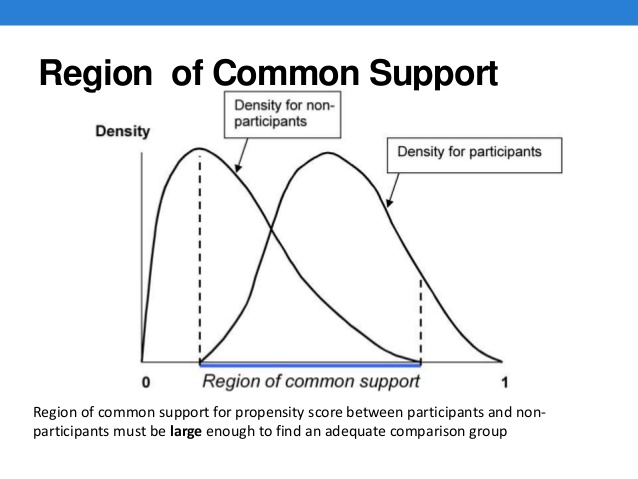

## Propensity Score Match

Propensity Score Matching (PSM) is a useful technique when using quasi-experimental or observational data (Austin, 2011; Rubin, 1983).

  * It helps to create a counterfactual sample (control group) when random assignment is unavailable, unfeasible, or unethical. 
  * By using an index instead of specific covariates to match, PSM mitigates the curse of dimensionality associated with "exact match" techniques.
  * Along with reducing the curse of dimensionality, this technique can be used in small samples where exact matches are infrequent or non-existent
  
## Conceptual Model

The model $$y=z \gamma+X\beta+u$$
Suppose you observe an outcome variable $y$, a treatment variable $z$, and a set of covariates in matrix $X$.

If the standard assumption that $E[Xu]=E[Zu]=0$  holds, then we can simply use OLS to estimate the treatment effect. 

However, this assumption rarely holds in non-experimental settings. That is, the treatment assignment is endogenous (i.e. $E[Zu]\ne0$)

## Conceptual Model

The model $$y=z \gamma+X\beta+u$$

If we have an instrumental variable for $z$, then we can still use IV to estimate the treatment effect.

Matching models become an option when

  1.  No instrument is available
  2.  We believe the covariates X are independent of the error term $E[Xu]=0$.

## Conceptual Model

We can use a two step process to help solve this problem.

Step 1. Use a probit or logit model to estimate $Pr(z=1|X)$.

  - This step allows us to estimate the likelihood that a person would receive treatment given their observable characteristics.

Step 2. Use the predict probability (propensity score) from Step 1 to match people in the treatment group with people in the control group that have very similar propensity scores.

  - For example, if someone in the treatment group has a predicted probability of receiving treatment equal to 0.5, then we would like to match that person with someone who has a predicted probability close to 0.5, but who did not receive the treatment.

## PSM illustrated

```{r echo=FALSE, fig.align='center', out.width="75%"}

```

## PSM Tips

* Probit/Logit may not be the best method to construct the propensity score.

* Machine Learning is particularly adapt to classification problems

* Consider using a classification model like Boost to obtain propensity scores

## Examples of Propensity Score problems

* JobCorps is the largest free residential education and jobs programs. We may want to know the benefit of JobCorps on employment. However, individuals self-select into the JobCorps program.

* Is there a wage penalty associated with smoking? People are not randomly assigned to be smokers. How can we estimate this affect?

* Is there a benefit of attending private vs public school? Again, students are not randomly assigned to public or private schools

## Other types of matching

Before we proceed with propensity score matching let's consider two alternatives

1. Exact Match: Here we match people in the treatment group with individuals in the control group that have identical observable characteristics (i.e. X's).

  * This method requires a lot of data.
  * The assumption is that the unobserved portion of the individual is randomly distributed.
  * We can average the outcome variable of the set of exact control matches and subtract that from the treatment outcome. The Law of Large numbers will give us an unbias estimate as $n \to \infty$.
  
## Other types of matching

Before we proceed with propensity score matching let's consider two alternatives

2. Mahalanobis Metric Matching: Relaxes the assumption of _exact match_. Instead, it calculates the distance between observation using a multidimentional distance metric.

  * Requires less data than exact match.
  * suffers from the curse of dimensionality.
  * To reduce the curse of dimensionality remove X's that are more randomly distributed between groups.
  
## Mahalanobis Metric Matching

The distance formula is given by $$d(i,j)=(u-v) C^{-1} (u-v)^T$$

Let k be the number of covariates, then u is a row vector of covariate for person i (treatment) with the dimensions 1xk. Similarly, v is a row vector for person j (control). The matrix $C^{-1}$ is the covariance matrix for the control group.

We match every person in the treatment with a person in the control group that has the smallest $d(i,j)$

It is possible that an individual from the control group who is selected as the match for a participant in the treatment group, is not close in a multidimensional space. The average distance between observations actually increases as we included more covariates (Gu & Rosenbaum, 1993; Stuart, 2010; Zhao, 2004).

## Propensity Score Matching

In propensity score matching, we utilize the nearest-neighbor routine, which matches individuals in the treatment group with individuals in the control group who have the closest propensity score.

As in the Mahalanobis Metric, we need to take care that the distance is between matches is not to great. We can impose a _caliper_ limit which states that $$||P_i-P_j||<\epsilon$$

where $\epsilon=0.25*\sigma_p$ and $\sigma_p$ is the standard deviation of the propensity score metric.

## Advance Routines

1. You can combine PSM with Mahalanobis Metric by estimating the propensity scores and including the score as another covariate in the Mahalanobis Metric

2. Optimal Matching: This method uses propensity score match, but tries to minimize the total propensity score difference across all matches.

3. Full Matching: Is equivalent to optimal matching, but matches with replacement. That is, the same person can be used as a match in more than one pair.

## Which Routine should I choose?

There are many choices and approaches to matching, including:

- Propensity score matching.
- Limited exact matching.
- Full matching.
- Nearest neighbor matching.
- Optimal/Genetic matching.
- Mahalanobis distance matching (for quantiative covariates only).
- Matching with and without replacement.
- One-to-one or one-to-many matching.

Which matching method should you use? __Whichever one gives the best balance!__

# Propensity Match in R

## National Supported Work

The National Supported Work (NSW) Demonstration was a federally and privately funded randomized experiment done in the 1970s to estimate the effects of a job training program for disadvantaged workers.

Participants were randomly selected to participate in the training program. Both groups were followed up to determine the effect of the training on wages.

Analysis of the mean differences (unbiased given randomization), was approximately $800.

[Lalonde (1986)](https://www.jstor.org/stable/1806062?seq=1) used data from the Panel Survey of Income Dynamics (PSID) and the Current Population Survey (CPS) to investigate whether non-experimental methods would result in similar results to the randomized experiment. He found results ranging from $\$$ 700 to $\$$ 1,600. He concluded that propensity score matching does not produce results similar to those found in experiments.

## PSM: Dehejia and Wahba (1999)

[Dehejia and Wahba (1999)](https://www.jstor.org/stable/2669919) later used propensity score matching to analyze the data.They criticized the results of Lalonde(1999) and found evidence in support of propensity score matching.

- Comparison groups selected by Lalonde were very dissimilar to the treated group.
- By restricting the comparison group to those that were similar to the treated group, they could replicate the original NSW results.
- Using the CPS data, the range of treatment effect was between $1,559 to $1,681. The experimental results for the sample was approximately $1,800.
- The covariates available include: age, education level, high school degree, marital status, race, ethnicity, and earning sin 1974 and 1975.
- Outcome of interest is earnings in 1978.

## Replication {.smaller .flexbox .vcenter}
Calculating the Propensity Score
```{r message=FALSE, warning=FALSE, results='asis'}
library(MatchIt); data(lalonde)
lalonde.formu <- treat~age + educ + nodegree + re74 + re75
ps <- glm(lalonde.formu, family=binomial, data=lalonde)
stargazer::stargazer(ps,type="html",single.row = TRUE)
```
## Propensity Score before matching
```{r message=FALSE, warning=FALSE}
lalonde$psvalue<-predict(ps,type="response")
library(Hmisc)
histbackback(split(lalonde$psvalue, lalonde$treat), main="Propensity score before matching", xlab=c("control",
"treatment"))
```

## Replication {.smaller}
```{r message=FALSE, warning=FALSE, echo=TRUE}
m.nn<-matchit(lalonde.formu, data = lalonde, ratio=1, method ="nearest")
nn.match<-match.data(m.nn)
```

## Replication: Test for balance {.smaller}
```{r message=FALSE, warning=FALSE}
library(RItools)
## Unconditional
xBalance(lalonde.formu, data = lalonde, report=c("chisquare.test"))
## Nearest Neighbor
xBalance(lalonde.formu, data = nn.match, report=c("chisquare.test"))
```
## Jitter plot
```{r}
plot(m.nn, type = "jitter")
```


## Overlapping Propensity Scores
```{r results='asis', message=FALSE, warning=FALSE}
library(Hmisc)
histbackback(split(nn.match$psvalue,nn.match$treat),main="Propensity score after matching", xlab=c("control","treatment"))
```

## Replication: Results
```{r results='asis'}
reg.1<-lm(re78~treat+age+educ+nodegree+re74+re75+married+factor(race),data=lalonde)
reg.2<-lm(re78~treat+age+educ+nodegree+re74+re75+married+factor(race),data=nn.match)
reg.3<-lm(re78~treat,data=nn.match)
```

## Replication: Results {.smaller}
```{r results='asis', echo=FALSE}
stargazer::stargazer(reg.1,reg.2,reg.3,type="html",dep.var.labels = c("OLS","NN 1","NN 2"))
```

## Replication: Matched Dataset {.smaller}
```{r}
matches<-data.frame(m.nn$match.matrix)
# Separate the data into treatment and control
group1<-match(row.names(matches),row.names(nn.match))
group2<-match(matches$m.nn.match.matrix,row.names(nn.match))
yT<-nn.match$re78[group1]
yC<-nn.match$re78[group2]
# bind matched cases
matched.cases<-cbind(matches,yT,yC)
# Paired T-test
t.test(matched.cases$yT,matched.cases$yC,paired=TRUE)
```

## What else can we do with propensity scores?

Suppose you do not like the idea of throwing out data as we do with PSM

An alternative is to use weighted least squares where the propensity scores are the weights.

For treated individuals the weight is $$\frac{1}{Pr(treat=1)}$$

For control individuals the weight is $$\frac{1}{1-Pr(treat=1)}$$

## Propensity score weights in R
```{r eval=FALSE}
# We will use our estimated pscores
lalonde$psvaluea<-predict(ps,type="response")
lalonde$gweight<-ifelse(lalonde$treat==1,1/lalonde$psvaluea,1/(1-lalonde$psvaluea))
reg.4<-lm(re78~treat+age+educ+nodegree+re74+re75+married+factor(race),
          data=lalonde, weights = gweight)

```

## PSM weights {.smaller}
```{r results='asis', echo=FALSE}
lalonde$psvaluea<-predict(ps,type="response")
lalonde$gweight<-ifelse(lalonde$treat==1,1/lalonde$psvaluea,1/(1-lalonde$psvaluea))
reg.4<-lm(re78~treat+age+educ+nodegree+re74+re75+married+factor(race),
          data=lalonde, weights = gweight)
stargazer::stargazer(reg.1,reg.2,reg.3,reg.4,type="html",dep.var.labels = c("OLS","NN 1","NN 2","PSM Weights"))
```

## Why are our results so off? Poor Balance {.smaller}

```{r}
summary(lm(re74~treat, data=lalonde, weights = gweight))
```


## Summary

* PSM is useful when your binary treatment variable is endogenous, your explanatory variables are exogenous, and there a no available instruments.
* It is a solution to the _"curse of dimensionality"_
* It can be used to construct a better control group when running regressions
* Or on its own non-parametrically
* There is a tradeoff between balance and sample size

Extensions

* PSM can also be used to control for sample selection bias by using inverse propensity score matching weights in your regressions.
