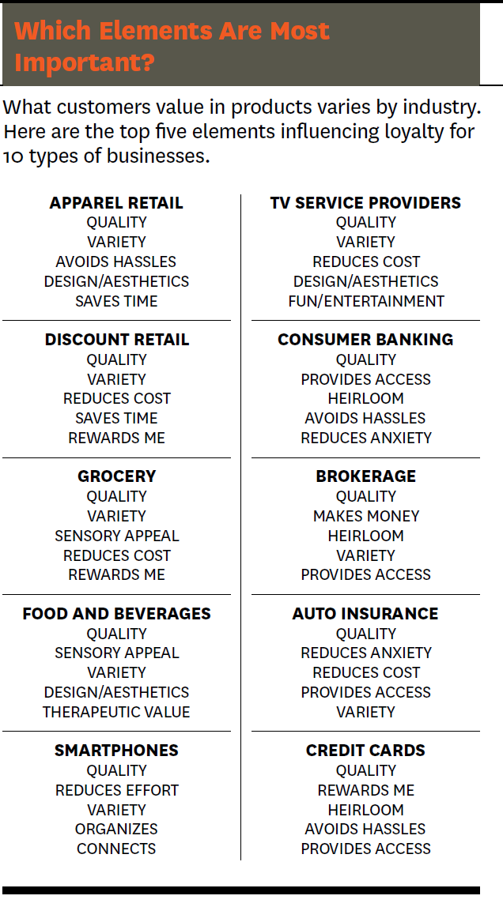

class: middle, center, inverse
# Modeling Consumer Choices

---
## Consumer Choices Modeling
{width=50% height=50%}
---
## Consumer Value

.pull-left[
Marketing and Consumer Behavior Research is all about affecting customer value.[You can read more here](https://hbr.org/2016/09/the-elements-of-value)

Favorite Quote about Marketing: "Marketing is the since of distracting the intelligent mind just long enough to extract money from it" Stephen Leacock, a Canadian humorist and economist. 
]


.pull-right[
{width=40% height=40%}
]

---
## Data Types

.pull-left[
__Revealed preference data__: These are data obtained by observing actual consumer behavior in the market, such as the products they purchase or the prices they pay. This type of data is based on actual choices that consumers make and is generally considered to be more reliable than stated preference data. However, revealed preference data can be difficult to collect and may be subject to confounding factors that make it hard to interpret.

__Stated preference data__: These are data obtained by asking consumers to state their preferences directly, often through surveys or experiments. This type of data is based on hypothetical choices that consumers might make in different scenarios and can be used to explore how consumers value different attributes of a product or service, as well as how they might respond to changes in these attributes. Stated preference data are generally easier and less expensive to collect than revealed preference data, but may be subject to biases and inaccuracies in how respondents perceive and report their preferences.
]


.pull-right[
{width=40% height=40%}
]
---
## Types of stated preference data

Multi-choice data: This type of choice data involves asking respondents to choose among more than two options. For example, a survey question might ask which of several flavors of ice cream is the respondent’s favorite.

Ranked choice data: This type of choice data involves asking respondents to rank a set of options in order of preference. For example, a survey question might ask respondents to rank their top five choices for factors that are important at work.

Rating scale data: This type of choice data involves asking respondents to rate a set of options on a numerical scale. For example, a survey question might ask respondents to rate their level of satisfaction with a store on a scale from 1 to 5.

Likert scale data: This type of choice data involves asking respondents to rate their level of agreement or disagreement with a statement on a scale, typically ranging from “strongly agree” to “strongly disagree.”
---
## Discrete choice Models


---
class: middle, center, inverse
# Multinomial Logit
---
## Models with Multiple Choices
Examples of multinomial choice (polytomous) situations:

1. Choice of a laundry detergent: Tide, Cheer, Arm & Hammer, Wisk, etc. 
```{r out.width="50%", fig.align='center', echo=FALSE}
library(knitr)
include_graphics("https://reviewed-com-res.cloudinary.com/image/fetch/s--ILdgWui---/b_white,c_fill,cs_srgb,f_auto,fl_progressive.strip_profile,g_xy_center,q_auto,w_1200,x_2301,y_1292/https://reviewed-production.s3.amazonaws.com/1478026682000/Best-Detergent-TBRN-Hero.jpg")
```

2. Choice of a major: economics, marketing, management, finance or accounting.
3. Choices after graduating from high school: not going to college, going to a private 4-year college, a public 4 year-college, or a 2-year college. 
---
class: inverse, right
background-image: url("https://boardmember.com/wp-content/uploads/2019/03/AdobeStock_219846704-1024x678.jpeg")
## Models with Multiple Choices
.pull-right[
### Firms also have such multinomial choices
1. In which country to operate
2. Where to locate a store
3. Which CEO to hire
]

---
## Multinomial Logit

The explanatory variable $x_i$ is __individual specific__, but does not change across alternatives. Example age of the individual.
	
The dependent variable is nominal

1. There are more than 2 choices

2. There is no meaningful ordering to them. 
  - Otherwise we would want to use that information (with an ordered probit or ordered logit)
---
## Multinomial Choice Probabilities

Recall, the logit probability is the case of two choices.

$$P_i=\frac{exp(\beta_{0i}+\beta_{1i}X_i)}{exp(\beta_{0i}+\beta_{1i}X_i)+ exp(\beta_{0k}+\beta_{1k}X_k)}$$
The probability that y is equal to choice $i$.

$$P_i=\frac{exp(\beta_{0i}+\beta_{1i}X_i)}{\sum_{k=1}^{K} exp(\beta_{0k}+\beta_{1k}X_k)}$$
The probability that y is equal to choice $j$.

$$P_j=\frac{exp(\beta_{0j}+\beta_{1j}X_j)}{\sum_{k=1}^{K} exp(\beta_{0k}+\beta_{1k}X_k)}$$
Relative probability choices $$P_i/P_j = \frac{exp(\beta_{0i}+\beta_{1i}X_i)}{exp(\beta_{0j}+\beta_{1j}X_j)}$$
---
## Relative Probabilities

We can only identify relative probabilities for each choice.

Similar to our discussion of dummy variables, we need to model our choices as relative to a base.

We set the base by forcing one of the choices to have $\beta$'s equal to zero.

If we do this for choice $j$, then the relative probabilities can be expressed as $$P_i/P_j = exp(\beta_{0i}+\beta_{1i}X_i)$$
---
## IIA Property

* There is the implicit assumption in logit models that the odds between any pair of alternatives is independent of irrelevant alternatives (IIA)

One way to state the assumption

* If choice A is preferred to choice B out of the choice set {A,B}, then introducing a third alternative X, thus expanding that choice set to {A,B,X}, must not make B preferable to A. 

* which kind of makes sense.
---
## IIA Property

There is the implicit assumption in logit models that the odds between any pair of alternatives is independent of irrelevant alternatives (IIA)

In the case of the multinomial logit model, the IIA implies that adding another alternative or changing the characteristics of a third alternative must not affect the relative odds between the two alternatives considered. 

This is not realistic for many real life applications involving similar (substitute) alternatives. 

.pull-left[
```{r echo=FALSE, out.width="100%"}
include_graphics("http://www.ezbustoys.com/images/DB1T110.jpg")

```
]
.pull-right[
Red Bus / Blue Bus Paradox
]
---
## Red Bus/Blue Bus (McFadden 1974). 

Imagine commuters first face a decision between two modes of transportation: cars and red bus
 
Suppose that a consumer chooses between these two options with equal probability, 0.5, so that the odds ratio equals 1. 

Now add a third mode, blue bus. Assuming bus commuters do not care about the color of the bus (they are perfect substitutes), consumers are expected to choose between bus and car still with equal probability, so the probability of car is still 0.5, while the probabilities of each of the two bus types should go down to 0.25

However, this violates IIA: for the odds ratio between car and red bus to be preserved, the new probabilities must be: car 0.33; red bus 0.33; blue bus 0.33

The IIA axiom does not mix well with perfect substitutes.
---
## Alternatives to Multionomial Logit

The advantage of Multinomial Logit (and Logit for that matter) is that the probabilities have a closed form solution (i.e. a simple equation)

An alternative is to use multinomial probit. 

Advantage: NO IIA property!

Disadvantage: Computationally intensive once the number of choices is greater than 3.
---
## Multinomial Logit Example

A relatively common  R  function that fits multinomial logit models is __multinom__ from package __nnet__. 

Let us use the dataset _nels_small_ for an example of how __multinom__ works. 

The variable  _grades_  in this dataset is an index, with best grades represented by lower values of  grade . 

We try to explain the choice of a secondary institution ( _psechoice_ ) only by the high school grade. 
---
## Categorical Dependent Variable

The variable  _pschoice_  can take one of three values:

Variable | Code
------------|-------------
_psechoice_=1 | no college,
_psechoice_=2 | two year college
_psechoice_=3 | four year college
---
## R Code for Multinomial Logit
<small>
```{r message=FALSE, warning=FALSE, include=FALSE, results='asis'}
library(nnet)
data("nels_small", package="PoEdata")
nels.multinom <- multinom(psechoice~grades, data=nels_small)
```
```{r message=FALSE, warning=FALSE, results='asis'}
stargazer::stargazer(nels.multinom, type="html", dep.var.labels.include = FALSE, column.labels = c("2 year college","4 year college"))
```
</small>
---
## Interpreting Output

The output from the _multinom_ function gives coefficient estimates for each level of the response variable  psechoice , except for the first level, which is the benchmark.

We treat the dependent choice variables similar to dummy variables. If there are G options, then we can only identify parameters associated with G-1 options.

As in the probit and logit model, we can only identify relative differences. 

That is, how much the probability of choosing option A over B increases or decreases
---
## Making Predictions
Suppose we wanted to know the probabilities for the median student and for the student in the top 5%. 

```{r}
medGrades <- median(nels_small$grades)
fifthPercentileGrades <- quantile(nels_small$grades, .05)
newdat <- data.frame(grades=c(medGrades, fifthPercentileGrades))
pred <- predict(nels.multinom, newdat, "probs")
knitr::kable(pred, digits = 2)
```

We can clearly see the high performing student is more likely to attend college.
---
# Conditional Logit
---
## Difference between Conditional and Multinomial Logit

Multinomial logit models a choice as a function of the chooser's characteristics, whereas conditional logit models the choice as a function of the choice's characteristics. 

It's really that simple! Note that the two can be combined.

Conditional Logit is a special case of Multinomial Logit
---
## Difference between Conditional and Multinomial Logit

Multinomial logit
$$U_{ij}=X_{i}\beta_j+e_{ij}$$
Conditional logit
$$U_{ij}=X_{ij}\beta+e_{ij}$$

Notice, the difference in the subscripts. Conditional logit does not estimate different $\beta$'s for each choice. Instead, there is one set of parameters, but the characteristics $X$ changes with each product.
---
## Important differences

Characteristics __CANNOT__ vary only by individual. If they do then they will fall out. 

$$Pr(Y_i=j)=\frac{exp(\beta_1 X_{ij}+\beta_2 Z_i)}{\sum_{k=1}^{K}exp(\beta_1 X_{ik}+\beta_2 Z_i) }$$

You can never estimate $\beta_2$ in this case.
---
## Proof

$$\begin{align*} Pr(Y_i=j) &=\frac{exp(\beta_1 X_{ij}+\beta_2 Z_i)}{\sum_{k=1}^{K}exp(\beta_1 X_{ik}+\beta_2 Z_i) } \\ \\
&=\frac{exp(\beta_1 X_{ij})exp(\beta_2 Z_i)}{\sum_{k=1}^{K}exp(\beta_1 X_{ik})exp(\beta_2 Z_i) } \\ \\
&=\frac{exp(\beta_1 X_{ij})exp(\beta_2 Z_i)}{exp(\beta_2 Z_i) \sum_{k=1}^{K}exp(\beta_1 X_{ik}) } \\ \\ 
&=\frac{exp(\beta_1 X_{ij})}{ \sum_{k=1}^{K}exp(\beta_1 X_{ik}) }\end{align*}$$
---
## Fixed Effect Logit

The conditional logit model can effectively removes certain fixed effects. 

Again, consider our previous example.
$$\begin{align*}Pr(Y_i=j) &=\frac{exp(\beta_1 X_{ij}+\beta_2 Z_i)}{\sum_{k=1}^{K}exp(\beta_1 X_{ik}+\beta_2 Z_i) } \\ \\
&=\frac{exp(\beta_1 X_{ij}+\alpha_i)}{\sum_{k=1}^{K}exp(\beta_1 X_{ik}+\alpha_i) }\end{align*}$$

__Warning__: As N grows large, the maximum likelihood routine is not well defined. This problem is called the incidental parameter problem and present in all non-linear models. In R, you can use the package _bife_ to reduce this problem.
---
## Mixed Logit

A mixed logit combines Conditional logit and multinomial logit

If you allow for random coefficients (unobserved heterogeneity also known as random effects), then the mixed logit model can overcome the IIA property.
---
## Conditional/Multinomial/Mixed Logit in R

We will use the mlogit package in R

```{r echo=TRUE, eval=FALSE}
library(mlogit)
data("Fishing", package = "mlogit")
Fish <- mlogit.data(Fishing, varying = c(2:9), shape = "wide", choice = "mode")
## a pure "conditional" model
m1<-mlogit(mode ~ price + catch, data = Fish)
## a pure "multinomial model"
m2<-mlogit(mode ~ 0 | income, data = Fish)
## which can also be estimated using multinom (package nnet)
#library("nnet")
#summary(multinom(mode ~ income, data = Fishing))
## a "mixed" model
m <- mlogit(mode ~ price+ catch | income, data = Fish)
#stargazer::stargazer(m1,m2,m,type="html", dep.var.labels.include = FALSE ,column.labels = c("Conditional","Multinomial","Mixed"), font.size = "tiny", single.row = TRUE)
modelsummary::modelsummary(list("Conditional"=m1,"Multinomial"=m2,"Mixed"=m), stars = TRUE)
```
---
## Examples of Mixed Logit in R 
<small>
```{r eval=TRUE, echo=FALSE, message=FALSE, warning=FALSE, results='asis'}
library(mlogit)
data("Fishing", package = "mlogit")
Fish <- mlogit.data(Fishing, shape="wide", varying=2:9, choice="mode")
## a pure "conditional" model
m1<-mlogit(mode ~ price + catch, data = Fish)
## a pure "multinomial model"
m2<-mlogit(mode ~ 0 | income, data = Fish)
## which can also be estimated using multinom (package nnet)
#library("nnet")
#summary(multinom(mode ~ income, data = Fishing))
## a "mixed" model
m <- mlogit(mode ~ price+ catch | income, data = Fish)
stargazer::stargazer(m1,m2,m,type="html", dep.var.labels.include = FALSE ,column.labels = c("Conditional","Multinomial","Mixed"), font.size = "tiny", single.row = TRUE)
modelsummary::modelsummary(list("Conditional"=m1,"Multinomial"=m2,"Mixed"=m), stars = TRUE)
```
</small>
---
## Summary

* Multinomial choice models are used when the dependent variable represents a choice between several options
* Multinomial probit and multinomial logit are the most popular multinomial choice models
* If choice is between J + 1 options, both will have J equations
* Conditional logit is a special case of multinomial logit with only 1 equation
* Maximum likelihood estimation is the most common way of estimating all these models
* Explanatory variables can be characteristics of the options or the individuals (or both) and can lead to different models (so pay careful attention
* Care must be taken with interpretation of coefficients/marginal effects
