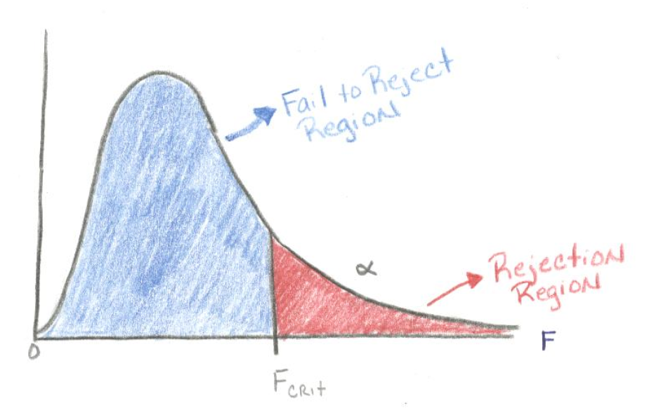
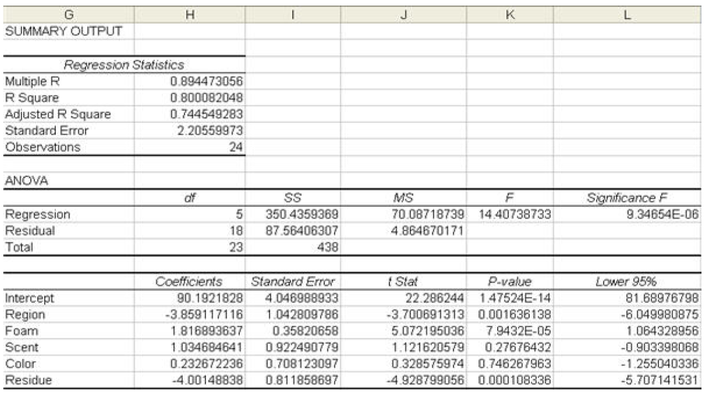
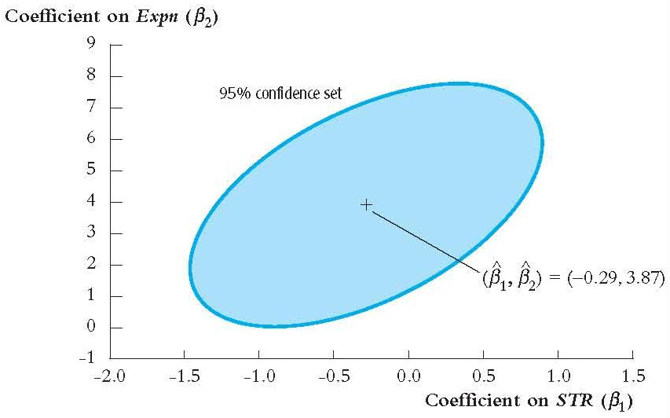
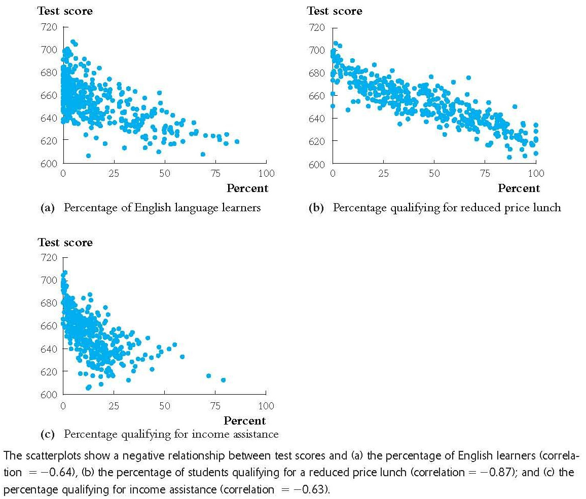
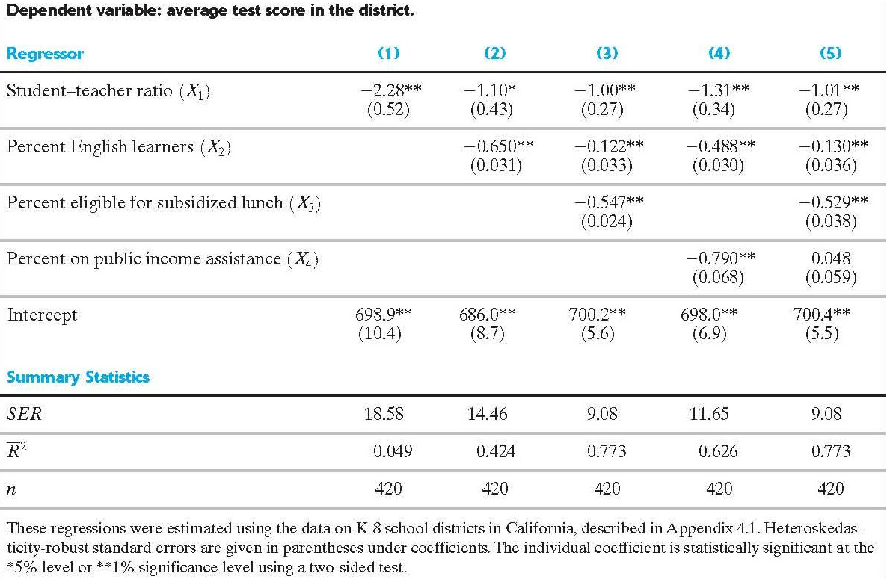

# What is Multiple Regression (1)
In the previous chapter, 

* we extended the simple model to multiple regression points.
* discussed how to separately identify each of these slopes.
* what are some of the pitfalls of "Omitted Variables Bias"

In this chapter, we discuss how to test

* individual point estimates (T-test)
* the whole linear equation (F-test)
* make comparisons between equations (F-test)

---
# Standard Errors for the OLS Estimators

Recall for single regressor estimation we were able to estimate the variance of $\hat{\beta}_1$ $(\sigma_{\hat{\beta}_1}^2)$ by relying on the law of large numbers
We were able to substitute sample averages for expectations
We called this estimate $\hat{\sigma}_{\hat{\beta}_1}^2$
From it we can get the standard error $SE(\hat{\beta}_1)=\sqrt{\hat{\sigma}_{\hat{\beta}_1}^2}$
With multiple regressors we are able to rely on the same concepts (large-sample normality of the estimators) to calculate $SE(\hat{\beta}_j)$ for any $j$

---
# Hypothesis Tests for a Single Coefficient (1)

A Two-sided test for any parameter $\beta_j$ would be $$\begin{align*} H_0&: \beta_j = \beta_{j,0} \\ H_1&: \beta_j \ne \beta_{j,0} \end{align*}$$

For example, suppose the coefficient for $STR$ is $\beta_j$ and we want to test the hypothesis that it is equal to zero. In that case, we would have $\beta_{j,0} = 0$

---
# Hypothesis Tests for a Single Coefficient (2)

The $t$-statistic would be $t =\frac{estimate - hypothesis}{standard error}= \frac{\hat{\beta}_j - \beta_{j,0}}{SE(\hat{\beta}_j)}$

The $p$-value would be $p\text{-value} = 2\Phi(-|t^{act}|)$ where $t^{act}$ is the value of $t$ for the observed sample.

---
# Hypothesis Testing: Wage Example

Consider the following regression result
$$\begin{array}{lclclcl} log(wage) & = & 0.0284 & + & 0.092 \times EDU & + & 0.0041 \times Exp & + & 0.022 \times tenure\\ & & (0.104) & & (0.007) & & (0.0017) & & (0.003) \end{array} $$ 
$n=526$ and $R^2=0.316$
Let's test if $\beta_{exper} = 0$ at the 5% and 1%.

* The null hypothesis is $H_0: \beta_{exper} = 0$
* The alternative hypothesis is $H_A:\beta_{exper} \neq 0$
* Our test statistic is $\frac{\hat{\beta}_{exper}-\beta_j}{SE(\hat{\beta}_{exper})}=\frac{0.0041 - 0}{.0017}=2.41$
* Degrees of Freedom, $df = n - k -1=526 - 3 - 1 = 522$
* Critical values (two-sided): $t_{.025,522}=2.25$ and $t_{.005,522}=2.82$
* We reject the null at the 5%, but not the 1% level.

---
# Hypothesis testing with 2 slopes: Wage Example

Suppose you want to test if $\beta_{educ}=\beta_{tenure}$, then your $H_0:\beta_{educ}-\beta_{tenure}=0$ and  $H_A:\beta_{educ}-\beta_{tenure} \neq 0$ 

Test Statistic: $\frac{\hat{\beta}_{educ}-\hat{\beta}_{tenure}-0}{SE(\hat{\beta}_{educ}-\hat{\beta}_{tenure})}=\frac{\hat{\beta}_{educ}-\hat{\beta}_{tenure}-0}{\sqrt{Var(\hat{\beta}_{educ})+Var(\hat{\beta}_{tenure})-2Cov(\hat{\beta}_{educ},\hat{\beta}_{tenure})}}$

Typical statistical print outs do not provide you with an estimate of the $Cov(\hat{\beta}_{educ},\hat{\beta}_{tenure})$, but with some linear algebra methods these estimates can be found quickly.

We will see how to find these estimates later in these notes.

---
# Confidence Intervals for a Single Coefficient

The method for constructing a confidence interval is the same as with a single regression. The $(1-\alpha)\times 100\%$ confidence interval for coefficient $\beta_j$ is

$$[\hat{\beta}_j - z_{\alpha/2}SE(\hat{\beta}_j), \hat{\beta}_j + z_{\alpha/2}SE(\hat{\beta}_j)]$$

---
# Application to Test Scores and the Student-Teacher Ratio (1)

To restate our results from regressing $TestScore$ on $STR$ and $PctEL$
$$\begin{array}{lclclcl} TestScore & = & 686.0 & - & 1.10 \times STR & - & 0.650 \times PctEL \\ & & (8.7) & & (00.43) & & (0.031) \end{array}$$

To test the hypothesis that the coefficient on $STR$ is 0 we need to compute the $t$-value 

* $t = \frac{-1.10 - 0}{0.43} = -2.54$ 
* and the associated $p$-value is $p\text{-value} = 2\Phi(-2.54) = 0.011$ 
* We can reject the hypothesis at a significance level of 5% but not 1%.

---
# Application to Test Scores and the Student-Teacher Ratio (2)

To calculate the 95% confidence interval for the coefficient on $STR$ 

$$ -1.10 \pm 1.96 \times 0.43 = (-1.95, -0.26) $$

And in response to a increase of 2 of the STR, a 95% confidence interval for the effect on test scores

$$(-1.95\times 2, -0.26\times 2) = (-3.90, -0.52)$$

---
# Adding Another Regressor (1)

Suppose we now want to also estimate the effect of expenditure per student. We want to know whether budget-cuts would be a good idea. We add a new regressor to the two we already have

$$TestScore_i = \beta_0 + \beta_1 STR + \beta_2 Expn + \beta_3 PctEL + u_i$$
```{r message=FALSE, warning=FALSE}
library("AER", quietly=TRUE, warn.conflicts = FALSE, verbose = FALSE)
data("CASchools")
CASchools$str <- with(CASchools, students/teachers)
CASchools$score <- with(CASchools, (math + read)/2)
CASchools$expn.per.1k <- CASchools$expenditure/1000/CASchools$students
regress.results <- lm(score ~ str + expn.per.1k + english, data = CASchools)
coeftest(regress.results, vcov.=vcovHC(regress.results))
```

---
# Adding Another Regressor (2)

The regression results can be restated as
$$ \begin{array}{lclclclcl} TestScore & = & 649.58 &-& 0.29 \times STR &+& 3.87 \times Expn &-& 0.66 \times PctEL \\ & & (15.38) & & (00.48) & & (1.57) & & (0.03) \end{array} $$

Notice that the coefficient on $STR$ has dropped from $-1.10$ in the original regression

* The $t$-statistic for the hypothesis that the coefficient on $STR$ is zero is $(-0.29-0)/0.48 = -0.60$ and the $p$-value is $0.551$
* We cannot reject the hypothesis that it is zero even at the 10% level
* This leads us to conclude that there is no evidence that hiring more teachers improves test scores (reduces $STR$) when expenditure is held constant.

---
# Adding Another Regressor (3)
$$\begin{array}{lclclclcl} TestScore & = & 649.58 & - & 0.29 \times STR & + & 3.87 \times Expn & - & 0.66 \times PctEL \\ & & (15.38) & & (00.48) & & (1.57) & & (0.03) \end{array}$$

* Note that the standard error of $STR$ increased when we added $Expn$
* Note that there is strong correlation between $STR$ and $Expn$

```{r message=FALSE, warning=FALSE}
cor(CASchools$str, CASchools$expenditure)
```

and hence we're seeing the effect of imperfect multicollinearity

---
# Test of Joint Hypothesis (F-test)
Until this point we have only considered testing one coefficient at a time (T-test), but what if we want to test all the coefficients _jointly_?

Consider, the following models
$$\begin{align*} Model ~ 1: y&=\beta_0+\beta_1X_1+\beta_2X_2+e \\ Model ~ 2: y&=\beta_0+\beta_1X_1+e \end{align*}$$

How could we test a null hypothesis such that $H_0:\beta_1-\beta_2=0$ or that Model 1 is better than Model 2. Here the use of an F-statistic is useful.

---
# F-statistic

An F-statistic is the ratio of two variables both are distributed chi-square. $$F=\frac{S^2_2}{S^2_1}$$

where $s^2$ is the sample variance of each regression model. Unlike the T-stat we need to account for two sets of degrees of freedom: the numerator and denominator.

$$df_1=n- ~ No. ~ X's ~ in ~ the ~ first ~ model -1$$
$$df_2=n- ~ No. ~ X's ~ in ~ the ~ second ~ model -1$$

---
# F-statistics (2)

Consider, the following models
$$\begin{align*} Model ~ 1: y&=\beta_0+\beta_1X_1+\beta_2X_2+e \\ Model ~ 2: y&=\beta_0+\beta_1X_1+e \end{align*}$$

each model will produce a different estimate for the variance of the error term. Let the estimate variance of the error term in Model 1 be $s^2_1$ and the estimated variance in Model 2 be $s^2_2$.

If $X_2$ is an important factor in predicting $Y$, then $s^2_2>s^2_1$ because Model 1 can explain more of the variation in the data than Model 2. On the other hand, if $X_2$ is not important, then $s^2_2$ will be close to $s^2_1$.

---
# F-statistic (3)

Using the F-test we can compare these two models $$F=\frac{S^2_2}{S^2_1}$$

If $s^2_1$ is sufficient smaller than $s^2_2$, then the F-statistic will be larger and may enter into the rejection region.

```{r, echo=FALSE, out.width="50%", warning=FALSE, message=FALSE}
library("knitr")

```

---
## F-statistic (4)

If we can reject the null hypothesis of equal variances, then we can conclude $X_2$ contains important information about our dependent variable and that Model 1 is better than Model 2.
   
There are two ways to calculate an F-stat in practice.

If you are comparing two models, then run the regression twice. Once with the full model, then the restricted model (dropping the variables to be tested). Here we can use the $R^2$ in both regressions to calculate our test statistic. $$F=\frac{(R^2_{unrestricted}-R^2_{restricted})/q}{1-R^2_{unrestricted}/(n-k-1)}$$

where $n$ is the sample size, $k$ is the number of explanatory variables in the full model, and $q$ is the difference in the number of explanatory variables between models.

---
# F-statistic (6)

- If you are comparing the full model versus a model with only a constant, then you need to only run the regression once with the full model. But you can calculate the F-stat using two ways in this case.

* You can use the $R^2$ statistic as in the previous example $$F=\frac{(R^2_{unrestricted})/k}{1-R^2_{unrestricted}/(n-k-1)}$$

* You can take the ratio of the Mean Square Error and the Mean Square Regression. $$F=\frac{MSR}{MSE}=\frac{SSR/k}{SSE/(n-k-1)}$$

---
# F-statistic (7)

Example
Consider the following regression output



In this example, $R^2=.80$, $MSR=70.09$, $MSE=4.864$, $F=14.41$, there are 5 explnatory variables, and $n=24$.

Check the two formulas for F from the previous slide.

---
# Testing Hypotheses on Two or More Coefficients

$$TestScore_i = \beta_0 + \beta_1 STR + \beta_2 Expn + u_i$$

Suppose that in the test score/STR analysis, an angry taxpayer hypothesizes that neither the STR nor expenditure per student have an effect on test scores

$$\begin{align*} H_0&: \beta_1 = 0 \text{ and } \beta_2 = 0 \\ H_1&: \beta_1 \ne 0 \text{ and/or } \beta_2 \ne 0 \end{align*}$$

(As a matter of terminology, here we see the null hypothesis imposing two restrictions)

---
# Joint Hypothesis

Joint hypothesis is a hypothesis that imposes $q \geq 2$ restrictions on the regression coefficents.

$H_0: \beta_j = \beta_{j,0}, \beta_m = \beta_{m,0},\dots$ for $q$ restrictions

$H_1:$ one or more of the $q$ restrictions under $H_0$ does not hold

For example, suppose we wanted to test the null hypothesis that the $2^{nd}, 4^{th}, \text{and }5^{th}$ coefficients are zero, we would have the $q=3$ restrictions $\beta_2 = 0, \beta_4 = 0, \text{and }\beta_5 = 0$

---
# Why Not Each Coefficient One At a Time? (1)

If we want to test the joint null hypothesis $\beta_1 = 0$ and $\beta_2 = 0$, why can't we get the $t$-statistic for each and if either exceeds our test's critical value, we reject it?

Because $t_1$ and $t_2$, respectively for the tests on $\beta_1$ and $\beta_2$, are random variables with a bivariate normal distribution, where each has the distribution $N(0,1)$.

---
# Why Not Each Coefficient One At a Time? (2)

Consider the special case where $t_1$ and $t_2$ are uncorrelated

What is the probability each test on its own is rejected, while the joint null hypothesis is true? It should be greater than the $\alpha \times 100$ significance level!

* Take $\alpha = 0.05$: the joint null hypothesis is not rejected if both $|t_1| \leq 1.96$ and $|t_2| \leq 1.96$. 
* This has the probability $Pr(|t_1| \leq 1.96) \times Pr(|t_2| \leq 1.96) = 0.95^2 = 0.9025$ 
* And hence the actual $\alpha$ is $1-0.9025 = 0.0975$

---
# The F-Statistic

In order to test a joint hypothesis with $q=2$ restriction we rely on the $F$-statistic $$F = \frac{1}{2}\left(\frac{t_1^2 + t_2^2 + 2\hat{\rho}_{t_1,t_2}t_1t_2}{1 - \hat{\rho}_{t_1,t_2}^2}\right) \sim F_{2,\infty}$$ where $\hat{\rho}_{t_1,t_2}$ is an estimator of the correlation between the two $t$-statistics.
    In general, for a hypothesis with $q$ restrictions we would have \[ F \sim F_{q,\infty} \]

---
# Computing the p-Value Using The F-Statistic

We can use the large-sample $F_{q,\infty}$ approximation to calculate the $p$-value for an observe $F^{act}$ $$ p\text{-value} = Pr[F_{q,\infty} > F^{act}]$$

---
# Application to Test Scores Regression

We can now test the null hypothesis that the coefficients on $STR$ and $Expn$ are zero, against the alternative that at least one of them is nonzero, holding $PctEL$ fixed. In R we can calculate the heteroskedasticity-robust $F$-statistic and its $p$-value, for the restrictions $\beta_1 = 0$ and $\beta_2 = 0$

---
# Application to Test Scores (2)
```{r message=FALSE, warning=FALSE}
data("CASchools")
CASchools$str <- with(CASchools, students/teachers)
CASchools$score <- with(CASchools, (math + read)/2)
CASchools$expn.per.1k <- CASchools$expenditure/1000/CASchools$students
regress.results <- lm(score ~ str + expn.per.1k + english, data = CASchools)
lht(regress.results, c('str = 0', 'expn.per.1k = 0'), test='F', vcov.=vcovHC(regress.results))
```

---
class: middle, inverse, center
# Testing Single Restrictions Involving Multiple Coefficients

---
## One Restriction with Two Coefficients (1)

Suppose we now want to test the null hypothesis $(q = 1)$ that two of the parameters are equal

$$\begin{align*} H_0&: \beta_1 = \beta_2 \\ H_1&: \beta_1 \ne \beta_2 \end{align*}$$

---
# One Restriction with Two Coefficients (2)

There are two approaches to do this

Test Directly: Some software packages allow for a $q=1$ null hypothesis with multiple coefficients

---
# One Restriction with Two Coefficients (3)

Transform the Regression 

Consider the model $$Y_i = \beta_0 + \beta_1 X_{1i} + \beta_2 X_{2i} + u_i$$ We can transform it by adding and subtracting $\beta_2 X_{1i}$ $$\begin{align*} Y_i &= \beta_0 + \beta_1 X_{1i} + \beta_2 X_{2i} + u_i \\ &= \beta_0 + \beta_1 X_{1i} + \beta_2 X_{2i} + \beta_2 X_{1i} - \beta_2 X_{1i} + u_i \\ &= \beta_0 + (\underbrace{\beta_1 - \beta_2}_{\gamma_1}) X_{1i} + \beta_2 (\underbrace{X_{1i} + X_{2i}}_{W_i}) + u_i \\ &= \beta_0 + \gamma_1 X_{1i} + \beta_2 W_i + u_i \end{align*}$$

The test simplifies to testing the $H_0: \gamma_1 = 0$ vs $H_1: \gamma \ne 0$.

---
# Testing One Restriction with Two Coefficients with R

Consider testing $\beta_1 = \beta_3$ in the test scores model

```{r message=FALSE, warning=FALSE}
data("CASchools")
CASchools$str <- with(CASchools, students/teachers)
CASchools$score <- with(CASchools, (math + read)/2)
CASchools$expn.per.1k <- CASchools$expenditure/1000/CASchools$students
regress.results <- lm(score ~ str + expn.per.1k + english, data = CASchools)
lht(regress.results, 'str = english', test='F', vcov.=vcovHC(regress.results))
```

---
class: inverse, middle, center
# Confidence Sets of Multiple Coefficients

---
## Confidence Sets for Multiple Coefficients

* In the single regressor case, where we describe an interval over which we are $(1-\alpha)\times 100\%$ confident that the true parameter value lies.
* We know what to be able to describe a $k$-dimensional set over which we are $(1-\alpha)\times 100\%$ confident that the true value of $k$ parameters lies
* Consider the case of two coefficients: $\beta_1$ and $\beta_2$.
* A 95% confidence set would be the two dimensional area inside which we are confident that the true values of $\beta_1$ and $\beta_2$ lie with 95% confidence.

---
# Graphical Representation of a Confidence Set


---
class: inverse, middle, center
# Model Specification for Multiple Regression

---
## How To Choose Regressors

The question now becomes what model specification do we use: what variables should our dependent variable be regressed on?

* We should not rely solely on purely statistical measures such as the $R^2$ or $\bar{R}^2$
* Instead, we should rely our expert knowledge of the problem being analyzed.

---
# Omitted Variable Bias in Multiple Regression (1)

In a multiple regression we will have OVB if

* there is an omitted variable that is correlated with one of the included variables
* this omitted variable is a determinant of the dependent variable \( Y \)
* Mathematically, OVB means that $E[u_i|X_{1i},\dots,X_{ki}]$ is nonzero, which violates A.1

---
# Omitted Variable Bias in Multiple Regression (2)

Consider the test scores example

We are regressing $TestScore$ on $STR$, $Expn$ and $PctEL$

But consider that wealthier household would provide greater opportunity for learning outside school for this children

Additionally, districts with wealthier residents would tend to have smaller classer and greater expenditure per student

Hence, the level of affluence of households in a district, which is omitted, would be correlated with $STR$ and $Expn$ and have a direct effect on test scores

---
# The Role of Control Variables in Multiple Regression

> A control variable is a variable added to a regression to remove OVB from a variable of interest. The coefficient on the control variable is not of interest. The causality (influence on the dependent variable) of the control variable cannot be assumed.

---
### Controlling For Students' Economic Background (1)

Now in order to control for the possible OVB in the test scores example due to "outside learning opportunities" available to richer households, we add the regressor $LchPct$: the percentage of students receiving free or subsidized school lunch.
```{r message=FALSE, warning=FALSE}
data("CASchools")
CASchools$str <- with(CASchools, students/teachers)
CASchools$score <- with(CASchools, (math + read)/2)
CASchools$expn.per.1k <- CASchools$expenditure/1000/CASchools$students
regress.results <- lm(score ~ str + english + lunch, data = CASchools)
coeftest(regress.results, vcov.=vcovHC(regress.results))
```

---
### Controlling For Students' Economic Background (2)

No major change is observed for the coefficient on $STR$, and it remains significant at the 1% level.

The coefficient on $LchPct$ is significant and very high. What can we make of this?

The size of the coefficient suggests that dropping the percentage of free or subsidized means from 50% to 0% would result in a 27.34 points increase $(0.547\times (50 - 0))$

Can we claim the same causality for $LchPct$ that we do for $STR$?

---
### Assumption A.1': Conditional Mean Independence (1)

We replace assumption A.1 with assumption A.1' that requires conditional mean independence instead of conditional mean zero $(E[u_i|X_{1i},\dots,X_{ki}] = 0)$.
To explain conditional mean independence, consider a regression with two regressors: $X_{1i}$, the variable of interest, and $X_{2i}$, the control variable. Conditional mean independence would be

$$E[u_i|X_{1i}, X_{2i}] = E[u_i|X_{2i}]$$

---
### Assumption A.1': Conditional Mean Independence (2)

$$E[u_i|X_{1i}, X_{2i}] = E[u_i|X_{2i}]$$

Therefore, in order for us to interpret the causality of $X_{1i}$ the conditional mean of both $X_{1i}$ and $X_{2i}$ must be independent of $X_{1i}$
In other words, once we control for $X_{2i}$ we can assume that $X_{1i}$ is randomly assigned and not correlated with any unobserved characteristics included in $u_i$
The control variable could still be correlated with $u_i$ and hence suffers from OVB

---
### Model Specification in Theory and in Practice (1)

* Given a set of variables, the question is which should be included in our regression?
* If there is an OVB problem we clearly need to add the variables to control for it, but in practice how do we decide which should be controlled for?
* Using our expert judgment or economic theory we first decided on a core set of variables to regress on. This is called the base specification

---
### Model Specification in Theory and in Practice (2)

*   Next we develop a list of candidate alternative specifications.
*   If we see no difference between the base and alternative specification we conclude that we do not need to add the extra regressors in the alternative specification.
*   If there are differences (suggesting OVB) we need to control for the extra omitted variables.

---
### Interpreting the R Squared and the Adjusted R Squared in Practice

* As mentioned before we must be careful not to over rely on these measures in making our choice of specification. Some problems with the $R^2$ and $\bar{R}^2$.

    + An increase in the $R^2$ and $\bar{R}^2$ do not indicate that an added variable is significant
    + The $R^2$ and $\bar{R}^2$ do not indicate causality.
    + The $R^2$ and $\bar{R}^2$ do not indicate an OVB.
    + The $R^2$ and $\bar{R}^2$ do not indicate the appropriateness of a choice of regressors.

---
class: center, middle, inverse
# Analysis of the Test Score Data Set

---
### Discussion of the Base and Alternative Specifications (1)

As we've done before we want to run a multiple regression to determine the effect of student to teacher ratio on average district test scores. 

We explained how we were concerned about OVB and need to control for students' background characteristics. Some controls we will consider

* The percentage of students learning English.
* The percentage of students who are eligible for free or subsidized lunch.
* The percentage of students whose families qualify for income assistance.

---
###  Discussion of the Base and Alternative Specifications (2)


---


---
### Discussion of Empirical Results

1.  Controlling for student background characteristics cuts the effect of $STR$ almost by half, but remains significant. Not large difference between specifications.
2.  Student characteristics are a strong predictor of test scores as witnessed by the big increase in $\bar{R}^2$.
3.  The control variable for the percentage of families receiving income assistance when added to regression (3) as in (5) is not significant, therefore it is redundant when the percentage of free or subsidized meals is included.

