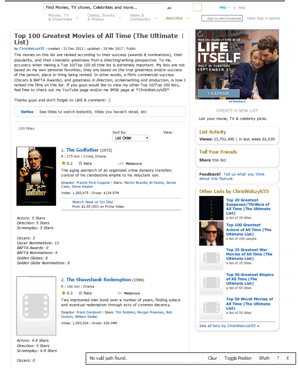
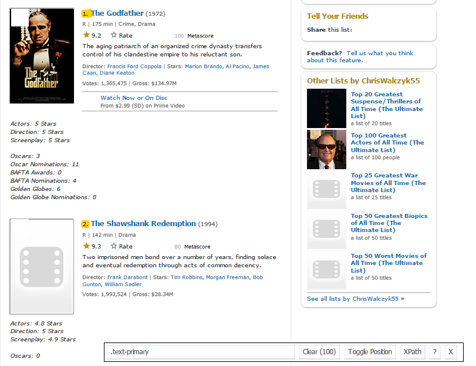

## Quantile Regression

Quantile Regression is an extension of linear regression. 

- Linear regression focuses on estimating the mean of y conditional on x. $$E[Y|X]=X \hat{\beta}$$
- However, we may be interested in other part of the distribution of Y.

- We can use quantile regression which predicts a quantile (or percentile) for given independent variables.
---

## Quantile Regression Basics

Recall that for linear regression we minimize the variance of the error term. $$\sum u_i^2 = \sum (Y_i-\beta_0-\beta_1 X_i)^2$$

Quantile regression uses the absolute value of the error instead.
 $$q\sum |u_i|+(1-q)\sum |u_i| = q\sum |Y_i-\beta_0-\beta_1 X_i|+(1-q)\sum |Y_i-\beta_0-\beta_1 X_i|$$
Median Regression is a special case where $q=0.5$. The objective equation simplifies to  $$\sum |u_i|= \sum |Y_i-\beta_0-\beta_1 X_i|$$
---

## Interpretation

The interpretation of the beta's is similar to that of linear regression. Except, we no longer say the beta's are changing the mean of Y. Instead, the beta's change the value of the p percentile of y. 

Suppose the regression equation for 25th quantile of regression is: $$y = 5.2333 + 700.823 x$$
It means that for one unit increase in x the estimated increase in 25th quantile of y by 700.823 units.
---

## Advantages of Quantile over Linear Regression

- Quite beneficial when heteroscedasticity is present in the data.
- Robust to outliers
- Distribution of dependent variable can be described via various quantiles.
- It is more useful than linear regression when the data is skewed.

- Keep in mind that the coefficients which we get in quantile regression for a particular quantile should differ significantly from those we obtain from linear regression. 
- If it is not so then our usage of quantile regression isn't justifiable.
- How do we know? Check the confidence intervals of each coefficient for both types of regression. If they overlap, then quantile regression is inefficient.
---
## Quantile Regression and R

We will need to install a new package to estimate a quantile regression.

'install.packages("quantreg")'

The primary function will will use in the library is the `rq()` function

`rq(formula, tau = 0.5, data = df_name)`

- formula = the regression equation you chooses to estimate.
- tau = the quantile or percentile you want to estimate. It must be a value between 0 and 1.

---
## Quantile Regression Example

We have discussed that a regression of food expenditures and income may display some heteroscedacity. Therefore, it may be a good option to use quantile regression. 

```{r warning=FALSE, message=FALSE, eval=FALSE, echo=TRUE}
library(quantreg)
data(engel)
qr1 <- rq(foodexp ~ income, tau = .5, data = engel)
qr2 <- rq(foodexp ~ income, tau = .25, data = engel)
qr3 <- rq(foodexp ~ income, tau = .75, data = engel)
ols1 <- lm(foodexp ~ income, data = engel)
stargazer::stargazer(ols1,qr2,qr1,qr3,type = "html",dep.var.labels = "Food Expenditures",column.labels = c("OLS","25 pct","50 pct","75 pct"))
```

---
## Quantile Regression Example
```{r warning=FALSE, message=FALSE, results='asis',eval=TRUE, echo=FALSE}
library(quantreg)
data(engel)
qr1 <- rq(foodexp ~ income, tau = .5, data = engel)
qr2 <- rq(foodexp ~ income, tau = .25, data = engel)
qr3 <- rq(foodexp ~ income, tau = .75, data = engel)
ols1 <- lm(foodexp ~ income, data = engel)
stargazer::stargazer(ols1,qr2,qr1,qr3,type = "html",dep.var.labels = "Food Expenditures",column.labels = c("OLS","25 pct","50 pct","75 pct"))
```

---
## Webscrapping

We are going to scrape the top 100 movies from IMBD.

There are four steps to webscrapping
  1.  Extract - obtaining the data - Library to use rvest
  2.  Preprocess - Cleaning the data - Library to use stringr
  3.  Analyze - Using the data - Libraries to use dplyr, ggplot2

---
## What is Web Scraping?
Web scraping is a technique for converting the data present in unstructured format (HTML tags) over the web to the structured format which can easily be accessed and used.

Almost all the main languages provide ways for performing web scrapping. In these slides, we'll use R for scrapping the data for the most popular feature films from the IMDb website.

We'll get a number of features for each of the 100 popular feature films. Also, we'll look at the most common problems that one might face while scrapping data from the internet because of lack of consistency in the website code and look at how to solve these problems.

---

## Warning about webscrapping

* Although the information is available on a public website, webscrapping is actively prevented by some companies.
  - Using very complicated html code or unorthodox html tags
  - embedding webpages
  - limiting the number of calls your ip can make to the website

* Your webscrap program will need to website specific. There is no one size fits all approach.
* Your webscrape program will need to be modified if the website is updated.

---
## Why do we need Web Scraping?
I am sure the first questions that must have popped in your head till now is "Why do we need web scraping"? As I stated before, the possibilities with web scraping are immense.

To provide you with hands-on knowledge, we are going to scrap data from IMDB. Some other possible applications that you can use web scrapping for are:

- Scrapping movie rating data to create movie recommendation engines.
- Scrapping text data from Wikipedia and other sources for making NLP-based systems or training deep learning models for tasks like topic recognition from the given text.
- Scrapping labeled image data from websites like Google, Flickr, etc to train image classification models.
- Scrapping data from social media sites like Facebook and Twitter for performing tasks Sentiment analysis, opinion mining, etc.
- Scrapping user reviews and feedbacks from e-commerce sites like Amazon, Flipkart, etc.

---
## Ways to scrap data
There are several ways of scraping data from the web. Some of the popular ways are:

* __Human Copy-Paste__: This is a slow and efficient way of scraping data from the web. This involves humans themselves analyzing and copying the data to local storage.
* __Text pattern matching__: Another simple yet powerful approach to extract information from the web is by using regular expression matching facilities of programming languages. You can learn more about regular expressions here.
* __API Interface__: Many websites like Facebook, Twitter, LinkedIn, etc. provides public and/ or private APIs which can be called using standard code for retrieving the data in the prescribed format.
* __DOM Parsing__: By using the web browsers, programs can retrieve the dynamic content generated by client-side scripts. It is also possible to parse web pages into a DOM tree, based on which programs can retrieve parts of these pages.

We'll use the DOM parsing approach during the course of this article.  And rely on the CSS selectors of the webpage for finding the relevant fields which contain the desired information. But before we begin there are a few prerequisites that one need in order to proficiently scrap data from any website.

---
## Pre-requisites

* You will need some knowledge of R. Specifically, we need to learn one of the webscrapping packages. The most popular packages is
```{r echo=TRUE, eval=FALSE}
install.packages('rvest')
```

* Second, some knowledge of HTML and CSS will be a huge advantage. However, if you do not have this knowledge, myself included, the use of Select Gadget is very helpful. 


---
## Scraping a webpage using R
Now, let's get started with scraping the IMDb website for the 100 most popular feature films released in 2016. You can access them here.
```{r echo=TRUE}
#Loading the rvest package
library('rvest')
library('stringr')

#Specifying the url for desired website to be scrapped
url <- 'https://www.imdb.com/list/ls055592025/'

#Reading the HTML code from the website
page <- read_html(url)
```
---
## Now, we'll be scraping the following data from this website.

* __Rank__: The rank of the film from 1 to 100 on the list of 100 most popular feature films released in 2016.
* __Title__: The title of the feature film.
* __Description__: The description of the feature film.
* __Runtime__: The duration of the feature film.
* __Genre__: The genre of the feature film,
* __Rating__: The IMDb rating of the feature film.
* __Votes__: Votes cast in favor of the feature film.
* __Gross_Earning_in_Mil__: The gross earnings of the feature film in millions.
* __Director__: The main director of the feature film. Note, in case of multiple directors, I'll take only the first.
* __Actor__: The main actor of the feature film. Note, in case of multiple actors, I'll take only the first.

---
## Here's a screenshot that contains how all these fields are arranged.


---
## Here's a screenshot that contains how all these fields are arranged.
Step 1: Now, we will start with scraping the Rank field. For that, we'll use the selector gadget to get the specific CSS selectors that encloses the rankings. You can click on the extension in your browser and select the rankings field with cursor.



Make sure that all the rankings are selected. You can select some more ranking sections in case you are not able to get all of them and you can also de-select them by clicking on the selected section to make sure that you only have those sections highlighted that you want to scrap for that go.
---
## Step 2
Step 2: Once you are sure that you have made the right selections, you need to copy the corresponding CSS selector that you can view in the bottom center.


---
## Step 3
Step 3: Once you know the CSS selector that contains the rankings, you can use this simple R code to get all the rankings:

```{r}
#Using CSS selectors to scrap the rankings section
movie.rank <- html_nodes(page,'.text-primary')

#Converting the ranking data to text
movie.rank <- html_text(movie.rank)

#Let's have a look at the rankings
head(movie.rank)
```
---
## Step 4
Step 4: Once you have the data, make sure that it looks in the desired format. I am preprocessing my data to convert it to numerical format.

```{r}
#Data-Preprocessing: Converting rankings to numerical
movie.rank<-as.numeric(movie.rank)

#Let's have another look at the rankings
head(movie.rank)
```
---
## Step 5
Step 5: Now you can clear the selector section and select all the titles. You can visually inspect that all the titles are selected. Make any required additions and deletions with the help of your curser. I have done the same here.


We repeat this for each variable
---
## Extraction Code

```{r}
# movie.rank <- page %>% html_nodes(".text-primary") %>% html_text()
titles <- page %>% html_nodes(".lister-item-header a")  %>%  html_text()
ratings <- page %>% html_nodes(".ipl-rating-star.small .ipl-rating-star__rating") %>% html_text() %>% as.numeric()
release.date <- page %>% html_nodes(".lister-item-header") %>% html_text()
movie.rating <- page %>% html_nodes(".certificate") %>% html_text() 
starring.cast <- page %>% html_nodes(".text-small:nth-child(6)") %>% html_text()
movie.genre <- page %>% html_nodes(".genre") %>% html_text()
movie.runtime <- page %>% html_nodes(".runtime") %>% html_text() 
movie.summary <- page %>% html_nodes(".ipl-rating-widget+ p , .ratings-metascore+ p") %>% html_text()
movie.votes <- page %>% html_nodes(".text-small+ .text-small") %>% html_text()
```
---
## Data Cleaning

Let's look at each one of our variables starting with titles, the star rating, and the movie rating

```{r}
head(titles) # These one looks good
head(ratings)
head(movie.rating)
movie.rating<-factor(movie.rating)
```
---
## Data Cleaning

There are some that need to be cleaned up

```{r}
head(release.date) #Not so pretty
```
---
## Getting rid of some characters
A common type of html code used is new line \n or return \r
We will use the gsub function to get rid of those terms
```{r}
release.date<-gsub("\n","",release.date)
head(release.date)
```
---
## Getting rid of extra spaccing
We will use the gsub function to get rid of extra spaces as well
```{r}
release.date<-gsub("  ","",release.date)
head(release.date)
```
Typically these commands are all you need to clean up a string. However, we want to extract the year between the (), which is difficult in R because a lot of functions use () and ignore them as a character.
---
## Getting items between parantheses using stringr
```{r}
# First, we tell R to grab any thing within ()
release.date<-str_extract_all(release.date, "\\([^()]+\\)")
# This code says to grab the items between parentheses
release.date <- substring(release.date, 2, nchar(release.date)-1)
# Lastly, we change the values from character to numeric
release.date <- release.date %>% as.numeric()
head(release.date)
```

---

## Grabbing only number from a character string
Sometimes we only want to grab the numerical values from a character string.
For example in run-time we do not need the label for minutes just the number
```{r}
head(movie.runtime)
#Grab the first set of numbers
movie.runtime<-as.numeric(gsub("([0-9]+).*$", "\\1", movie.runtime)) 
head(movie.runtime)
```
---
## Cleaning Votes and Earning
In this slide, we deal with the most complicated variable movie.vote
This variable contains both the number of voters as well as Gross Earning for the movie.
We need to not only clean up the variable, but also split the variable. 
The best method is to isolate the values you want for each variable.
Let's start with vote totals first.
```{r}
#First, we clean movie.votes
movie.votes <- gsub("\n","",movie.votes) # removes \n
movie.votes <- gsub("  ","",movie.votes) # removes extra white space
movie.votes <- gsub("Votes:","",movie.votes) #removes the word Votes
movie.votes <- gsub("Gross:","",movie.votes) #removes the word Gross
movie.votes <- gsub(",","",movie.votes) #removes all the commas
movie.votes1<-readr::parse_number(movie.votes) #extracts the first number
head(movie.votes1)
```
---
## Cleaning Revenue
Now that we have vote totals, we want to obtain revenue. We will need to split our movie.vote variable by the character "|".
```{r}
# This one extracts only Revenue
# It splits the variable at each instance of "|" and holds the second value
# We need to do this for each row of the vector.
# We use sapply to repeat the split at each row
movie.rev<-sapply(strsplit(movie.votes, split='|',fixed=TRUE),function(x) (x[2]))
head(movie.rev)
# Lastly, we need to extract the numerical values
movie.rev <- readr::parse_number(movie.rev)
head(movie.rev)
```
---
## Directors and Starring Cast
```{r}
starring.cast<-gsub("\n","",starring.cast)
starring.cast<-gsub("  ","",starring.cast)
starring.cast<-gsub("Director:","",starring.cast)
starring.cast<-gsub("Directors:","",starring.cast)
movie.director<-sapply(strsplit(starring.cast, split="| Stars:", fixed=TRUE),function(x) (x[1]))
movie.cast<-sapply(strsplit(starring.cast, split="| Stars:", fixed=TRUE),function(x) (x[2]))
head(movie.director)
head(movie.cast)
```
---
## Clean-up Summary

```{r}
movie.summary <- gsub("  ","",gsub("\n","",movie.summary))
head(movie.summary)
```
---
## Genre Clean-up
```{r}
movie.genre <- gsub("  ","",gsub("\n","",movie.genre))
movie.genre.primary <- factor(gsub(",.*","",movie.genre))
head(movie.genre.primary)
```
---
## Finally Create Data Frame
```{r}
movie.info<-data.frame(rank = movie.rank, titles, rating = movie.rating, score = ratings, year = release.date, votes = movie.votes1, gross = movie.rev, genres=movie.genre, main_genre = movie.genre.primary, runtime = movie.runtime, director = movie.director, cast = movie.cast, synopsis = movie.summary)
```
---
## Some Data Analysis
```{r message=FALSE, warning=FALSE}
library(knitr)
table(movie.info$rating,movie.info$main_genre) %>% kable(caption="Top 100 Movies by Genre and Rating")
```
---
## Plot 1
```{r message=FALSE, warning=FALSE, out.height="50%"}
library('ggplot2')
qplot(data = movie.info,runtime,fill = main_genre,bins = 30)
```
---
## Plot 2
```{r message=FALSE, warning=FALSE, out.height="50%"}
ggplot(movie.info, aes(x=score,y=gross))+geom_smooth()
```

---
## Quantile Regression on Movie Revenues

```{r echo=FALSE, results='asis'}
ols2<-lm(gross~score+votes, data=movie.info)
qr4 <- rq(gross ~ score+votes, tau = .5, data = movie.info)
qr5 <- rq(gross ~ score+votes, tau = .25, data = movie.info)
qr6 <- rq(gross ~ score+votes, tau = .75, data = movie.info)
stargazer::stargazer(ols2,qr5,qr4,qr6,type = "html",dep.var.labels = "Gross Rev.",column.labels = c("OLS","25 pct","50 pct","75 pct"))
```

