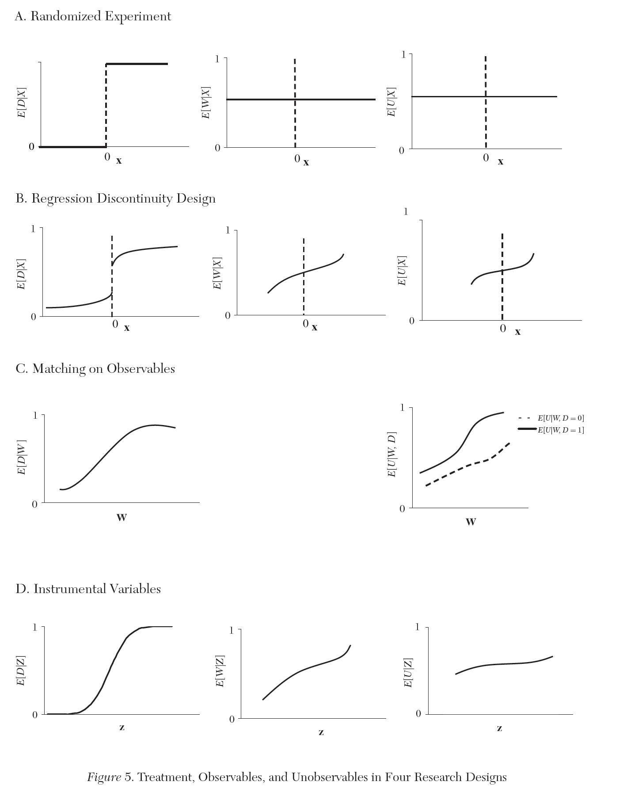
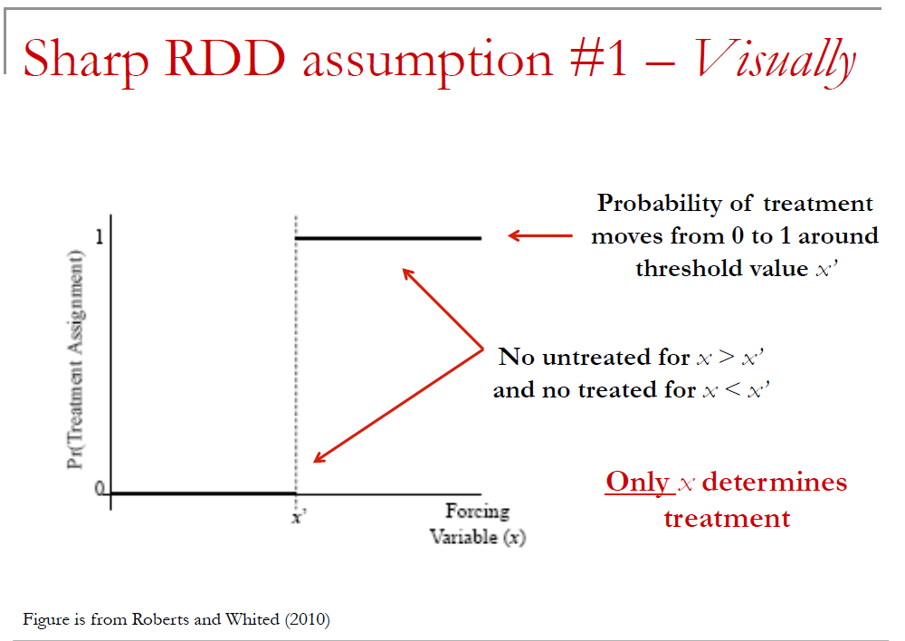
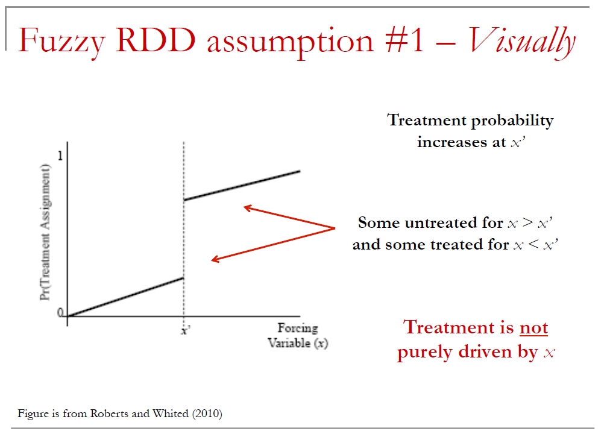
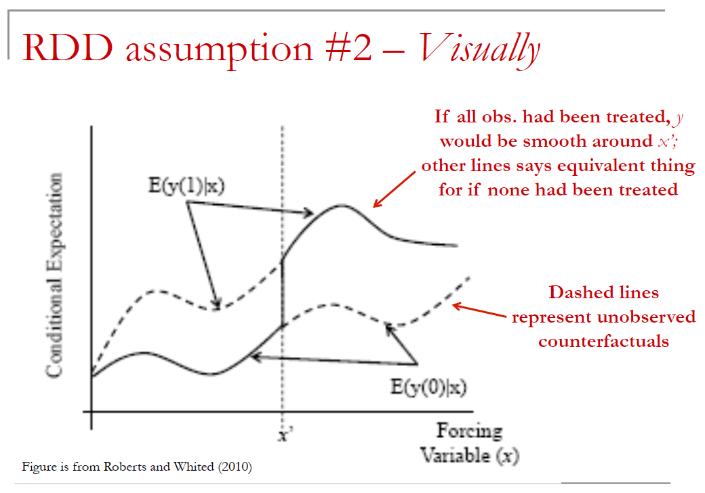
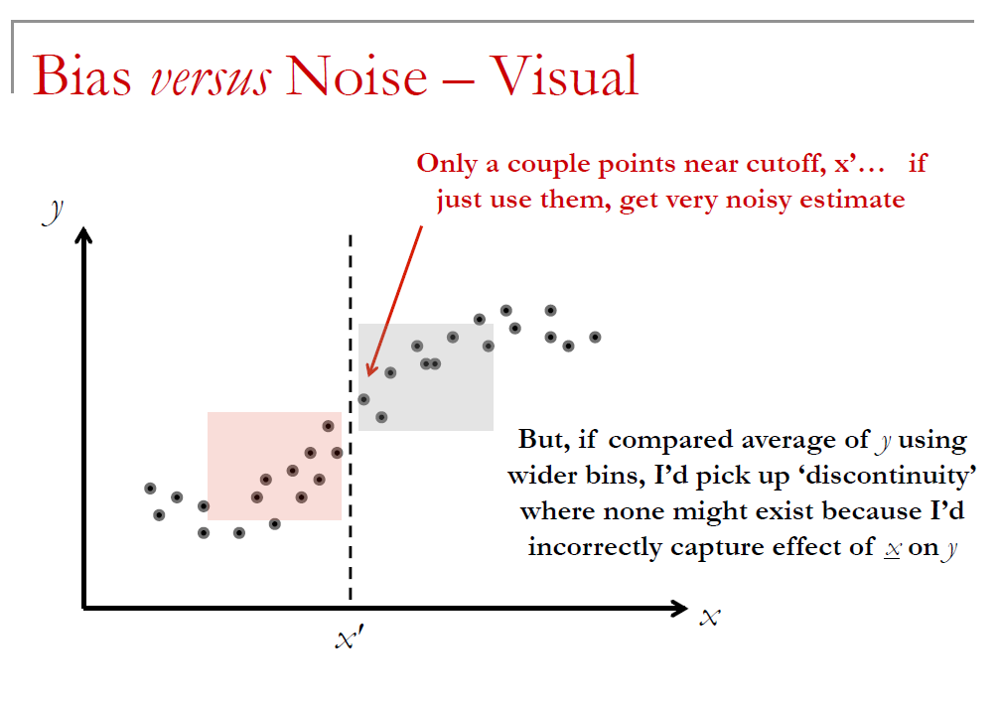
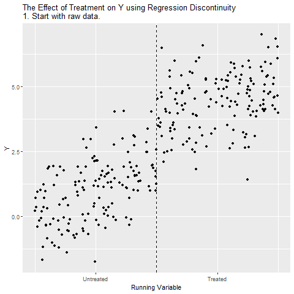
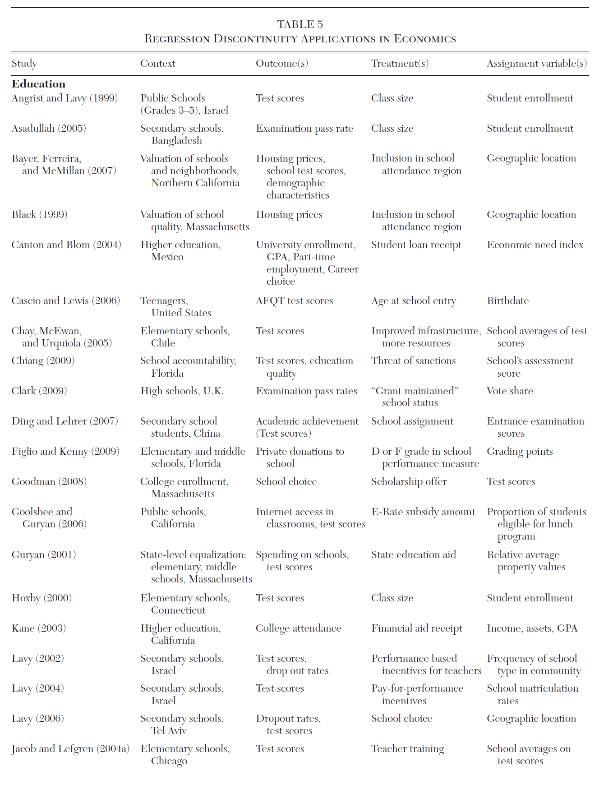
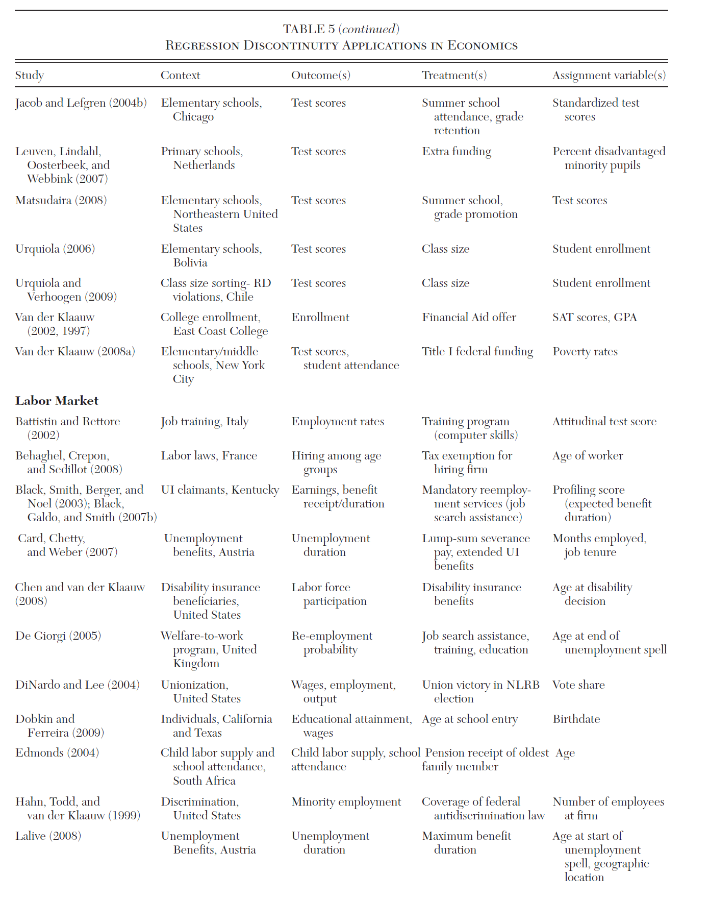
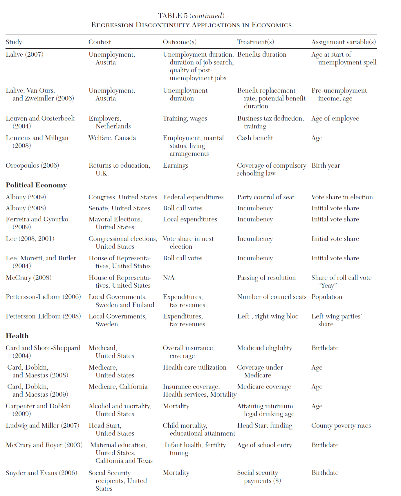
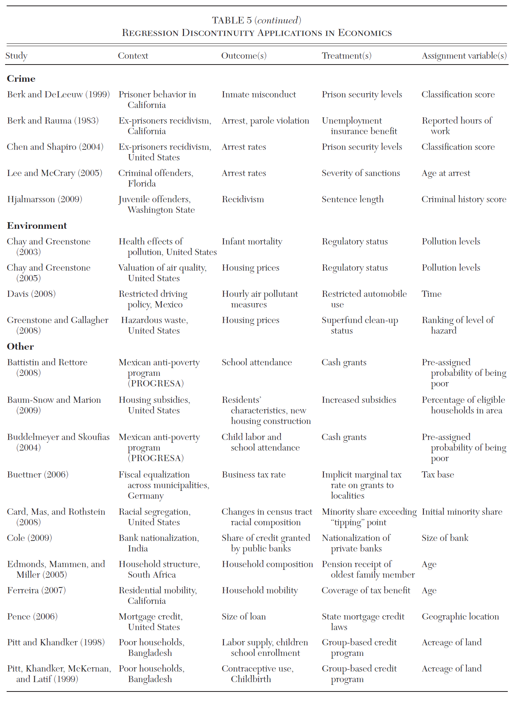

class: middle, center, inverse
# Regression Discontinuity Design 

---
## Quick Review of diff-in-diff

_This document replicates the Table 4.1 and Figures 4.2 4.4 4.5 found in Mastering Metrics (based on data from Carpenter and Dobkin 2009)_

Will adding controls affect diff-in-diff estimates if treatment assignment was random?

- __Answer__ = Not unless you've added 'bad controls', which are controls also affected by treatment.

---
## Quick Review of diff-in-diff

When you've done this, you're no longer estimating the causal effect of treatment

- __Control__ (that are exogenous) will just improve precision, but shouldn't affect estimates

---
## Quick Review of diff-in-diff

What are some standard falsification tests you might want to run with diff-in-diff?

 __Answer__
 
-  Compare ex-ante characteristics of treated & untreated
- Check timing of treatment effect
- Run regression using dep. variables that shouldn't be affected by treatment (if it is what we think it is)
- Check whether reversal of treatment has opposite effect
- Triple-difference estimation

---
## Quick Review of diff-in-diff

If you find ex-ante differences in treated and treated, is internal validity gone?

- __Answer__ = Not necessarily but it could suggest non-random assignment of treatment that is problematic. E.g. observations with characteristic 'z' are more likely to be treated and observations with this characteristic are also likely to be trending differently for other reasons

---
## Quick Review of diff-in-diff

Does the absence of a pre-trend in diff-in-diff ensure that differential trends assumption holds and causal inferences can be made?

 __Answer__ = Sadly, no. We can never prove causality with 100% confidence. It could be that trend was going to change after treatment for reasons unrelated to treatment

---
## Quick Review of diff-in-diff
 
How are triple differences helpful and reducing concerns about violation of parallel trends assumption?

 __Answer__ = Before, an "identification policeman" would just need a story about why treated might be trending differently after event for other reasons. Now, he/she would need story about why that different trend would be particularly true for subset of firms that are more sensitive to treatment

---
## Basic idea of RDD

The basic idea of regression discontinuity RDD is the following:

- Observations (e.g. firm, individual, etc.) are "treated" based on a known cutoff rule.
- The cutoff is what creates the discontinuity.

Researcher is interested in how this treatment affects outcome variable of interest, $y$.

---
## Examples of RDD settings

- If you think about it, these type of cutoff rules are commonplace in finance
    - A borrower FICO score > 620 makes securitization of the loan more likely
        + Keys, et al (QJE 2010)
    
- Accounting variable x exceeding some threshold causes loan covenant violation
    + Roberts and Sufi (JF 2009)

---
## RDD is like difference-in-difference

- Has similar flavor to diff-in-diff natural experiment setting in that you can illustrate identification with a figure
- Plot outcome y against independent variable that determines treatment assignment, x.
- Should observe sharp, discontinuous change in y at the cutoff value of x.

---
## But, RDD is different

- RDD has some key differences. 
    - Assignment to treatment is NOT random;
    - Assignment is based on value of x
    - When treatment only depends on x (what I'll later call "sharp RDD", there is no overlap in treatment & controls; i.e. we never observe the same x for a treatment and a control)

---
## Randomized Experiment
```{r echo=FALSE, out.width="60%", fig.align='center', message=FALSE, warning=FALSE}
library(knitr)

```

---
## RDD randomization assumption

- Assignment to treatment and control isn't random, but whether _individual_ observation is treated is assumed to be random.
  - i.e. researcher assumes that observations (e.g. firm, person, etc.) can't perfectly manipulate their x value
  - Therefore, whether an observation's x falls immediately above or below key cutoff x is random

---
## Two types of RDD

__Sharp RDD__

- Assignment to treatment only depends on x; i.e. if $x >= x'$ you are treated with probability 1

__Fuzzy RDD__

- Having $x >= x'$ only increases probability of treatment; i.e. other factors (besides x) will influence whether you are actually treated or not

---
## Sharp RDD
```{r echo=FALSE, out.width="75%", fig.align='center'}

```

---
## Fuzzy RDD
```{r echo=FALSE, out.width="75%", fig.align='center'}

```

---
## Sharp versus Fuzzy RDD

This subtle distinction affects exactly how you estimate the causal effect of treatment

- With Sharp RDD, we will basically compare average $y$ immediately above and below $x'$
- With fuzzy RDD, the average change in y around the threshold understate causal effect __[why?]__

    - __Answer__ = Comparision assumes all observations were treated, but this isn't true; if all observations had been treated, observed change in y would be even larger; we will need to rescale based on change in probability

---
## Parrallel Trends    
```{r echo=FALSE, out.width="75%", fig.align='center'}

```

---
## Bias vs Noise
```{r echo=FALSE, out.width="75%", fig.align='center'}

```

---
## RDD Animated

```{r echo=FALSE, fig.align='center'}

```

---
## RDD in R

```{r eval=FALSE}
library(AER)
library(foreign)
library(rdd)
library(stargazer)
AEJfigs=read.dta("AEJfigs.dta")
# All = all deaths
AEJfigs$age = AEJfigs$agecell - 21
AEJfigs$over21 = ifelse(AEJfigs$agecell >= 21,1,0)
reg.1=RDestimate(all~agecell,data=AEJfigs,cutpoint = 21)
plot(reg.1)
title(main="All Causes of Death", xlab="AGE",
      ylab="Mortality rate from all causes (per 100,000)")
```

---
## RDD in R

```{r echo=FALSE, message=FALSE, warning=FALSE, fig.align='center'}
library(AER)
library(foreign)
library(rdd)
library(stargazer)
AEJfigs=read.dta("AEJfigs.dta")
# All = all deaths
AEJfigs$age = AEJfigs$agecell - 21
AEJfigs$over21 = ifelse(AEJfigs$agecell >= 21,1,0)
reg.1=RDestimate(all~agecell,data=AEJfigs,cutpoint = 21)
plot(reg.1)
title(main="All Causes of Death", xlab="AGE",ylab="Mortality rate from all causes (per 100,000)")
```

---
## RDD in R
```{r echo=FALSE}
summary(reg.1)
```

---
## RDD in R
```{r echo=FALSE, fig.align='center'}
reg.2=RDestimate(mva~agecell,data=AEJfigs,cutpoint = 21)
plot(reg.2)
title(main="Motor Vehicle Accidents Death", xlab="AGE",ylab="Mortality rate from all causes (per 100,000)")
```

---
## RDD in R 
```{r echo=FALSE}
summary(reg.2)
```

---
## RDD in R
```{r echo=FALSE, fig.align='center'}
reg.3=RDestimate(internal~agecell,data=AEJfigs,cutpoint = 21)
plot(reg.3)
title(main="Internal Causes of Death", xlab="AGE",ylab="Mortality rate from all causes (per 100,000)")
#summary(reg.3)
```

---
## RDD in R

```{r echo=FALSE}
summary(reg.3)
```

---
#### List of Papers that use RDD
```{r out.width="70%",fig.align='center', echo=FALSE}

```

---
#### List of Papers that use RDD
```{r out.width="70%",fig.align='center', echo=FALSE}

```

---
#### List of Papers that use RDD
```{r out.width="70%",fig.align='center', echo=FALSE}

```

---
#### List of Papers that use RDD
```{r out.width="70%",fig.align='center', echo=FALSE}

```

---
## References

C. Carpenter and C. Dobkin, "The Effect of Alcohol Consumption on Mortality: Regression Discontinuity Evidence from the MLDA", American Economic Journal: Applied Economics 1 (2009), 164-182.

A. Abdulkadiroglu, et al., "The Elite Illusion: Achievement Effects at Boston and New York Exam Schools", Econometrica, 2014.
