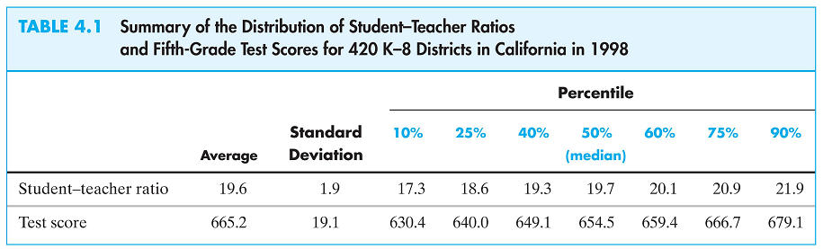

class: center, inverse, middle
# Simple Linear Regression

---
## Introduction

- We are interested in the causal relationship between two random variables \(X\) and \(Y\)
- We assume that \(X\) (the regressor or the independent variable) causes changes in \(Y\) (the dependent variable)
- We assume that the relationship between them is linear
- We are interested in estimating the slope of this linear relationship

---
## Example: The Effect of Class Size on Student Performance (1)

- Suppose the superintendent of an elementary school district wants to know the effect of class size on student performance
- She decides that test scores are a good measure of performance

---
## The Effect of Class Size on Student Performance (2)

What she wants to know is what is the value of $$\beta_{ClassSize} = \frac{\text{change in }TestScore}{\text{change in }ClassSize} = \frac{\Delta TestScore}{\Delta ClassSize}$$
If we knew $\beta_{ClassSize}$ we could answer the question of how student test scores would change in response to a specific change in the class sizes $$\Delta TestScore = \beta_{ClassSize} \times \Delta ClassSize$$
If $\beta_{ClassSize} = -0.6$ then a reduction in class size by two students would yield a change of test scores of $(-0.6)\times(-2) = 1.2$.

---
## Linear Equation of Relationship (1)

$\beta_{ClassSize}$ would be the slope of the straight line describing the linear relationship between $TestScore$ and $ClassSize$

$$TestScore = \beta_0 + \beta_{ClassSize} \times ClassSize$$

If we knew the parameters $\beta_0$ and $\beta_{ClassSize}$, not only would we be able to predict the change in student performance, we would be able to predict the average test score for any class size

---
## Linear Equation of Relationship (2)

We can't predict exact test scores since there are many __other factors__ that influence them that are not included here 
- teacher quality 
- better textbooks 
- different student populations 
- etc.

The equation of the model that includes all these other factors and predicts exact test scores we write

$$TestScore = \underbrace{\beta_0 + \beta_{ClassSize} \times ClassSize}_{\text{Average }TestScore} + \text{ other factors}$$

---
## General Form

More generally, if we have $n$ observations for $X_i$ and $Y_i$ pairs (e.g. $Y_i$ is the average test score and $X_i$ is the average class size, for district $i$)

$$Y_i = \beta_0 + \beta_1 X_i + u_i$$

- $\beta_0$ (intercept) and $\beta_1$ (slope) are the model parameters
- $\beta_0 + \beta_1 X_i$ is the population regression line (function)
- $u_i$ is the error term. It contains all the other factors beyond $X$ that influence $Y$. 

We refer to this relationship as: $Y_i$ regressed on $X_i$

---
## Regression Model Plot


---
## Parameter Estimation

Typically, for our model

$$Y_i = \beta_0 + \beta_1 X_i + u_i$$

We don't know the parameters $\beta_0$ and $\beta_1$

__What is the best way to draw a line through the points?__

---
class: center, inverse, middle
# The Math of Simple Linear Regression

---
## Ordinary Least Squares

We use statistical models to predict the value of a random variable, $y_i$.
$$y_i = model_i+ u_i$$
where i indexes an observation and $u_i$ is the error.

The simplest model is the mean of the random variable, $$\overline{y} = \frac{1}{n}\sum y_{i}.$$

How good our model is depends on how close our prediction, $\overline{y}$, is to actual values, $y_i$. 

We call the difference between these two value the error, $u_i$.  $$u_i = y_i -\overline{y}$$

---
## Minimizing the Variance
A familiar way to quantify this deviation is the variance. $$var(y)=\frac{1}{n}\sum (y_{i}-\overline{y})^{2}=\frac{1}{n}\sum u_{i}^{2}$$

A simple regression makes an improvement over the mean of y. $$y_i = \beta_0 + \beta_1 X_i + u_i$$

We choose the value of $\beta_0$ and $\beta_1$, which minimize the variance. A smaller variance implies a better prediction. 
$$var(y)=\frac{1}{n}\sum u_{i}^{2}=\frac{1}{n}\sum (y_{i}-\beta_0 - \beta_1 X_i)^{2}$$


---
### The Betas
The estimated values of our $\beta$'s are $\widehat{\beta}_{0}$ and $\widehat{\beta}_{1}$. 

$$\widehat{\beta}_{0}=\bar{Y} - \hat{\beta_1}\bar{X}$$
$$\widehat{\beta}_{1}=\frac{COV(Y,X)}{VAR(X)}$$

The regression line improves on the model fit over just using the mean. $$\widehat{y}_{i} = \widehat{\beta}_{0}+\widehat{\beta}_{1}X_i$$

A proof can be found on blackboard or the ebook

---

## Class Size Data

To estimate the model parameters of the class size/student performance model we have data from 420 California school districts in 1999


---
## Correlation and Scatterplot (1)

The sample correlation is found to be -0.23, indicating a weak negative relationship. 

However, we need a better measure of causality. 

We want to be able to draw a straight line through these dots characterizing the linear regression line, and from that we get the slope.

---
## Correlation and Scatterplot (2)
```{r warning=FALSE, message=FALSE}
suppressPackageStartupMessages(library(AER,quietly=TRUE,warn.conflicts=FALSE))
library(ggplot2,quietly=TRUE,warn.conflicts=FALSE)
data("CASchools")
CASchools$str=CASchools$students/CASchools$teachers
CASchools$testscr=(CASchools$read+CASchools$math)/2
qplot(x=str, y=testscr, data=CASchools, geom="point", xlab="Student/Teacher Ratio", ylab="Test Scores")
```

---
## The Ordinary Least Squares Estimator (1)

- The _ordinary least squares (OLS)_ estimator selects estimates for the model parameters that minimize the distance between the sample regression line (function) and the observed data.
- Recall that we use $\bar{Y}$ as an estimator of $E[Y]$ since it minimizes $\sum_i (Y_i - m)^2$
- With OLS we are interested in minimizing $$\min_{b_0,b_1} \sum_i [Y_i - (b_0 + b_1 X_i)]^2$$ We want to find $b_0$ and $b_1$ such that the mistakes between the observed $Y_i$ and the predicted value $b_0 + b_1 X_i$ are minimized.

---
## The Ordinary Least Squares Estimator (2)

The OLS estimator of $\beta_1$ is $$\hat{\beta}_1 = \frac{\sum_i (X_i - \bar{X})(Y_i - \bar{Y})}{\sum_i (X_i - \bar{X})^2} = \frac{s_{XY}}{s_X^2}$$

The OLS estimator of $\beta_0$ is $$\hat{\beta}_0 = \bar{Y} - \hat{\beta}_1 \bar{X}$$

The predicted value of $Y_i$ is $$\hat{Y}_i = \hat{\beta}_0 + \hat{\beta}_1 X_i$$

The error in predicting $Y_i$ is called the residual $$\hat{u}_i = Y_i - \hat{Y}_i$$

---
## OLS Regression of Test Scores on Student-Teacher Ratio (1)

Using data from the 420 school districts an OLS regression is run to estimate the relationship between test score and teacher-student ratio (STR).

$$\widehat{TestScore} = 698.9 - 2.28 \times STR$$

where $\widehat{TestScore}$ is the predicted value. (This is referred to as test scores regressed on STR)

---
## OLS Regression of Test Scores on Student-Teacher Ratio (2)
```{r}
qplot(x=str, y=testscr, data=CASchools, geom="point", xlab="Student/Teacher Ratio", ylab="Test Scores") + geom_abline(intercept=698.9, slope=-2.28, color='blue')
```

---
class: center, inverse, middle
# Goodness of Fit

---
## Goodness of Fit

Now that we've run an OLS regression we want to know

- How much does the regressor account for variation in the dependent variable?
- Are the observations tightly clustered around the regression line?

We have two useful measures

- The regression $R^2$
- The standard error of the regression $(SER)$

---
## The R Squared (1)

  __The $R^2$ is the fraction of the sample variance of $Y_i$ (dependent variable) explained by $X_i$ (regressor)__

- From the definition of the regression predicted value $\hat{Y}_i$ we can write $$Y_i = \hat{Y}_i + \hat{u}_i$$ and $R^2$ is the ratio of the sample variance of $\hat{Y}_i$ and the sample variance of $Y_i$
- $R^2$ ranges from 0 to 1. $R^2 = 0$ indicates that $X_i$ has no explanatory power at all, while $R^2 = 1$ indicates that it explains $Y_i$ fully.

---
## The R Squared (2)

Let us define the total sum of squares ($TSS$), the explained sum of squares ($ESS$), and the sum of squared residuals ($SSR$)

$$\begin{align*} Y_i &= \hat{Y}_i + \hat{u}_i \\ Y_i - \bar{Y} &= \hat{Y}_i - \bar{Y} + \hat{u}_i \\ (Y_i - \bar{Y})^2 &= (\hat{Y}_i - \bar{Y} + \hat{u}_i)^2 \\ (Y_i - \bar{Y})^2 &= (\hat{Y}_i - \bar{Y})^2 + (\hat{u}_i)^2 + 2(\hat{Y}_i - \bar{Y})\hat{u}_i \\ \underbrace{\sum_i(Y_i - \bar{Y})^2}_{TSS} &= \underbrace{\sum_i(\hat{Y}_i - \bar{Y})^2}_{ESS} + \underbrace{\sum_i(\hat{u}_i)^2}_{SSR} + \underbrace{2\sum_i(\hat{Y}_i - \bar{Y})\hat{u}_i}_{=0} \\ TSS &= ESS + SSR \end{align*}$$

---
## The R Squared (3)

$$TSS = ESS + SSR$$

$R^2$ can be defined as $$R^2 = \frac{ESS}{TSS} = 1 - \frac{SSR}{TSS}$$

---
## SSR and SSE

- You can think of the ESS (Explained sum of squres) as the amount of the total variation that the regression line explains. 
- Essentially, it tells us how much better using a line is over just using the mean of the dependent variable. 
- The SSR (Sum of Square Residual) tells us how much of the total variation is left unexplained. 

---
## The Standard Error of the Regression

The standard error of the regression $(SER)$ is an estimator of the standard deviation of the population regression error $u_i$.

Since we don't observe $u_1,\dots, u_n$ we need to estimate this standard deviation
We use $\hat{u}_1,\dots, \hat{u}_n$ to calculate our estimate

$$SER = s_{\hat{u}}$$ where $$s_{\hat{u}}^2 = \frac{1}{n-2}\sum_i \hat{u}_i^2 = \frac{SSR}{n-2}$$

---
## Measure of Fit of Test Score on STR Regression

- The $R^2$ is calculated to be 0.051. This means that the $STR$ explains 5.1\% of the variance in $TestScore$.
- The $SER$ is calculated to be 18.6. This is an estimate of the standard deviation of $u_i$ which shows a large spread.
- Low $R^2$ (or low $SER$) does not mean that the regression is bad: it means that there are other factors that have a strong influence on the dependent variable that have not been included in the regression.

---
class: center, inverse, middle
# Regression in R

---
## Load the data
If you haven't done so already, then let's load the data into R.
We want the CA Schools data from the AER library.

Enter the following code into R

- library(AER)
- data(CASchools)

---
## Let's run a regression
```{r}
regress.results=lm(formula = testscr ~ str, data=CASchools)
summary(regress.results)
```


---
class: center, inverse, middle
# Sampling Distribution of the OLS Estimators

---
## Coefficients are Random Variables

- Since our regression coefficient estimates, $\beta_0$ and $\beta_1$, depend on a random sample $(X_i, Y_i)$ they are random variables
- While their distributions might be complicated for small samples, for large samples, using the __Central Limit Theorem__, they can be approximated by a normal distribution.
- It is important for us to have a way to describe their distribution, in order for us to carry out our inferences about the population.

---
## Review of Sampling Distribution of the Sample Mean of Y

When we have a large sample, we can approximate the distribution of the random variable $\bar{Y}$ by a normal distribution with mean $\mu_Y$.

---
## The Sampling Distribution of the Model Coefficient Estimators (1)

- Both estimates are unbiased: $E[\hat{\beta}_0] = \beta_0$ and $E[\hat{\beta}_1] = \beta_1$.
- Using the same reasoning as we did with $\bar{Y}$, we can use the CLT to argue that $\hat{\beta}_0$ and $\hat{\beta}_1$ are both approximately normal
- The large sample variance of $\hat{\beta}_1$ is $$\sigma_{\hat{\beta}_1}^2 = \frac{1}{n}\frac{Var[(X_i - \mu_X)u_i]}{[Var(X_i)]^2}$$
- If the error terms are homoscedastic (constant variance), then the equation simplifies to $$\sigma_{\hat{\beta}_1}^2 = \frac{1}{n}\frac{Var[u_i]}{[Var(X_i)]^2}$$
- Since $\sigma_{\hat{\beta}_1}^2$ decreases to zero the large the sample, $\hat{\beta}_1$ is said to be consistent

---
## The Sampling Distribution of the Model Coefficient Estimators (2)

Another implication of the variance of $\hat{\beta}_1$ $$\sigma_{\hat{\beta}_1}^2 = \frac{1}{n}\frac{Var[(X_i - \mu_X)u_i]}{[Var(X_i)]^2}$$

is the larger $Var(X_i)$ the smaller is $\sigma_{\hat{\beta}_1}^2$ and hence tighter is our prediction of $\beta_1$.

---
## The Effect of Greater Variance in X


---
## The Sampling Distribution of the Model Coefficient Estimators (3)

Yet another implication of the variance of $\hat{\beta}_1$

$$\sigma_{\hat{\beta}_1}^2 = \frac{1}{n}\frac{Var[(X_i - \mu_X)u_i]}{[Var(X_i)]^2}$$

is that the smaller the variance $u_i$ the smaller is $\sigma_{\hat{\beta}_1}^2$ and hence tighter is our prediction of $\beta_1$.

---
## The OLS Assumptions

1. The error term $u_i$ has a mean of zero, $E[u_i]=0$.
2. The error term is independent of the X's, $E[X_i u_i]=COV(X_i,u_i)=0$.
3. The error term has a constant variance, $Var[u_i|X_i]=\sigma^2$.
4. The variables $Y_i$ and $X_i$ are independently identically distributed (i.e. they are a random sample)
5. The relationship between $Y_i$ and $X_i$ is linear with respect to the parameters
6. There are no large outliers.
7. For testing reasons, we do assume the error terms are normally distributed. 

These assumptions are necessary for us to be able to estimate, test, and interpret the $\beta$'s.
