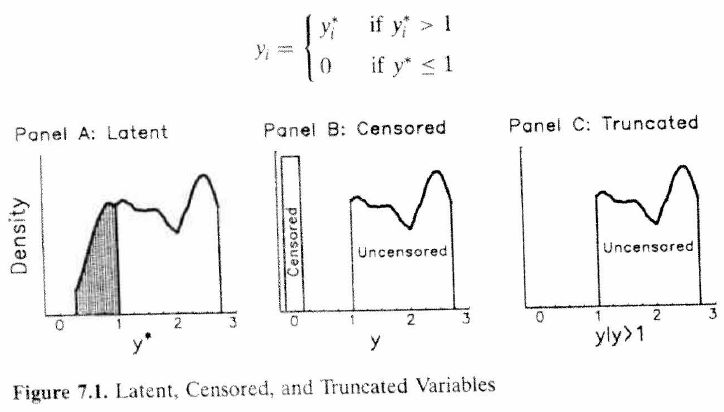
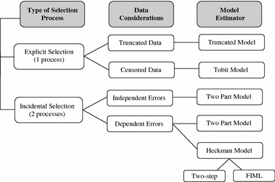

## Censored Data

In the world of data science sometimes data do not appear the way we would like.

One such case is when data are either _top coded_ or _bottom coded_.

For example, you may be interested in household income. You run to the American Community Survey only to find the following.

* Household earning less than $10,000 are given a lumped into one income category (i.e. _bottom coded_).
* Household earning more than $1,000,000 are given a lumped into the top income cateogry (i.e. _top coded_).

These variables are missing due to exogenous reasons.
---
## Censored Data

A second type of censored data is when the data are missing for endogenous reasons.

For example, a person's wage information is missing because they are not in the labor force. However, this does not mean that if we could magically put them in the labor force that their wage would be zero.

Simply, the person's __reservation wage__ is higher than the wage offers they are receiving.

A different example, consider you want to know the effect of High School GPA on College GPA. You will only observe a college GPA for people who get into college. Likewise, if you sample college students, then you will observe college GPA, but you will only observe the high school GPA of individuals who entered college.
---
## Truncated Data

A third problem that can exist is that not only can you not observe the dependent variable, but you also cannot observed the explanatory variables.

In this case, if both the dependent and independent variables are censored due to a cutoff value, then we say the data are truncated.
---
## Censored Data

Therefore, we need three different types of models to deal with _exogenous_ missing data and _endogenous_ missing data.

Tobit - exogenously censored dependent variable.

Truncated Regression - exogenous censoring of both dependent and independent variables.

Sample Selection Model (Heckman Model) - endogenously censored dependent variable
---
## Tobit

Suppose Y (wages) are subject to "top coding" (as is often observed in government data):
$$Y=\left\{\begin{matrix}
y^* & y^*<c \\ 
c & y^*>c
\end{matrix}\right.$$

We are interested in estimating the equation $$Y=X\beta+u$$

If we are willing to assum $u \rightarrow N(0,\sigma^2)$, then we can use the Tobit Model
---
## Tobit Density and Likelihood Function

The probability density of Y will resemble that of a normal distribution.
$$f(y)=\left\{\begin{matrix}
\frac{1}{\sigma}\phi(\frac{y_i-X_i'beta}{\sigma}) & y^*<c \\ 
1-\Phi(\frac{c-X_i'beta}{\sigma}) & y^*>c
\end{matrix}\right.$$

Log Likelihood Function $$LL(\beta,\sigma)=\sum_{c<y} \frac{1}{\sigma}\phi(\frac{y_i-X_i'beta}{\sigma})+\sum_{c>y} 1-\Phi(\frac{c-X_i'beta}{\sigma})$$

---
## The Expected Value of the Tobit model

The unconditional expected value is of Y is
$$E[Y_i]=\Phi(\frac{x_i \beta}{\sigma})(x_i \beta+\sigma *\lambda) \\ \lambda = \frac{\phi(x_i \beta)/\sigma}{\Phi(x_i \beta/\sigma)}$$
If we condition on Y>0, then the expected value simplifies to 

$$E[Y_i|Y_i>0,x]=x_i \beta+\sigma *\lambda \\ \lambda = \frac{\phi(x_i \beta)/\sigma}{\Phi(x_i \beta/\sigma)}$$
---
## Marginal Effects of Tobit Model

We can calculate the probability of Y>0
$$Pr(Y>0)=\Phi(x_i \beta/\sigma) \\ \frac{d Pr(Y>0)}{dx} = \frac{\beta}{\sigma}*\phi(x_i \beta/\sigma)$$
Similarly, we can calculate the marginal effect of x on Y.
$$\frac{d E[Y]}{dx} = \beta*\Phi(x_i \beta/\sigma)$$

---
## Tobit Model in R
```{r eval=FALSE, message=FALSE, warning=FALSE}
library(AER)
library(stargazer)
data("Affairs")
fm.ols <- lm(affairs ~ age + yearsmarried + religiousness + occupation
             + rating,  data = Affairs)
fm.tobit <- tobit(affairs ~ age + yearsmarried + religiousness + occupation 
                  + rating,  data = Affairs)
fm.tobit2 <- tobit(affairs ~ age + yearsmarried + religiousness + occupation 
                   + rating,  right = 4, data = Affairs)
stargazer(fm.ols,fm.tobit,fm.tobit2,type="html")
```
---
## Tobit Model in R 
```{r echo=FALSE, message=FALSE, warning=FALSE, results='asis'}
library(AER)
library(stargazer)
data("Affairs")
fm.ols <- lm(affairs ~ age + yearsmarried + religiousness + occupation + rating,  data = Affairs)
fm.tobit <- tobit(affairs ~ age + yearsmarried + religiousness + occupation + rating,  data = Affairs)
fm.tobit2 <- tobit(affairs ~ age + yearsmarried + religiousness + occupation + rating,  right = 4, data = Affairs)
stargazer(fm.ols,fm.tobit,fm.tobit2,type="html",omit.table.layout = "sn", model.numbers = FALSE, font.size = "small", single.row = TRUE, star.char = c("c","b","a"), style = "qje")
```
---
class: center, inverse, middle
# Truncated Regression
---
## Truncated Regression

Truncated data differ from censored data in that we only observe y __and__ x if y is above (below) a certain cutoff. In censored data, we always observed x.

Example: Hausman and Wise's analysis of the New Jersey negative income tax experiment (Truncated Regression)

Goal: Estimate earnings function for low income individuals

Truncation: Individuals with earnings greater than 1.5 poverty level were excluded from the sample.

Two types of inference:

1. Inference about entire population in presence of truncation
2. Inference about sub-population observed
---
## Truncated Regression Model
$$y_i=x_i'\beta+e_i, i=1, ..., n$$
where the error term $e_i \rightarrow N(0,\sigma^2)$

Truncation from below: observe $y_i$ and $x_i$ if $y_i>c$

Truncation from above: observe $y_i$ and $x_i$ if $y_i<c$
---
## Truncated Normal Distribution
Let X be a normally distributed random variable with mean $\mu$ and variance $\sigma^2$. Also, let there be a cutoff constant $c$.

Then we can write the probability density function of X to be 
$$\begin{align*}f(X|X>c) &= \frac{f(x)}{Pr(X>c)}=\frac{f(x)}{1-F(c)} \\ \\&= \frac{\frac{1}{\sigma}\phi\frac{x-\mu}{\sigma}}{1-\Phi(\frac{c-\mu}{\sigma})}\end{align*}$$
---
## Truncated Normal Distribution
The mean and variance are given by 
$$\begin{align*}E[X|X>c] &= \mu+\sigma \lambda(\frac{c-\mu}{\sigma}) \\ var(X|X>c) &= \sigma^2(1-\delta(\frac{c-\mu}{\sigma})) \end{align*}$$

where $\lambda(x)=\frac{phi(x)}{1-Phi(x)}$ = Inverse Mills Ratio and $\delta(x)=\lambda(x)(\lambda(x)-x),\,0<\delta(x)<1$


---
## Truncated Normal Distribution

Consequences of not accounting for the truncation is that you will overstate the mean and understate the variance. __WHY?__

We are throwing out lower values pushing the mean up.

We are throwing out values from the extreme part of the distribution, which means we have less variation in the remaining data.
---
## Estimate of Truncated Normal
Simply using Ordinary Least Squares will result in a bias.

Instead, we use maximum likelihood. We can correct for the missing data by dividing the probability density function by the Pr(y>c).

$$f(y|y>c) =\frac{\frac{1}{\sigma}\phi\frac{y-x'\beta}{\sigma}}{1-\Phi(\frac{c-x'\beta}{\sigma})}$$
Notice that $\int_c^\infty f(y|y>c) dy=1$

Likelihood function $$L(\beta,\sigma^2|x,y)=\prod_i^n \frac{\frac{1}{\sigma}\phi\frac{y-x'\beta}{\sigma}}{1-\Phi(\frac{c-x'\beta}{\sigma})}$$
---
## Truncated Regression in R
```{r}
########################
## Artificial example ##
########################
## simulate a data.frame
set.seed(1071)
n <- 10000
sigma <- 4
alpha <- 2
beta <- 1
x <- rnorm(n, mean = 0, sd = 2)
eps <- rnorm(n, sd = sigma)
y <- alpha + beta * x + eps
d <- data.frame(y = y, x = x)
```
---
## Truncated Regression in R
```{r message=FALSE, warning=FALSE}
library(truncreg) # Truncated Regression package
## truncated response
d$yt <- ifelse(d$y > 1, d$y, NA)
## compare estimates for full/truncated/censored/threshold response
fm_full <- lm(y ~ x, data = d)
fm_ols <- lm(yt ~ x, data = d)
fm_trunc <- truncreg(yt ~ x, data = d, point = 1, direction = "left")
```
---
## OLS vs Truncreg
```{r echo=FALSE, message=FALSE, warning=FALSE, results='asis'}
stargazer::stargazer(fm_full,fm_ols,fm_ols,type="html",dep.var.labels = c("Full Data","Truncated"),column.labels = c("OLS","OLS","Trunc. Reg."),coef=list(NULL,NULL,fm_trunc$coefficients[1:2]),se = list(NULL,NULL,sqrt(diag(fm_trunc$vcov[1:2,1:2]))),omit.stat = c("rsq","adj.rsq","F","ser"), model.numbers = FALSE, font.size = "small", single.row = TRUE, star.char = c("c","b","a"), omit.table.layout = "sn")
```
---
## Truncated Regression: Histogram
```{r message=FALSE, warning=FALSE, eval=FALSE}
group1<-rep("Normal",length(d$y))
group2<-rep("Truncated",length(d$yt))
data_1<-data.frame(c(d$y,d$yt),c(group1,group2))
names(data_1)<-c("Y","groups")
library(ggplot2)
ggplot(data_1, aes(x=Y, fill=groups)) +
     geom_density(alpha=.3)
```
---
## Truncated Regression: Histogram
```{r message=FALSE, warning=FALSE, echo=FALSE}
group1<-rep("Normal",length(d$y))
group2<-rep("Truncated",length(d$yt))
data_1<-data.frame(c(d$y,d$yt),c(group1,group2))
names(data_1)<-c("Y","groups")
library(ggplot2)
ggplot(data_1, aes(x=Y, fill=groups)) +
     geom_density(alpha=.3)
```
---
class: center, middle, inverse
# Heckman Model
---
## Heckman Model

The Heckman Model can be thought of as a two part model (but it can be done in one step)

Step 1. You estimate a probit/logit model that determines if the dependent variable is censored.

Step 2. Construct the Inverse Mills Ratio (corrects for sample selection)

Step 3. Run the regression including the Inverse Mills Ratio as an explanatory variable. 
---
## Heckman Model: Math

Consider the model
$$\begin{align*}Y &= X\beta +\sigma u \\
d &=1(z'\gamma+v>0) \end{align*}$$

where z contains an instrumental variable not contained in X. The error terms $v$ and $u$ are assumed to be jointly distributed standard normal. $$\binom{u}{v}\to N\left ( 0,\begin{bmatrix} 1 & \rho \\ \rho & 1 \end{bmatrix} \right )$$
---
## Heckman Model: Math

We want to estimate the 

$$\begin{align*}E[Y|X,d=1] &= X\beta+\sigma E[u|d=1] \\
&= X\beta+\sigma E[u|z'\gamma+v>0]  \\
&= X\beta+\sigma \rho \lambda(z'\gamma) \end{align*}$$

where $\lambda(z\gamma)$ is called the _Inverse Mills Ratio_ $$\lambda(z\gamma)=\frac{\phi(z'\gamma)}{\Phi(z'\gamma)}$$
---
## Heckman Two Step

First, we estimate the decision equation to get our estimates of $\gamma$.

We use those estimates to construct $\lambda(z'\widehat{\gamma})$.

Then we estimate the level equation as $$Y=X\beta+\alpha\lambda(z'\widehat{\gamma})+u$$

If $\alpha=0$, then there is no sample selection problem.
---
## OLS versus Heckman

Now is a good time to think about how Heckman corrects OLS.

Let's restate the omitted variable bias (OVB) table, but using the correction factor as the OV. If x affects both the participation equation and the level equation, then we will have some sort of OVB.

Signs      | Corr($x$,Mills Ratio)>0 | Corr($x$,Mills Ratio)<0
---------  | ------------------- | ------------------
$\alpha>0$| Positive Bias       | Negative Bias
$\alpha<0$| Negative Bias       | Positive Bias

---
## Heckman Model in R
```{r eval=FALSE, message=FALSE, warning=FALSE}
library(sampleSelection)
data( Mroz87 )
Mroz87$kids  <- ( Mroz87$kids5 + Mroz87$kids618 > 0 )
# Two-step estimation
heck.m1 <- heckit( lfp ~ age + I( age^2 ) + faminc + kids + educ,
   wage ~ exper + I( exper^2 ) + educ + city, Mroz87, method = "2step" ) 
# MLE Estimator
heck.m2 <- heckit( lfp ~ age + I( age^2 ) + faminc + kids + educ,
   wage ~ exper + I( exper^2 ) + educ + city, Mroz87, method = "ml" ) 
# OLS Estimator
ols.m1 <- lm(wage ~ exper + I( exper^2 ) + educ + city, Mroz87)
stargazer::stargazer(ols.m1,heck.m1,heck.m2,type="html", model.numbers = FALSE, font.size = "small", single.row = TRUE, star.char = c("c","b","a"), omit.table.layout = "sn")
```

---

```{r echo=FALSE, message=FALSE, warning=FALSE, results='asis'}
library(sampleSelection)
data( Mroz87 )
Mroz87$kids  <- ( Mroz87$kids5 + Mroz87$kids618 > 0 )
# Two-step estimation
heck.m1 <- heckit( lfp ~ age + I( age^2 ) + faminc + kids + educ,
   wage ~ exper + I( exper^2 ) + educ + city, Mroz87, method = "2step" ) 
# MLE Estimator
heck.m2 <- heckit( lfp ~ age + I( age^2 ) + faminc + kids + educ,
   wage ~ exper + I( exper^2 ) + educ + city, Mroz87, method = "ml" ) 
# OLS Estimator
ols.m1 <- lm(wage ~ exper + I( exper^2 ) + educ + city, Mroz87)
stargazer::stargazer(ols.m1,heck.m1,heck.m2,type="html", omit.stat = c("rsq","f","adj.rsq","ser"), model.numbers = FALSE, font.size = "small", single.row = TRUE, star.char = c("c","b","a"), style = "qje")
```
---
## Summary
```{r fig.align='center',echo=FALSE,out.width="100%"}

```
---
## Summary
```{r fig.align='center',echo=FALSE,out.width="100%"}

```
