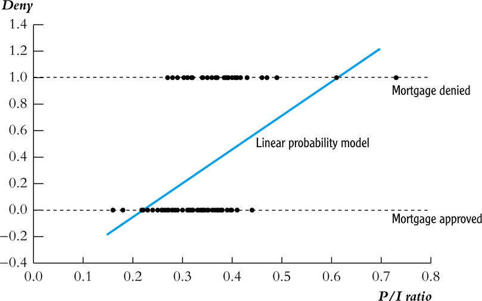
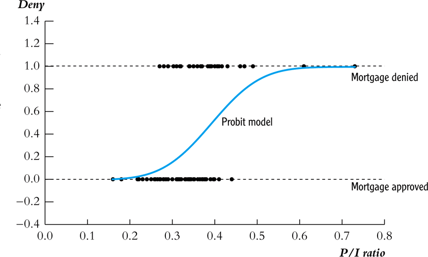
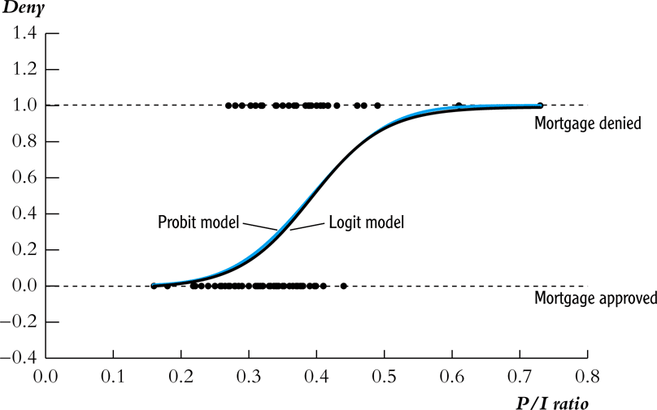

## Introduction (1)

* Previously, we learned how to use binary variables as explanatory variables (dummy/indicator variables)
* But in some cases we might be interested in learning how entity characteristics influence a binary dependent variable
* For example, we might be interested in studying whether there is racial discrimination in the provision of loans
    * We are interested in comparing individuals who are identify with different races, but are otherwise identical
    * It is not sufficient to compare average loan denial rates

---
## Introduction (2)

We will consider two forms of regression to analyze such situations

1.  __Linear Probability Models__, using linear regression with a binary dependent variable
2.  __Nonlinear Regression Models__, that might be a better fit of such binary models (Logit/Probit)

---
## The Math of Latent Dependent Variables

In economics, we believe people choose to do things that makes them better off. That is, they __maximize utility__. 

Suppose you could go out to eat (option 1) or cook at home (option 2).

Each option gives you different utility.
- $u_1=X\beta_{out}+e_1$ is the utility you get from eating out
- $u_2=X\beta_{home}+e_2$ is the utility you get from eating at home

Let $y*$ represent a person's net utility, $u_1-u_2$. We do not get to observe $y*$.

Instead, we observe $y=1$ if $y*>0$ and $y=0$ otherwise.
- $y=1$ implies you went out to each.
- $y=0$ implies you cooked at home.

---
## The Math of Latent Dependent Variables

$$y* = \beta X + \epsilon$$
Now assume $F$ is the cumulative distribution of $\epsilon$
$$\begin{align*} Prob(y=1) &= Prob(y*>0) \\
&= Prob(\beta X + \epsilon>0) \\
&= Prob(\epsilon>-\beta X) \\
&= 1-Prob(\epsilon<-\beta X) \\
&= 1-F(-\beta X) \end{align*}$$

If F is symmetric about 0,
$$\begin{align*} Prob(y=1) &= 1-F(\epsilon<-\beta X) \\
&= F(\beta X) \end{align*}$$

---
## Examples of Binary Dependent Variables

- The provision of a mortgage loan
- The decision to smoke/not smoke
- The decision to go to college or not
- If a country receives foreign aid or not

---
## Racial Discrimination Mortgage Loans

- In this chapter we are interested in studying whether there is racial discrimination in the provision of mortgage loans.
- Data compiled by researchers at the Boston Fed under the Home Mortgage Disclosure Act (HMDA)
- The dependent variable of this example is a binary variable equal
    - 1 if an individual is denied
    - 0 otherwise

---
## Effect of Payment-to-Income Ration



Using a subset of the data on mortgages $n=127$

---
## Interpreting the OLS Regression (1)

- Looking at the plot we see that when $P/I~ratio = 0.3$, the predicted value $\widehat{deny} = 0.2$.
- What does it mean to predict a binary variable with a continuous value?
- Using a probability linear model, we interpret this as predicting that someone with such a P/I ratio would be denied a loan with a probability of 20%.

---
## Interpreting the OLS Regression (2)

- Recall that the predicted value of an OLS regression is $$E[Y|X_1, \dots, X_k] = \beta_0 + \beta_1 X_{1i} + \dots + \beta_k X_{ki}$$

- Recall that for a binary random (Bernoulli) variable $Y$ $$\begin{align*} E[Y] &= Pr(Y=0)\times 0 + Pr(Y=1)\times 1 \\ &= Pr(Y=1) \end{align*}$$

- In a regression context $$E[Y|X_1,\dots,X_k] = Pr(Y=1|X_1,\dots, X_k)$$

---
## The Linear Probability Model

The linear probability model is

$$Y_i = \beta_0 + \beta_1 X_{1i} + \dots + \beta_k X_{ki} + u_i$$

and therefore, the mean of $Y$ can be interpreted as a probability.

$$Pr(Y = 1|X_1,\dots, X_k) = \beta_0 + \beta_1 X_{1} + \dots + \beta_k X_{k}$$

- $\beta_1$ is the change in the probability that $Y=1$ associated with a unit change in $X_1$.

---
## R Squared in a LPM

- If you have a model with a continuous dependent variable, then you can imagine the possibility of getting $R^2 = 1$, when all the data lines up on the regression line.
- This would be impossible if we had a binary dependent variable, unless the explanatory variables are also all binary.
- Therefore, $R^2$ from a LPM regression does not have a useful interpretation.

---
## Application to the Boston HMDA Data

```{r message=FALSE, warning=FALSE}
library(car)
library("AER")
data(HMDA)
fm1 <- lm(I(as.numeric(deny) - 1) ~ pirat, data = HMDA)

coeftest(fm1, vcov.=vcovHAC(fm1))
```

---
## Application to the Boston HMDA Data

```{r}
fm2 <- lm(I(as.numeric(deny) - 1) ~ pirat + afam, data = HMDA)

coeftest(fm2, vcov.=vcovHAC(fm2))
```

---
class: center, middle, inverse
# Probit and Logit

---
## Introduction to Non-Linear Probability Model

- Since the fit in a linear probability model could be nonsensical, we consider two alternative nonlinear regression models
- Since cumulative probability distribution functions (CDFs) produce functions from 0 to 1, we use them to model $Pr(Y=1|X_1,\dots,X_k)$
- We use two types of nonlinear models
    
    1.  __Probit regressions__, which uses the CDF of the standard normal
    2.  __Logistic regression__, uses a "logistic" CDF
    
Fun Fact: Logistic regression is not a regression. Both Logit and Probit are estimated using maximum likelihood, not regression.

---
class: middle, inverse, center
# Probit

---
## Probit Regression

The Probit regression model with a single regressor is

$$Pr(Y=1|X) = \Phi(\beta_0 + \beta_1 X)$$

where $\Phi$ is the CDF of the standard normal distribution. 

Probit uses a linear line to capture the Z-score, $Z = \beta_0 + \beta_1 X$

The CDF is nonlinear (remember what a normal distribution looks like), but the Z score is linear.

---
## Graphic Representation of the problem.
```{r echo=FALSE, message=FALSE, warning=FALSE, out.width="150%"}
library(knitr)
include_graphics("https://www.dummies.com/wp-content/uploads/415062.image3.jpg")
```
---
## Example

- Consider the mortgage example, regression loan denial on the P/I ratio
- Suppose that $\beta_0 = -2$ and $\beta_1 = 3$
- What is the probability of being denied a loan is $P/I~ratio = 0.4$?

$$\begin{align*} \Phi(\beta_0 + \beta_1 P/I~ratio) &= \Phi(-2 + 3\times P/I~ratio)\\ &= \Phi(-0.8) \\ &= Pr(Z \leq -0.8) = 21.2\% \end{align*}$$where $Z \sim N(0,1)$

---
## Interpreting the Coefficient (1)

$$Pr(Y=1|X) = \Phi(\underbrace{\beta_0 + \beta_1 X}_{z})$$

- $\beta_1$ is the change in the $z$-value associated with a unit change in $X$.
- If $\beta_1 > 0$, an increase in $X$ would lead to an increase in the $z$-value and in turn the probability of $Y=1$
- If $\beta_1 < 0$, an increase in $X$ would lead to a decrease in the $z$-value and in turn the probability of $Y=1$
- While, the effect of $X$ on the $z$-value is linear, its effect on $Pr(Y=1)$ is nonlinear

---
## Probit Model Graph



---
## Multiple Regressor Probit

$$Pr(Y=1|X_1, X_2) = \Phi(\beta_0 + \beta_1 X_1 + \beta_2 X_2)$$

- Once again the parameters $\beta_1$ and $\beta_2$ represent the linear effect of a unit change in $X_1$ and $X_2$, respectively, on the $z$-value.
- For example, suppose $\beta_0 = -1.6$, $\beta_1 = 2$, and $\beta_2 = 0.5$. If $X_1 = 0.4$ and $X_2 = 1$, the probability that $Y=1$ would be $\Phi(-0.3) = 38\%$.

---
## General Probit Model

$$\begin{equation*} Pr(Y=1|X_1, X_2,\dots, X_k) = \\ \\ \Phi(\underbrace{\beta_0 + \beta_1 X_1 + \beta_2 X_2 + \dots + \beta_k X_k}_z) \end{equation*}$$To calculate the effect of a change in a regressor (e.g. from $X_1$ to $X_1 + \Delta X_1$) on the $Pr(Y=1|X_1,\dots,X_k)$, subtract $$\Phi(\beta_0 + \beta_1 X_1 + \beta_2 X_2 + \dots + \beta_k X_k)$$from $$\Phi(\beta_0 + \beta_1 (X_1 + \Delta X_1) + \beta_2 X_2 + \dots + \beta_k X_k)$$

---
## Application to Mortgage Data (1)

```{r}
fm3 <- glm(deny ~ pirat, family = binomial(link = "probit"), data = HMDA)
summary(fm3)
```

---
## Application to Mortgage Data (2)

```{r}
fm4 <- glm(deny ~ pirat + afam, family = binomial(link = "probit"), data = HMDA)
summary(fm4)
```
---
class: middle, inverse, center
# Logit

---
## Logit Regression

$$\begin{equation*} Pr(Y = 1|X_1, \dots, X_k) =\\ F(\beta_0 + \beta_1 X_1 + \dots + \beta_k X_k) =\\ \frac{1}{1+\exp(\beta_0 + \beta_1 X_1 + \dots + \beta_k X_k)} \end{equation*}$$

It is similar to the probit model, except that we use the CDF for a standard logistic distribution, instead of the CDF for a standard normal.

---
## Probit vs Logit Regression Models



---
## Application to Mortgage Data (3)

```{r}
fm5 <- glm(deny ~ pirat + afam, family = binomial(link = "logit"), data = HMDA)
summary(fm5)
```

---
class: center, middle, inverse
# Marginal Effects

---
## Marginal Effects (1)

While it is straightforward to perform hypothesis testing on the $\beta$'s of a non-linear model, the interpretation of these coefficients are difficult. 

Instead, we have a preference for marginal effects.

---
## Marginal Effects (2)

To find the marginal effects, we would need to take the derivative of the probability function and then find the expected value of the derivative. 

To perform this task by hand is very difficult. Instead, we will use a package called mfx

---
## Application to Mortgage Data (4)

```{r, echo=TRUE , eval=FALSE}
suppressMessages(library("mfx"))
fm6 <- probitmfx(deny ~ pirat, data = HMDA)
fm7 <- probitmfx(deny ~ pirat + afam, data = HMDA)
fm8 <- logitmfx(deny ~ pirat + afam,  data = HMDA)
texreg::htmlreg(list(fm3,fm6,fm2,fm7), 
                custom.model.names = c("Probit","Marginal Effects Probit",
                "Linear Probability","Marginal Effects Probit"),
                center = TRUE, caption = "")
```

---
## Application to Mortgage Data (4)

```{r, echo=FALSE , eval=TRUE, results='asis',fig.align='center'}
suppressMessages(library("mfx"))
fm6 <- probitmfx(deny ~ pirat, data = HMDA)
fm7 <- probitmfx(deny ~ pirat + afam, data = HMDA)
fm8 <- logitmfx(deny ~ pirat + afam,  data = HMDA)
texreg::htmlreg(list(fm3,fm6,fm2,fm7), custom.model.names = c("Probit","Marginal Effects Probit","Linear Probability","Marginal Effects Probit"),center = TRUE, caption = "")
```

---
## Advantages and Disadvantages

Model Type | Advantages | Disadvantages
-----------|------------|--------------
LPM | Can use fixed effects and easy to interpret | Can predict outside 0 and 1. Heteroscedasticity is always present.
Probit | Prob. bounded between 0 and 1. | You can't use fixed effects and suffers from incidental parameter problem. Coefficients are also hard to interpret.
Logit | Prob. bounded between 0 and 1. Can use one-way fixed effects (conditional logit) | Suffers Incidental parameter problem. Coefficients are hard to interpret.
