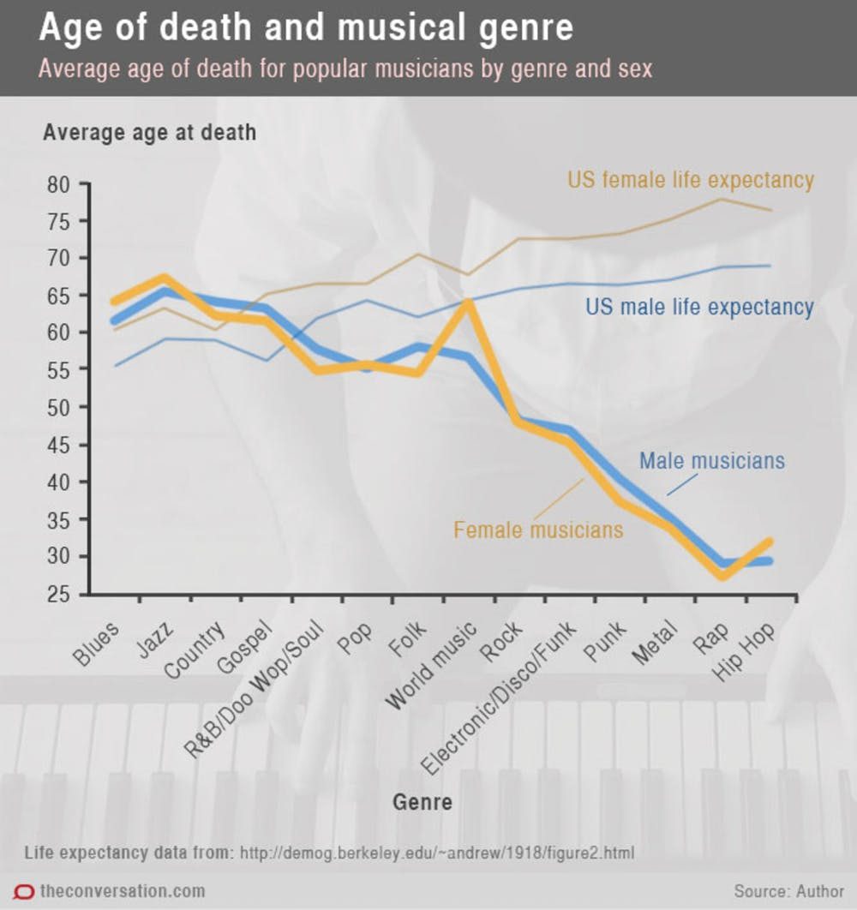
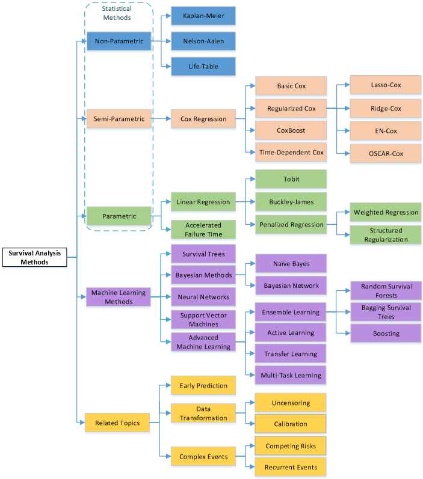

class: inverse, middle, center
```{r setup, include=FALSE}
# load packages
library(knitr)
library(tidyverse)
library(broom)
library(survival)
```

# Introduction
---

## What is survival data?

Time-to-event data that consists of a distinct start time and end time. These data are common in the medical field.

Examples from cancer:

- Time from surgery to death
- Time from start of treatment to progression
- Time from response to recurrence
---

## Examples from other fields

Time-to-event data is common in many fields including, but not limited to:

- Crime: Time from release to criminal recidivism
- Marketing: Customer retention
- Engineering: Time to machine malfunction
- Finance: Time to loan default
- Management: Time to employee resignation/termination
---

## Aliases for survival analysis

Because survival analysis is common in many other fields, it also goes by other names:

- Reliability analysis
- Duration analysis
- Event history analysis
- Time-to-event analysis

---
## Questions of interest

The two most common questions I encounter related to survival analysis are:

1. What is the probability of survival to a certain point in time?
2. What is the average survival time?
---
class: inverse, center, middle
# Censoring
---

## What is censoring?

In survival analysis, it is common for the exact event time to be unknown, or unobserved, which is called censoring. A subject may be censored due to:

- Loss to follow-up
- Withdrawal from study
- No event by end of fixed study period

Specifically these are examples of **right** censoring. Other common types of censoring include:

- Left (you do not observed the beginning)
- Interval (individual is loss during the study)
---

### Censored survival data

When the exact event time is unknown then some patients are censored, and survival analysis methods are required.


```{r swimmer, echo = FALSE}
# make fake data
set.seed(20180809)
fkdt <- tibble(Subject = as.factor(1:10), 
                   Years = sample(4:20, 10, replace = T),
                   censor = sample(c("Censor", rep("Event", 2)), 10, 
                                   replace = T)) 
# %>% mutate(Subject = fct_reorder(Subject, Years, desc = TRUE))

# plot with shapes to indicate censoring or event
ggplot(fkdt, aes(Subject, Years)) + 
    geom_bar(stat = "identity", width = 0.5) + 
    geom_point(data = fkdt, 
               aes(Subject, Years, color = censor, shape = censor), 
               size = 6) +
    coord_flip() +
    theme_minimal() + 
    theme(legend.title = element_blank(),
          legend.position = "bottom")
```

---
### We can incorporate censored data using survival analysis techniques

Toy example of a Kaplan-Meier curve for this simple data (details to follow):
.pull-left[
```{r echo = FALSE}
library(survival)
plot(survfit(Surv(Years, ifelse(censor == "Event", 1, 0)) ~ 1, data = fkdt), 
     xlab = "Years", 
     ylab = "Survival probability", 
     mark.time = T, 
     conf.int = FALSE)
```
]
.pull-right[
- Horizontal lines represent survival duration for the interval
- An interval is terminated by an event
- The height of vertical lines show the change in cumulative probability
- Censored observations, indicated by tick marks, reduces the cumulative survival between intervals
]
---
## Danger of ignoring censoring 

.pull-left[
[Case study: musicians and mortality](https://callingbullshit.org/case_studies/case_study_musician_mortality.html)

Conclusion: Musical genre is associated with early death among musicians.

Problem: this graph does not account for the right-censored nature of the data.
]
.pull-right[

```{r echo = FALSE}

```

]
---
## Components of survival data

For subject $i$:

1. Event time $T_i$
2. Censoring time $C_i$
3. Event indicator $\delta_i$: 

    - 1 if event observed (i.e. $T_i \leq C_i$)
    - 0 if censored (i.e. $T_i > C_i$)
    
4. Observed time $Y_i = \min(T_i, C_i)$

---
class: center, middle, inverse
# Data example
---

## Research question of interest

Organ Transplantation is limited by the supply of cadaveric and living donors.

Unfortunately, many people die while waiting on the list.

What types of characteristics lead to an increase or decrease likelihood of dying on the waiting list?

---
## Data structure

```{r}
data("transplant")
```

- `r nrow(transplant)` of people on the waiting list 
- Outcome: Death
- Predictors: age, sex, Blood type, year added to list 

```{r peekdata}
transplant %>% 
    head
```
---
## Variables:

- "futime": the observed time $Y_i = min(T_i, C_i)$
- "event": the event factor variable can take on censored, death, liver transpant, or withdraw
- "abo": blood type A, B, AB, or O
- sex: Male or Female
- age: age at addition to the waiting list

---
class: center, inverse, middle
# Preparing data for analysis

---
## Event indicator

Most functions used in survival analysis will also require a binary indicator of event that is:

- 0 for no event
- 1 for event

Currently our data example contains a factor variable indicating whehter the patient has died or if they have received a liver transpant, been withdrawn, or are censored.

```{r}
transplant$delta<-0
transplant$delta[transplant$event=="death"]<-1
```

---
class: center, inverse, middle
# Analyzing survival data

---
## Questions of interest

Recall the questions of interest:

1. What is the probability of surviving to a certain point in time?
2. What is the average survival time?

---
## Creating survival objects

The Kaplan-Meier method is the most common way to estimate survival times and probabilities. It is a non-parametric approach that results in a step function, where there is a step down each time an event occurs.

- The `Surv` function from the `survival` package creates a survival object for use as the response in a model formula. 
- There will be one entry for each subject that is the survival time, which is followed by a `+` if the subject was censored. 

Let's look at the first 10 observations:

```{r}
survival::Surv(transplant$futime, transplant$delta)[1:10]
```

---
## Estimating survival curves with the Kaplan-Meier method

- The `survival::survfit` function creates survival curves based on a formula. Let's generate the overall survival curve for the entire cohort, assign it to object `f1`, and look at the `names` of that object:

```{r}
f1 <- survfit(Surv(transplant$futime, transplant$delta) ~ 1, data = transplant)
names(f1)
```

Some key components of this `survfit` object that will be used to create survival curves include:

- `time`, which contains the start and endpoints of each time interval
- `surv`, which contains the survival probability corresponding to each `time`

---
## Kaplan-Meier plot - base R

Now we plot the `survfit` object in base `R` to get the Kaplan-Meier plot:
.pull-left[
```{r}
plot(f1, xlab = "Days", ylab = "Overall survival probability")
```
]
.pull-right[
- The default plot in base `R` shows the step function (solid line) with associated confidence intervals (dotted lines). Note that the tick marks for censored patients are not shown by default, but could be added using `mark.time = TRUE`
]
---

## Estimating survival time

The surivival model helps us find the probability of surviving up until a certain number $(x)$ of years.

For example, to estimate the probability of surviving to year 5, use `summary` with the `times` argument:

```{r}
summary(f1, times = 5*365)
```

We find that the 5-year probability of survival in this study is `r round(summary(f1, times = 5*356)$surv * 100)`%. The associated lower and upper bounds of the 95% confidence interval are also displayed.

---
## Survival time is often estimated incorrectly 

What happens if you use a "naive" estimate? 

`r table(transplant$delta[transplant$futime <= 5*365])[2]` of the `r nrow(transplant)` patients died by 5 years so:

$$\Big(1 - \frac{66}{815}\Big) \times 100 = 92\%$$

- You get an **incorrect** estimate of the 5-year probability of survival when you ignore the fact that `r table(transplant$delta[transplant$futime <= 5*365])[1]` patients were censored before 5 years.

- Recall the **correct** estimate of the 5-year probability of survival was `r round(summary(f1, times = 5*365)$surv * 100)`%.

---

## Estimating median survival time

Another quantity often of interest in a survival analysis is the average survival time, which we quantify using the median (survival times are not expected to be normally distributed so the mean is not an appropriate summary). 

We can obtain this directly from our `survfit` object:

```{r}
survival::survfit(survival::Surv(futime, delta) ~ 1, data = transplant)
```

```{r eval=FALSE}
round(summary(f1)$table["median"]/365, 1)
```


We see the median survival time is `r round(summary(f1)$table["median"]/365, 1)` years. The lower and upper bounds of the 95% confidence interval are also displayed.

---
## Median survival is often estimated incorrectly

What happens if you use a "naive" estimate? 

Summarize the median survival time among the `r table(transplant$delta)[2]` patients who died:

```{r}
transplant$futime[transplant$delta == 1] %>% 
    median
```

- You get an **incorrect** estimate of median survival time of `r round(median(transplant$futime[transplant$delta == 1])/365, 1)` years when you ignore the fact that censored patients also contribute follow-up time.

- Recall the **correct** estimate of median survival time is `r round(summary(f1)$table["median"]/365, 1)` years.
---
class: center, middle, inverse
# Comparing survival times between groups

---
## Questions of interest with respect to between-group differences

Is there a difference in survival probability between groups?

From our example: does the probability of survival differ according to gender among liver transplant patients?

---
## Kaplan-Meier plot by group

We can add a covariate to the right-hand side of the `survival::survfit` object to obtain a stratified Kaplan-Meier plot. 

Let's also look at some other customization we can do with `survminer::ggsurvplot`.

```{r fig.height = 6, eval=FALSE}
survminer::ggsurvplot(
    fit = survival::survfit(survival::Surv(futime, delta) ~ abo, data = transplant), 
    xlab = "Days",
    ylab = "Overall survival probability",
    legend.title = "Blood Type",
    legend.labs = c("A", "B", "AB","O"),
    break.x.by = 100, 
    censor = FALSE,
    risk.table = TRUE,
    risk.table.y.text = FALSE)
```

---

```{r out.width="80%", echo=FALSE, message=FALSE, warning=FALSE}
survminer::ggsurvplot(
    fit = survival::survfit(survival::Surv(futime, delta) ~ abo, data = transplant), 
    xlab = "Days",
    ylab = "Overall survival probability",
    legend.title = "Blood Type",
    legend.labs = c("A", "B", "AB","O"),
    break.x.by = 356, 
    censor = FALSE,
    risk.table = TRUE,
    risk.table.y.text = FALSE)
```

---
## Kaplan-Meier plot by group
- Blood type B patients have the lowest overall survival probability.
- The risk table below the plot shows us the number of patients at risk at certain time points, which can give an idea of how much information is being used to calculate the estimates at each time
- Male patients have the lowest overall survival probability.

---
## $x$-year survival probability by group 

As before, we can get an estimate of, for example, 1-year survival by using `summary` with the `times` argument in our `survival::survfit` object:

```{r}
summary(survfit(Surv(futime, delta) ~ sex, data = transplant), times = 365)
```

---
## Log-rank test for between-group significance test

- We can conduct between-group significance tests using a log-rank test. 
- The log-rank test equally weights observations over the entire follow-up time and is the most common way to compare survival times between groups.
- There are versions that more heavily weight the early or late follow-up that could be more appropriate depending on the research question.

We get the log-rank p-value using the `survival::survdiff` function:

```{r}
survival::survdiff(Surv(futime, delta) ~ sex, data = transplant)
```

And we see that the p-value is .2, indicating no significant difference in overall survival according to gender.
---
class: center, middle, inverse
# Competiting  Risk Model

---
## Competiting Risk Model

Sometimes people are subject to multiple risk at the same time. 

An employee could stay with the firm or leave the firm voluntarily or get fired. 

An employee that leaves the firm voluntarily is potentially very different than an employee who is fired. 


---
## Competting Risk

Example 1: The problem with competing risk is that if a person is fired, we will never see if they would have left the firm for a better job.

Example 2: Likewise, if a person leaves a firm for a different job, then we do not know if they would have ever been fired. 

- In Example 1: the person who is fired is censored to leaving for a better job.
- In Example 2: the person who leaves for a different job is censored to being fired.
- In both examples, the person still with the firm is censored to either being fired or leaving to another job.

---
## Competiting Risk in R

In this situation, if you are interested in firing, then censor both people who stay with the firm and those that leave for a better job.

If you are interested in who stays with the firm, then censor both those that stay or get fired.

If you are interested in if anyone leaves the firm, then only censor those that stay with the firm. 

---
## Example in R

We have data on people who have been diagnosed with melanoma. These patients could continue to survive, die due to melanoma, or die due to a different cause.

```{r}
# install.packages("MASS")
data(Melanoma, package = "MASS")
```
We will use the `Melanoma` data from the {MASS} package to illustrate these concepts. It contains variables:

- `time` survival time in days, possibly censored.
- `status` 1 died from melanoma, 2 alive, 3 dead from other causes.
- `sex` 1 = male, 0 = female.
- `age` age in years.
- `year` of operation.
- `thickness` tumor thickness in mm.
- `ulcer` 1 = presence, 0 = absence.

---
## R code
```{r eval=FALSE}
library(ggsurvfit)
library(tidycmprsk)
Melanoma <- 
  Melanoma %>% 
  mutate(
    status = as.factor(recode(status, `2` = 0, `1` = 1, `3` = 2))
  )

cuminc(Surv(time, status) ~ 1, data = Melanoma) %>% 
  ggcuminc() + 
  labs(
    x = "Days"
  ) + 
  add_confidence_interval() +
  add_risktable()
```
---
## R code
```{r eval=TRUE, echo=FALSE}
library(ggsurvfit)
library(tidycmprsk)
Melanoma <- 
  Melanoma %>% 
  mutate(
    status = as.factor(recode(status, `2` = 0, `1` = 1, `3` = 2))
  )

cuminc(Surv(time, status) ~ 1, data = Melanoma) %>% 
  ggcuminc() + 
  labs(
    x = "Days"
  ) + 
  add_confidence_interval() +
  add_risktable()
```
---
## R code
```{r eval=FALSE}
## This code produces the non-parametric competiting risk model

cuminc(Surv(time, status) ~ 1, data = Melanoma) %>% 
  ggcuminc(outcome = c("1", "2")) +
  ylim(c(0, 1)) + 
  labs(
    x = "Days"
  )
```
---
## R code
```{r eval=TRUE, echo=FALSE}
## This code produces the non-parametric competiting risk model

cuminc(Surv(time, status) ~ 1, data = Melanoma) %>% 
  ggcuminc(outcome = c("1", "2")) +
  ylim(c(0, 1)) + 
  labs(
    x = "Days"
  )
```
---
class: center, middle, inverse
# Regression
---

## The Cox regression model

We may want to quantify an effect size for a single variable, or include more than one variable into a regression model to account for the effects of multiple variables.

The Cox regression model is a semi-parametric model that can be used to fit univariable and multivariable regression models that have survival outcomes.

Some key assumptions of the model:

- non-informative censoring
- proportional hazards
---

## Cox regression example using a single covariate

We can fit regression models for survival data using the `survival::coxph` function, which takes a `survival::Surv` object on the left hand side and has standard syntax for regression formulas in `R` on the right hand side.

```{r eval = FALSE}
survival::coxph(survival::Surv(futime, delta) ~ factor(abo), data = transplant)
```

We can see a tidy version of the output using the `tidy` function from the `broom` package:

```{r}
broom::tidy(survival::coxph(survival::Surv(futime, delta) ~ factor(abo), 
                            data = transplant))
```

---
## Hazard ratios

The quantity of interest from a Cox regression model is a **hazard ratio (HR)**.

If you have a regression parameter $\beta$ (from column `estimate` in our `survival::coxph`) then HR = $\exp(\beta)$.
```{r echo=FALSE}
broom::tidy(survival::coxph(survival::Surv(futime, delta) ~ factor(abo), 
                            data = transplant))
```
For example, from our example we obtain the regression parameter $\beta_1=0.195$ for AB vs B blood type, so we have HR = $\exp(\beta_1)=1.21$. 

A HR < 1 indicates reduced hazard of death whereas a HR > 1 indicates an increased hazard of death.

So we would say that a person with AB blood type has 1.21 times increased hazard of death as compared to a person with A blood type.

---
## Summary

- Time-to-event data is common
- Survival analysis techniques are required to account for censored data
- The `survival` package provides tools for survival analysis, including the `Surv` and `survfit` functions
- The `survminer` package allows for customization of Kaplan-Meier plots based on `ggplot2`
- Between-group comparisons can be made with the log-rank test using `survival::survdiff`
- Multiavariable Cox regression analysis can be accomplished using `survival::coxph` 

---

## Empoyee Attrition Example

```{r}
# First let's import the data 
q = read.csv('turnover2.csv', header = TRUE, sep = ",", na.strings = c("",NA))
```

Our case uses data of 1785 employees.

__Variables__

$exp$ - length of employment in the company

$event$ - event (1 - terminated, 0 - currently employed)

$branch$ - branch

$pipeline$ - source of recruitment

Please note that the data is already prepared for survival analysis. Moreover, length of employment is counted in months up to two decimal places, according to the following formula: (date fire - date hire) / (365.25 / 12).

---
## Cox Model

```{r eval=FALSE, echo=TRUE}
w1 = coxph(Surv(exp, event) ~ . , data = q)
library(modelsummary)
modelsummary(list("Cox" = w1), estimate = "{estimate}{stars} ({std.error})",   statistic = NULL, coef_rename = c(branchfirst="First Branch",branchsecond="Second Branch",branchthird="Third Branch",branchfourth="Fourth Branch",pipelineea="Pipeline: EEA",pipelinejs="Pipeline: JS",pipelineref="Pipeline: Referral",pipelinesm="Pipeline: Social Media"), stars = TRUE)
```

---
## Cox Model

```{r echo=FALSE}
w1 = coxph(Surv(exp, event) ~ . , data = q)
library(modelsummary)
modelsummary(list("Cox"= w1), estimate = "{estimate}{stars} ({std.error})",   statistic = NULL, coef_rename = c(branchfirst="First Branch",branchsecond="Second Branch",branchthird="Third Branch",branchfourth="Fourth Branch",pipelineea="Pipeline: EEA",pipelinejs="Pipeline: JS",pipelineref="Pipeline: Referral",pipelinesm="Pipeline: Social Media"), stars = TRUE) 
```

---
##Accelerated failure-time models

###survreg(formula, dist='weibull')

An accelerated failure-time (AFT) model is a parametric model with covariates and failure times following the survival function of the form $S(x|Z) = S_0 (x exp[\theta Z])$, where $S_0$ is a function for the baseline survival rate. The term $exp[\theta Z]$ is called the acceleration factor. 

The AFT model uses covariates to place individuals on different time scales { note the scaling by the covariates in $S(t|Z)$ via $exp[\theta Z]$. The AFT model can be rewritten in a log-linear form, where the log of failure time (call this logX) is linearly related to the mean $\mu$, the acceleration factor, and an error term $\sigma W$: $$log X = \theta'Z+\sigma W$$

---

## Different AFT Models

There are serveral AFT models depending on the assumption about the distribution of the error $W$.

Distribution | df | Included in Survival
-------------|----|---------------------
Exponential | 1  | yes
Weibull | 2 | yes
lognormal | 2 | yes
log logistic | 2 | yes
generalized gamma | 3 | no

---

## Weibull

The Weibull distribution has a survival function equal to $$S(t)=exp(-(\lambda t)^\rho)$$

and a hazard function equal to $$\Lambda(t)=\rho \lambda(\lambda t)^{\rho-1}$$

where $\lambda>0$ and $\rho>0$. A special case of the Weibul functions is the exponential distribution when $\rho=1$.

If $\rho > 1$, then the risk increases over time. 

If $\rho < 1$, then the risk decreases over time.

---

## Weibul Model in R
The _survial_ package allows us to estimate all of these models. We will use the same model with a small change to estimate a Weibul AFT model.
```{r message=FALSE, warning=FALSE, eval=FALSE}
w2 = survreg(Surv(exp, event) ~ . , data = q, dist = "weibul")
w3 = survreg(Surv(exp, event) ~ . , data = q, dist = "exponential")
modelsummary(list("Cox"=w1,"Weibul"=w2,"Exp."=w3), estimate = "{estimate}{stars} ({std.error})",   statistic = NULL, coef_rename = c(branchfirst="First Branch",branchsecond="Second Branch",branchthird="Third Branch",branchfourth="Fourth Branch",pipelineea="Pipeline: EEA",pipelinejs="Pipeline: JS",pipelineref="Pipeline: Referral",pipelinesm="Pipeline: Social Media"), stars = TRUE)
```
__Cox Reg estimates hazard rates. Weibul estimates survival rates.__
---
## Weibul Model in R
<font size=2>
```{r message=FALSE, warning=FALSE, echo=FALSE}
w2 = survreg(Surv(exp, event) ~ . , data = q, dist = "weibul")
w3 = survreg(Surv(exp, event) ~ . , data = q, dist = "exponential")
modelsummary(list("Cox"=w1,"Weibul"=w2,"Exp."=w3), estimate = "{estimate}{stars} ({std.error})",   statistic = NULL, coef_rename = c(branchfirst="First Branch",branchsecond="Second Branch",branchthird="Third Branch",branchfourth="Fourth Branch",pipelineea="Pipeline: EEA",pipelinejs="Pipeline: JS",pipelineref="Pipeline: Referral",pipelinesm="Pipeline: Social Media"), stars = TRUE)
```
</font>

---
## Do we need accelerated time?
The exponential model assumes a constant effect of time. 

We can perform a likelihood ratio test between the exponential and Weibul model to see if AFT is necessary.

```{r message=FALSE, warning=FALSE}
library(lmtest)
lrtest(w2,w3)
```

Although there is little difference in the parameter estimates, the likelihood ratio test suggest we should use the Weibul model over the exponential. 
---
## This is only the beginning

* Machine learning methods are improving on survival models
* We have only discussed X's that are constant over time, but what about time-varying covariates (or worse yet time-dependent covariates)
* There are also issues of competing risks

[Read More Here](https://rpubs.com/omironenko/survival_churn)

---
## This is only the beginning
```{r fig.retina=1, echo=FALSE, out.width="65%", out.height="65%", fig.align='center'}

```